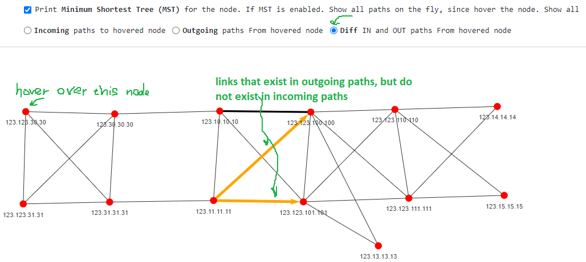

# Comparing Network States

Each topology you upload is a **snapshot** — the network frozen at the moment of
capture. Topolograph keeps your snapshots over time, which means you can put two
of them side by side and see *exactly* what changed.

## The classic workflow

1. **Snapshot before.** Upload the current LSDB (or let a
   [Watcher](../monitoring/index.md) keep snapshots flowing automatically).
2. **Make your change.** For example, redistribute routes from BGP into OSPF with
   a route-map and prefix-list, adjust a link metric, or add a new adjacency.
3. **Snapshot after.** Upload the new LSDB.
4. **Compare.** Topolograph highlights the differences between the two states.

Because each upload is timestamped, you can compare any two points in time — not
just consecutive ones.

## What a comparison shows

- **Links** that appeared or disappeared between the two states.
- **Cost changes** on existing links.
- **Networks/prefixes** that were added or withdrawn.
- **Nodes** that joined or left the topology.

This turns "did my change do what I expected?" into a visual, verifiable answer —
instead of diffing raw `show` output by eye.

## Pairs well with monitoring

Manual before/after snapshots are great for planned changes. For *unplanned*
ones, a [Watcher](../monitoring/index.md) records every transition continuously,
so you can scroll back through a timeline of states and see what changed and
when — and alert on it via [ELK](../monitoring/elk-kibana.md),
[Zabbix](../monitoring/zabbix.md) or [Slack](../monitoring/webhooks.md).

---

**Next:** [Build arbitrary topologies with YAML →](yaml-topologies.md)
