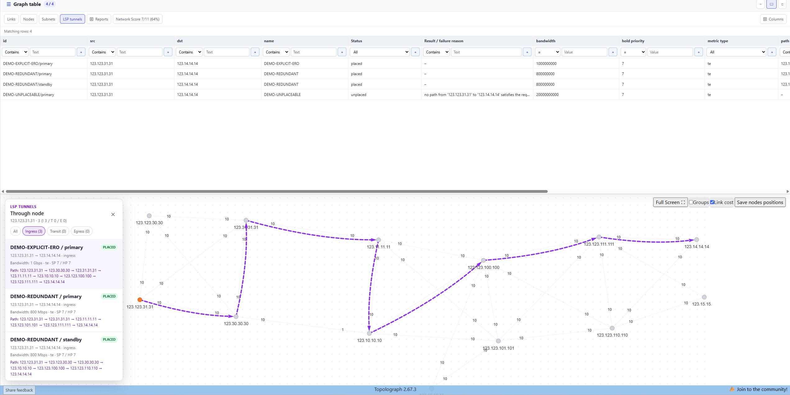

# MPLS TE 隧道

在[基于 YAML 的拓扑](yaml-topologies.md)和[流量工程属性](traffic-engineering.md)
的基础上，拓扑图还可以在顶层的 `lsps:` 部分声明 **MPLS TE 隧道**（RSVP-TE 或
SR-TE 风格）。Topolograph 会对它们运行 CSPF（Constrained Shortest Path First，
约束最短路径优先）放置计算——与真实路由器相同的带宽/affinity/SRLG 约束，
无需任何信令——并将结果可视化。



**LSP tunnels** 标签页列出每条路径的放置状态、失败原因、带宽和优先级；
选择一个节点会显示以该节点为 ingress、transit 或 egress 的隧道，已放置的路径
会绘制在画布上。

!!! info "目前仅支持 YAML 拓扑图"
    `lsps:` 目前仅在基于 YAML 的拓扑图上可用。对由 watcher 实时上报的隧道的
    支持计划在后续版本中提供。

## YAML 中的隧道

```yaml
lsps:
  TUN_R1_R3:                    # 键 = 隧道名称
    src: 10.10.10.1
    dst: 10.10.10.3
    metric_type: te             # igp（默认） | te
    bandwidth: 2G                # 应用于每条路径，除非被覆盖
    setup_priority: 7
    admin_groups:
      exclude-any: [red]
    color: "#ff9900"
    autoroute: false             # 见下文 "autoroute"
    paths:                       # = LSP；完全省略则表示一条动态主路径
      primary:
        ero:
          - 10.10.10.2                        # 纯字符串 = 松散跳
          - {node: 10.10.10.3, hop: strict}    # 严格跳的显式写法
      secondary:
        role: standby
        bandwidth: 1G            # 覆盖隧道级别的默认值
        srlg_exclude: [1001]
```

## 键参考

| 键 | 层级 | 值 / 格式 | 含义 |
|---|---|---|---|
| `lsps` | 顶层 | 字典，隧道名称 → 主体 | 与 `nodes`/`edges` 并列的可选部分 |
| `src`、`dst` | 隧道 | 节点名称（IP 地址格式） | 隧道端点 |
| `metric_type` | 隧道 | `igp`（默认）\| `te` | CSPF 优化所依据的度量 |
| `bandwidth` | 隧道/路径 | `2G`、`500M`，或原始的 bps 数值 | 所需带宽；路径级别的值会覆盖隧道级别的默认值 |
| `setup_priority` | 隧道/路径 | `0`–`7`，默认 `7` | RSVP-TE 准入池（`0` 优先级最高） |
| `hold_priority` | 隧道/路径 | `0`–`7`，默认与 `setup_priority` 相同 | 预留所保持的池；不能弱于 setup priority |
| `admin_groups` | 隧道/路径 | 字典：`exclude-any` / `include-any` / `include-all` → 名称列表 | affinity 过滤器 |
| `srlg_exclude` | 路径 | 整数列表 | SRLG 约束 |
| `color` | 隧道 | CSS 颜色 | 画布上的高亮颜色 |
| `autoroute` | 隧道 | 布尔值，默认 `false` | 见下文 |
| `paths` | 隧道 | 字典，路径名称 → 主体；省略则表示一条动态 `primary` | 该隧道的 LSP |
| `role` | 路径 | `primary`（默认）\| `secondary` \| `standby` | 路径角色 |
| `ero` | 路径 | 列表：`10.10.10.2`（松散跳）或 `{node: ..., hop: strict}` | 显式路由 |

当路径省略 `bandwidth`、`setup_priority`、`hold_priority` 和 `admin_groups` 时，
会从隧道继承这些值。`srlg_exclude` 和 `ero` **不会**被继承——在隧道级别声明
`srlg_exclude` 没有任何效果，需要在每条需要它的路径上单独设置。

链路声明的是与[流量工程页面](traffic-engineering.md#what-topolograph-parses)
中相同的 TE 属性（`temetric`、`max_rsrv_link_bw`、`admin_group`/affinity、`srlg`、
`unreserved_bw_0`…`unreserved_bw_7`）——不为 MPLS 场景单独命名。

### `autoroute`

**已建立信令的 LSP 不会自动重定向流量**——这与真实的 RSVP-TE/SR-TE 行为一致：
如果没有 `autoroute announce`（或指向该隧道的显式静态路由），隧道只是预留的
带宽，对 IGP 式的路径计算不可见。在隧道上设置 `autoroute: true`，可让它在
端到端路径查询中充当转发捷径（见下文 `with_lsps`）——这相当于在真实网络中
在 headend 上开启 autoroute。

### Setup 与 holding 优先级

`0` 是最强的优先级，`7` 是最弱的。不设置 `hold_priority` 时，它会跟随
`setup_priority`，与路由器上省略第二个值的 `priority <setup>` 相同。

以强优先级建立、却以弱优先级保持的隧道，在信令建立的瞬间就可能被抢占，
因此这种组合会被拒绝：`hold_priority` 必须至少与 `setup_priority` 一样强
（`setup_priority: 0` 搭配 `hold_priority: 7` 会产生校验错误，`setup_priority: 7`
搭配 `hold_priority: 0` 则没有问题）。

### 被拒绝的（操作性）键

`rro`、`oper_status`、`active_lsp_name`，以及任何 `label_*` 键在 `lsps:` 中
都会被**拒绝**——它们描述的是实时信令状态（Record Route、当前状态、活动路径），
而不是声明的意图，只有在真实的 watcher 上报它们时才有意义。如果包含其中任何
一个键，都会引发校验错误。

## CSPF 放置

每次保存时，Topolograph 都会按 `setup_priority` 顺序（RSVP-TE 惯例：`0` 最高）
放置每条路径，规则与真实路由器所应用的相同：

- 过滤掉在所请求的 `setup_priority` 池中带宽不足、不满足 affinity 过滤器，
  或位于被排除的 SRLG 中的链路；
- 在剩余的链路上运行最短路径计算，并遵循任何 `ero`（`strict` 跳必须是与
  上一跳直接相连的边——LSP 会失败，而不是被静默地绕行）；
- 在放置下一条路径之前，从该优先级池（以及所有更低优先级的池）中扣减已
  放置的带宽。

放置计算永远不会修改通告的 TE 属性（`unreserved_bw_*`）——已消耗的容量是
单独跟踪的，因此重新运行放置计算总是从真实通告的数值开始。

ECMP 的平局按确定性方式打破：先比较跳数最少，再按节点名称的字典序比较。

## 读取放置结果

`GET /api/graph/{graph_time}/lsps` 和 `GET /api/graph/{graph_time}/lsps/{name}`
会返回每条路径的放置结果，以及其声明的配置：

```json
{
  "name": "TUN_R1_R3",
  "src": "10.10.10.1",
  "dst": "10.10.10.3",
  "paths": {
    "primary": {
      "placed": true,
      "reason": null,
      "cost": 20,
      "path": ["10.10.10.1", "10.10.10.2", "10.10.10.3"]
    },
    "secondary": {
      "placed": false,
      "reason": "insufficient bandwidth",
      "cost": null,
      "path": []
    }
  }
}
```

`reason` 用文字解释未放置路径失败的*原因*。与之相伴的 `reason_code` 给出
机器可读的分类，`binding_constraints` 则指出实际造成阻塞的因素：

| `reason_code` | 含义 | 应对方法 |
|---|---|---|
| `disconnected` | 即使解除所有约束也不存在路径 | 修复拓扑 |
| `constraints_unsatisfiable` | 路径存在，但请求过于严格 | 放宽 `binding_constraints` 中列出的约束（`bandwidth`、`affinity`、`srlg`） |
| `ero_strict_hop_unreachable` | 某个严格跳与上一跳之间没有边相连 | 修正 `ero` |
| `endpoint_not_found` | `src`/`dst` 不在图中 | 修正端点 |

`binding_constraints` 中出现多个条目，意味着它们是组合起来才造成阻塞——
解除其中任意一个即可。

列表端点上的实用筛选参数：

```python
# 哪些隧道放置失败，以及原因
graph.lsps_list(status="unplaced")

# 哪些隧道经过给定的节点或链路（维护前的影响检查）
graph.lsps_list(via_node="10.10.10.2")
graph.lsps_list(via_edge="10.10.10.1,10.10.10.2")
```

在计入所有已放置的隧道之后，链路上还剩多少 TE 带宽：

```python
graph.edges_list(include=["lsp_left_bw"])
# -> ..., "lsp_left_bw_7": ..., "lsp_reserved_bw": "7Gbps",
#    "lsp_left_bw": "3Gbps", "lsp_bandwidth_usage": "7Gbps/3Gbps"
```

## CSPF 路径，无需声明隧道

`cspf_path` 回答"哪条路径满足这些约束，代价是多少"——这是一种带约束过滤的
最短路径计算，与普通最短路径属于同一类查询。不会创建或持久化任何内容：

```python
result = graph.cspf_path(
    "10.10.10.1", "10.10.10.7",
    bandwidth="5G",
    admin_exclude_any=["red"],
)
# {'path': [...], 'cost': 42, 'reason': ''}
# 如果没有路径满足条件：{'path': [], 'cost': None, 'reason': 'no path ... satisfies the requested constraints: ...'}
```

该结果会计入**已声明隧道所占用**的带宽：在带有 `lsps:` 部分的拓扑上，
检查依据的是放置计算之后每条链路的剩余容量，而不是通告的数值，因此结果
永远不会承诺已被占用的容量。约束是按 setup priority 逐一评估的，因此一条
链路可能在某个优先级上已满，而在更高优先级上仍有余量。

Affinity 约束（`admin_exclude_any`、`admin_include_any`、`admin_include_all`）
匹配的是链路上的 affinity **名称**。从真实网络采集的拓扑将管理组通告为位图，
因此在这些图上基于名称的 `include-any`/`include-all` 不会匹配任何内容，
结果是"无路径"——请改用 `exclude-any`，或使用带有命名 affinity 的 YAML 拓扑。

## 通过隧道的端到端路径（`with_lsps`）

默认情况下，`graph.paths.shortest(src, dst)` 是一条普通的 IGP 路径——不受
图中任何隧道的影响，与没有 autoroute 时的真实 IP 转发相同。传入
`with_lsps=True`，可将 `autoroute: true` 的隧道计入转发捷径：

```python
graph.paths.shortest("10.10.10.1", "10.10.10.4")               # 普通 IGP 路径
graph.paths.shortest("10.10.10.1", "10.10.10.4", with_lsps=True) # 经由活动的 autoroute 隧道
```

## 如果一条链路故障会影响什么？

`edge_failure_reaction` 预测一条或多条链路故障对整个网络的影响——连通性，
以及哪些链路会承接或失去流量：

```python
graph.paths.edge_failure_reaction([("10.10.10.1", "10.10.10.2")])
# {'isGraphStillConnected': True, 'affectedLinks': {...}, 'disjointedNodes': []}
```

若要按隧道逐一查看同一个问题，可结合 `lsps_list(via_edge=...)`，在检查故障
影响之前先看看哪些隧道经过该链路。

---

**相关内容：**[基于 YAML 的拓扑](yaml-topologies.md)·
[流量工程属性](traffic-engineering.md)·
[Python SDK](../automation/python-sdk.md)
