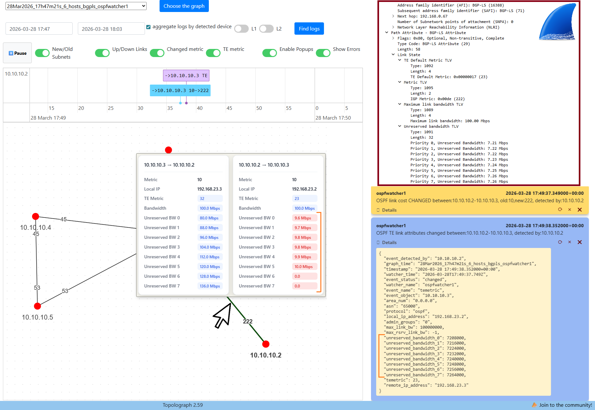

# Traffic Engineering (TE)

Beyond the basic IGP cost, OSPF and IS-IS can carry **Traffic Engineering**
attributes — bandwidth, a separate TE metric, and administrative
groups/affinities. Topolograph parses these and makes them available for richer
visualization and filtering, for both **OSPF** and **IS-IS**.

!!! info "TE is optional"
    Your graph builds fine from plain LSA 1/2/5 (OSPF) or the standard IS-IS
    LSDB. TE data is *extra* — turn it on when you need capacity-aware analysis.

## What Topolograph parses

| Attribute | API/SDK name | Meaning |
| --- | --- | --- |
| TE default metric | `temetric` | TE-specific link metric (independent of IGP cost) |
| Administrative group | `admin_group` | Affinity / color / resource class |
| Maximum link bandwidth | `max_link_bw` | Physical link capacity |
| Maximum reservable bandwidth | `max_rsrv_link_bw` | Bandwidth available for reservation |
| Unreserved bandwidth (per priority) | `unreserved_bw_0` … `unreserved_bw_7` | Remaining bandwidth at each of the 8 TE priorities |

The **same attribute names** are used regardless of whether the data came from
OSPF or IS-IS.

## How to feed TE data in

=== "OSPF — text file"

    Include **`show ip ospf database opaque-area`** in the same upload file as
    your router/network/external LSDB. Type-10 (opaque-area) LSAs carry the TE
    data; the rest of the graph is built from LSA 1, 2 and 5 as usual.

    [:octicons-arrow-right-24: Text file upload](../ingestion/text-file.md)

=== "IS-IS — text file"

    TE attributes come straight from the IS-IS LSDB when you use the standard
    detailed commands (e.g. FRR **`show isis database detail`**). No extra
    command is required beyond your normal IS-IS capture.

=== "OSPF / IS-IS — BGP-LS"

    **BGP-LS carries TE attributes natively** — admin group, maximum and
    reservable bandwidth, unreserved bandwidth, and the TE default metric — with
    no opaque-LSA trick needed. TE updates stream into the monitoring view live.

    [:octicons-arrow-right-24: BGP-LS session](../ingestion/bgp-ls.md)

When TE data arrives over BGP-LS, the monitoring page shows the link attributes
as updates come in:



## Filtering links by TE attributes

Once a diagram has TE data, you can query edges by any TE attribute using the
range operators `__gt`, `__lt`, `__gte`, `__lte` — handy for finding links that
violate (or satisfy) a TE constraint. With the
[Python SDK](../automation/python-sdk.md):

```python
# Links with TE metric >= 100
edges = graph.edges_list(temetric__gte=100)

# Links with unreserved bandwidth at priority 0 below 1 Gbps
edges = graph.edges_list(unreserved_bw_0__lt=1e9)

# Links between two nodes with max link bandwidth above 10 Gbps
edges = graph.edges_list(src_node="1.1.1.1", dst_node="2.2.2.2", max_link_bw__gt=1e10)
```

The same filtering is available through the diagram edges REST API.

## IS-IS specifics

IS-IS TE relies on **wide metrics** (Extended IS/IP Reachability, TLVs 22/135)
and supports **IPv6** reachability (TLV 236). Vendor support for the relevant
TLVs is summarized on the
[Supported Vendors](../reference/supported-vendors.md#is-is-tlv-support) page.

## Monitoring TE changes

When a Watcher is connected, changes to TE attributes are captured as events
alongside cost and adjacency changes — see the `te_log` views in
[ELK / Kibana](../monitoring/elk-kibana.md) and the
[IS-IS Watcher](../monitoring/isis-watcher.md) page.

---

**Related:** [Getting topology in](../ingestion/index.md) ·
[Visualizing & analyzing](visualizing.md)
