# Visualisation et analyse

C'est le cœur de Topolograph : un graphe OSPF/IS-IS interactif que vous
pouvez interroger avec les mêmes algorithmes que ceux utilisés par les
routeurs. Tout ce qui suit s'exécute sur votre **instantané** importé, si
bien que les expérimentations n'affectent jamais le réseau en production.

## Chemins les plus courts

Choisissez un nœud source et un nœud destination et Topolograph construit
l'**arbre des chemins les plus courts** entre eux, en mettant en
surbrillance le(s) chemin(s) et en affichant le coût IGP total.

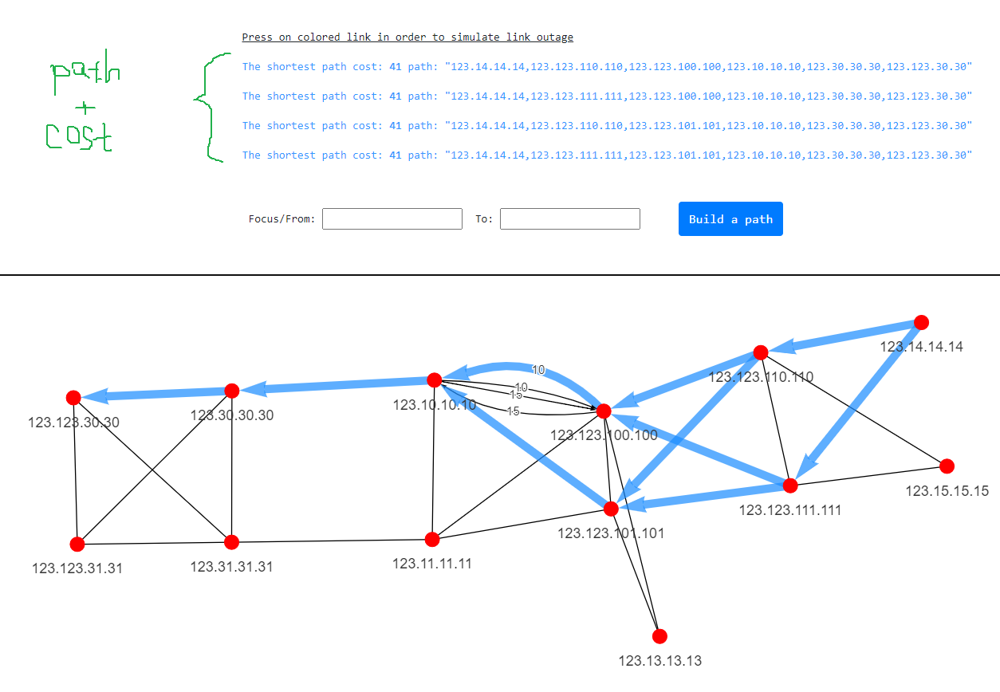

Lorsque plusieurs chemins à coût égal existent, l'**ECMP** est affiché
explicitement afin que vous puissiez voir où le trafic se répartit.

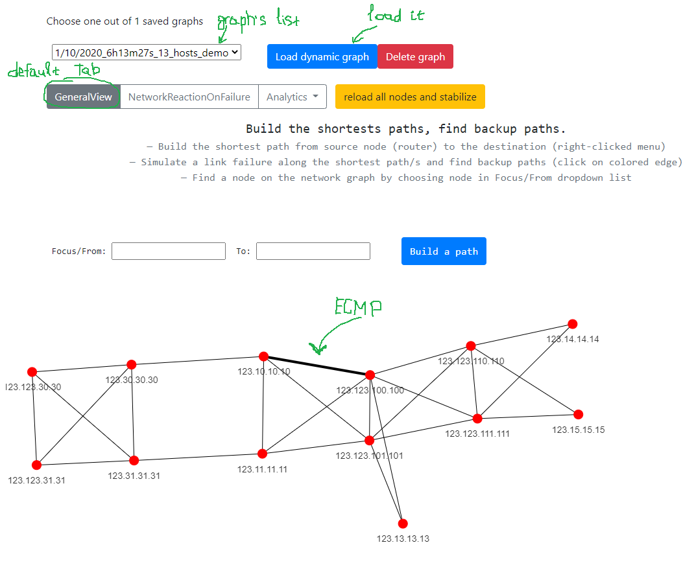

## Chemins de secours

Topolograph n'affiche pas seulement le chemin principal — il calcule le
**chemin de secours** que le réseau utiliserait réellement en cas de panne
du chemin principal, y compris les secours **secondaires**. Cela répond à
la question que soulève chaque fenêtre de changement : *« si ce lien tombe,
où va le trafic ? »*

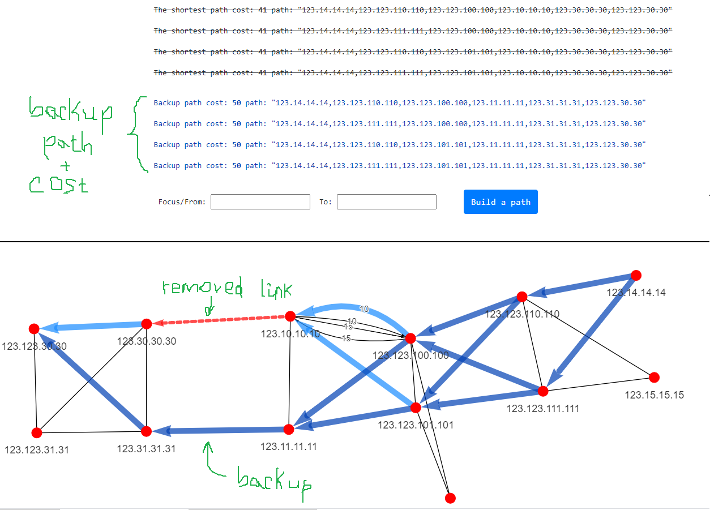

Il distingue aussi les chemins de secours qui empruntent l'ECMP de ceux qui
ne le font pas, ce qui compte lorsque vous raisonnez sur la capacité
pendant une panne.

## Simuler des pannes { #simulating-failures }

Testez des scénarios « et si » sans rien toucher en production.

### Couper un lien

Supprimez un lien et Topolograph recalcule instantanément les chemins, en
montrant comment le trafic se réachemine autour de celui-ci.

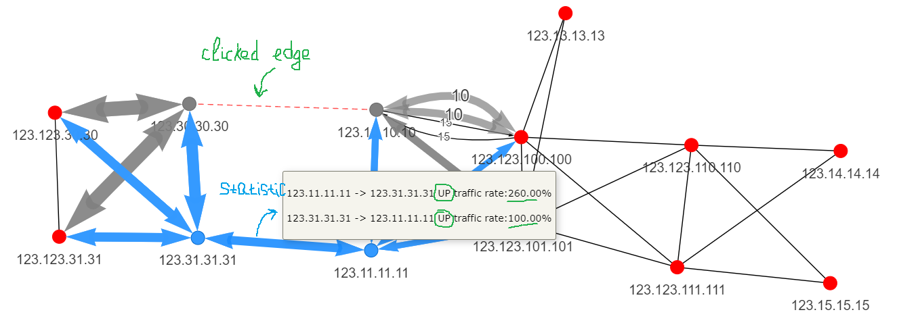

Vous pouvez voir le résultat avec les statistiques concernées :

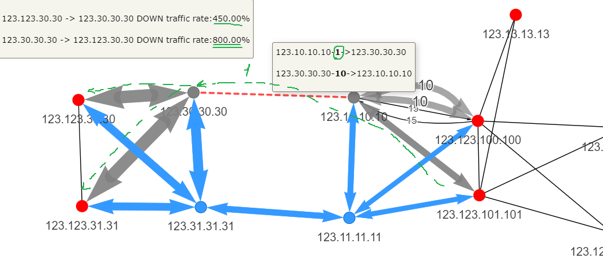

### Couper un nœud

Simulez la panne d'un routeur entier et observez le trafic contourner le
nœud en panne. Faites un clic droit sur un nœud et choisissez
**Shutdown this node**.

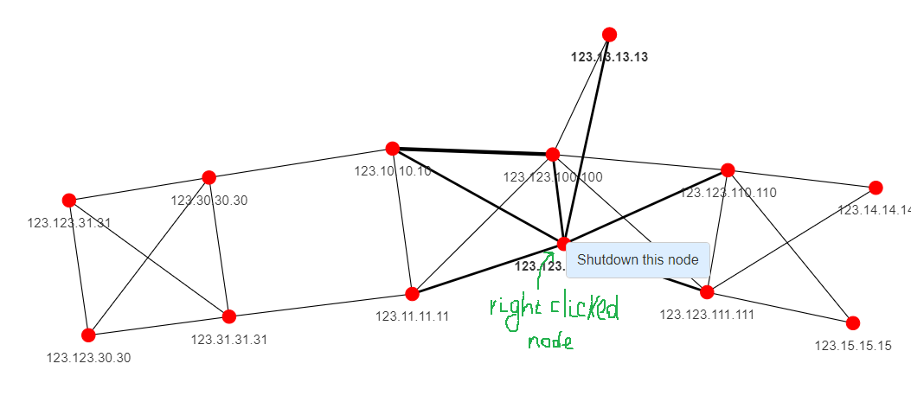

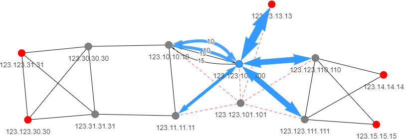

## Planifier les coûts de liens

Modifiez une métrique IGP à la volée et observez immédiatement l'effet sur
le choix des chemins — idéal pour planifier une maintenance, déplacer du
trafic hors d'un lien, ou valider une conception de coûts avant de la
déployer.

Assurez-vous d'être toujours sur l'onglet **Réaction du réseau aux pannes**.
Faites un clic droit sur un lien : un formulaire listant les liens apparaît.
Définissez une nouvelle valeur de métrique en face du lien voulu ; le
résultat du recalcul des chemins s'affiche immédiatement sur le graphe.

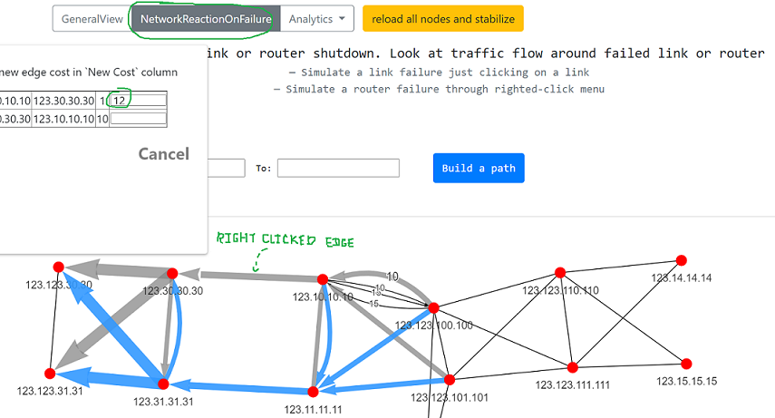

## Carte de chaleur du réseau { #network-heatmap }

La **carte de chaleur du réseau** (sous Analytics) révèle en un coup d'œil
les propriétés structurelles de la topologie — quels liens et nœuds portent
le plus de chemins, où se trouvent vos points de défaillance uniques, et
quels réseaux n'ont **aucun chemin de secours**.

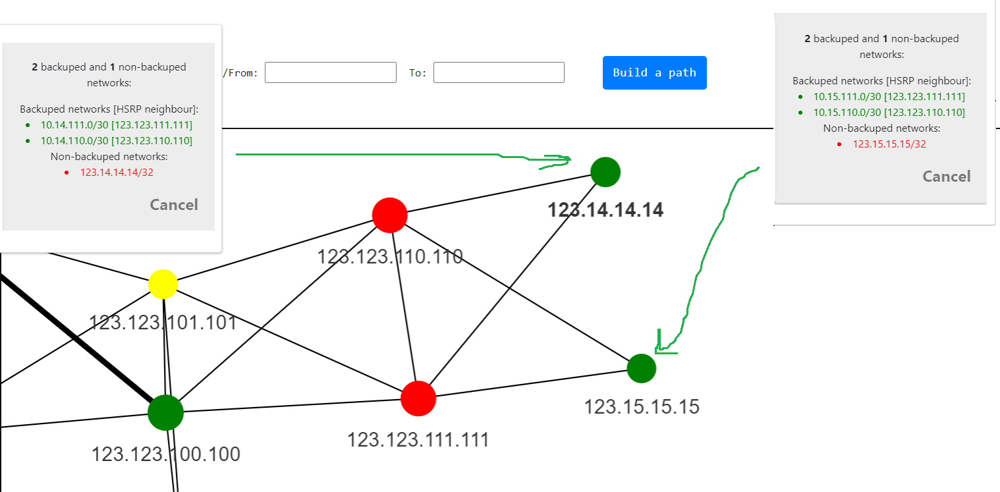

Les nœuds marqués en rouge portent le plus de réseaux sans chemin de secours.

Filtrez sur les réseaux qui **ne sont pas protégés par un secours** pour
trouver exactement où une panne unique provoquerait une perte
d'accessibilité :

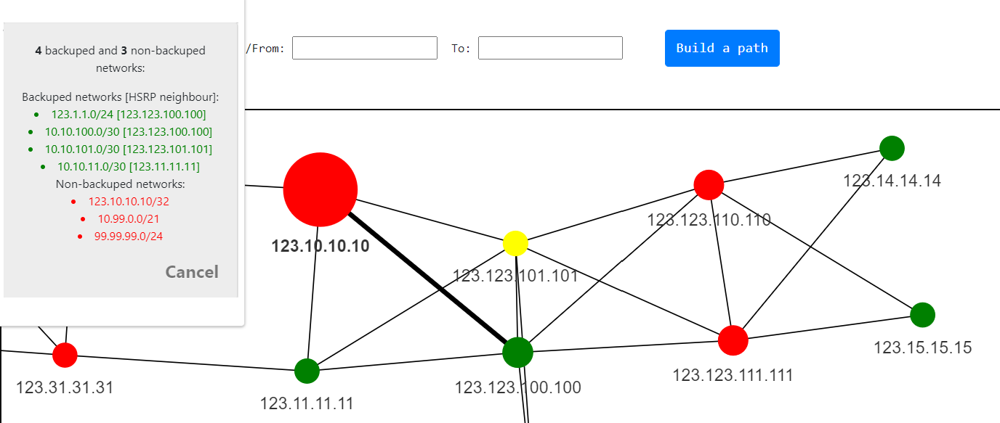

## Détecter le routage asymétrique

Un routage qui emprunte un chemin à l'aller et un chemin différent au
retour peut compliquer les pare-feux, la QoS et le dépannage. Le rapport
**Analytics → Asymmetric paths** de Topolograph trouve ces paires pour
vous.

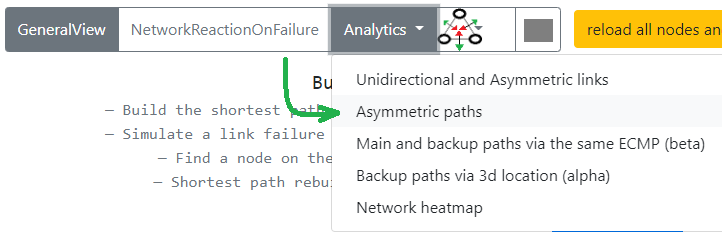

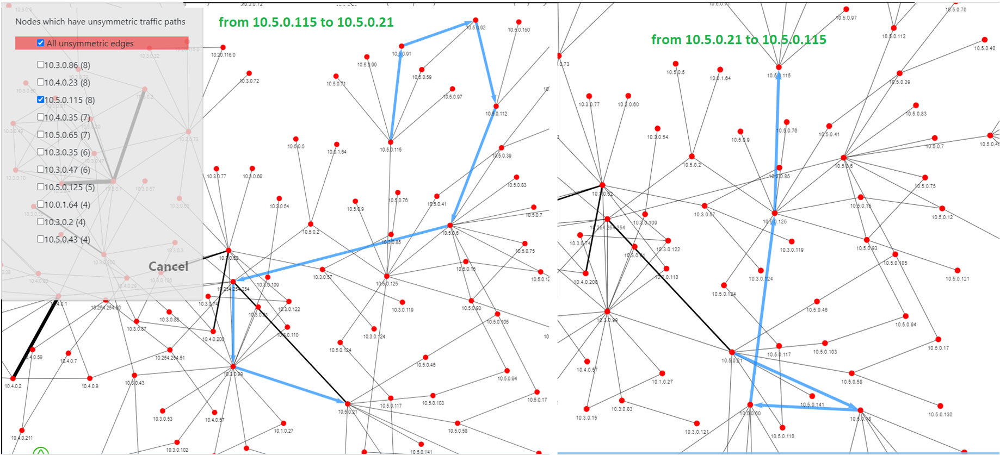

## Et ensuite ?

-   :material-compare:{ .lg .middle } __Comparer deux instantanés__

    ---

    Voyez ce qui a changé entre deux captures.

    [:octicons-arrow-right-24: Comparaison des états](comparing-states.md)

-   :material-tune-variant:{ .lg .middle } __Ajouter des données TE__

    ---

    Bande passante, métrique TE, groupes administratifs.

    [:octicons-arrow-right-24: Ingénierie de trafic](traffic-engineering.md)

-   :material-radar:{ .lg .middle } __L'observer en direct__

    ---

    Capturez chaque changement au moment où il se produit.

    [:octicons-arrow-right-24: Surveillance en temps réel](../monitoring/index.md)

