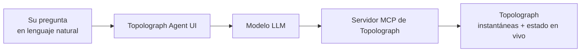

# AI Agent

El **agente de IA OSPF & IS-IS** es un asistente en lenguaje natural para su
IGP. Se comunica con dominios OSPF/IS-IS reales — obteniendo datos de
instantáneas de Topolograph o del estado en vivo del [Watcher](../monitoring/index.md)
a través del [servidor MCP](mcp-server.md) — y responde preguntas en
lenguaje claro mediante una interfaz web.

[:simple-github: vadims06/ospf-isis-ai-agent](https://github.com/Vadims06/ospf-isis-ai-agent){ .md-button }
[:material-youtube: Video de demostración](https://youtu.be/92YBRXqZWUo){ .md-button }


!!! tip "Pruebe el agente alojado"
    Hay una instancia pública en
    **[agent.topolograph.com](https://agent.topolograph.com)**: puede hacerle
    preguntas de inmediato. Funciona con el propio modelo de Topolograph
    alojado en GPU (un LLM basado en **Qwen**), por lo que allí no hace falta
    una clave de OpenAI.

## Qué puede preguntar

- *¿Qué grafos están conectados actualmente?*
- *¿Qué nodos hay en el grafo más reciente del área 0 de OSPF?*
- *¿Qué redes están asignadas a un host específico?*
- *¿Cuál es la ruta entre dos direcciones IP?*
- *¿Qué pasó con los enlaces después de que cambió la topología?*


## Cómo encaja todo



El agente usa el [servidor MCP](mcp-server.md) como puente hacia Topolograph,
de modo que puede responder con datos reales de la red en lugar de
suposiciones.

## Inicio rápido (Docker)

!!! info "Requisitos previos"
    Una **clave de API de OpenAI** (la demo cuesta bien menos de \$1). Una
    opción de LLM local mediante vLLM está en desarrollo.

Como la configuración actual usa modelos públicos de OpenAI, un endpoint MCP
**local** debe ser accesible desde OpenAI — por eso se expone mediante un
túnel.

=== "Cloudflare Tunnel"

    ```bash
    docker-compose --profile cloudflare up --build
    ```

    Observe los registros para ver una URL pública como
    `https://your-tunnel-url.trycloudflare.com`.

=== "ngrok"

    ```bash
    ngrok http 8080   # Topolograph's MCP server (published via Nginx on 8080)
    ```

Luego apunte el agente al túnel en `.env`:

```bash
MCP_SERVER_URL=https://your-tunnel-url.trycloudflare.com
```

Inícielo y abra la interfaz:

```bash
docker-compose up --build
# http://localhost:8501
```

## Reproducir la demo

```bash
# 1. Topolograph + an OSPF lab
git clone https://github.com/Vadims06/topolograph-docker
cd topolograph-docker
sudo ./install.sh

# 2. The assistant (from this repo)
docker-compose up --build
```

## Desarrollo local

```bash
cp .env.template .env   # then edit
pip install -r requirements.txt
streamlit run app.py
```

---

**Relacionado:** [MCP Server](mcp-server.md) · [Python SDK](python-sdk.md) ·
[Monitoreo en tiempo real](../monitoring/index.md)
