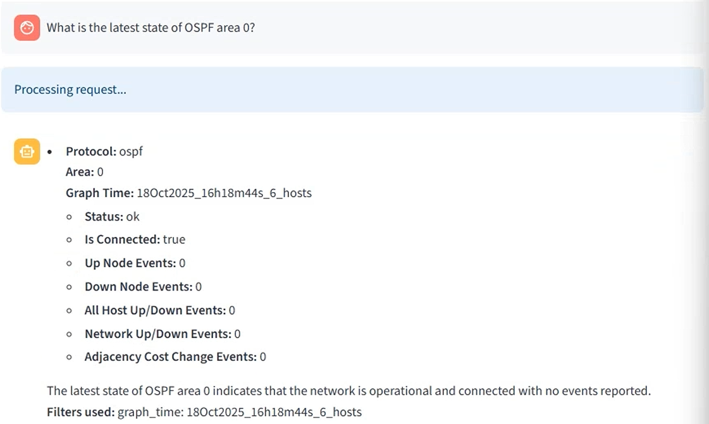
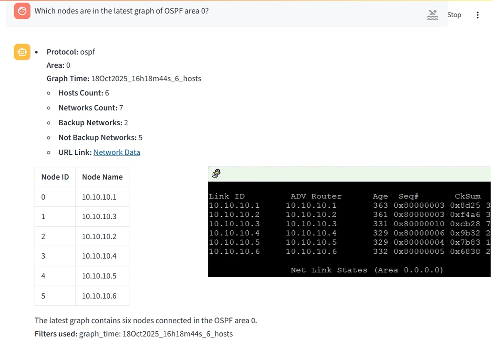
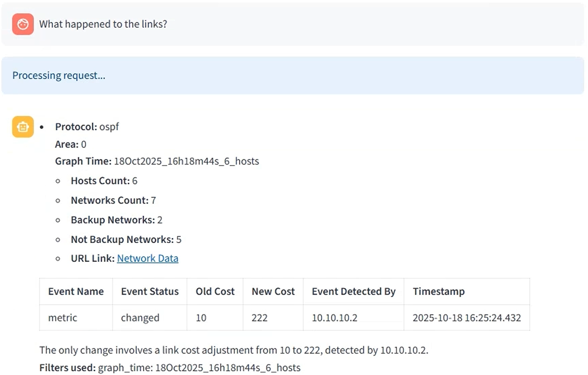
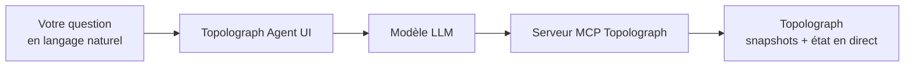

# AI Agent

L'**OSPF & IS-IS AI Agent** est un assistant en langage naturel pour votre
IGP. Il dialogue avec de vrais domaines OSPF/IS-IS — en s'appuyant sur des
snapshots Topolograph ou sur l'état [Watcher](../monitoring/index.md) en
direct via le [serveur MCP](mcp-server.md) — et répond aux questions en
langage naturel via une interface web.

[:simple-github: vadims06/ospf-isis-ai-agent](https://github.com/Vadims06/ospf-isis-ai-agent){ .md-button }
[:material-youtube: Vidéo de démo](https://youtu.be/92YBRXqZWUo){ .md-button }



!!! tip "Essayez l'agent hébergé"
    Une instance publique est disponible sur
    **[agent.topolograph.com](https://agent.topolograph.com)** : vous pouvez
    lui poser des questions immédiatement. Elle s'appuie sur le modèle propre
    à Topolograph hébergé sur GPU (un LLM basé sur **Qwen**), aucune clé
    OpenAI n'est donc nécessaire.

## Ce que vous pouvez demander

- *Quels graphes sont actuellement connectés ?*
- *Quels nœuds sont dans le dernier graphe de la zone OSPF 0 ?*
- *Quels réseaux sont assignés à un hôte spécifique ?*
- *Quel est le chemin entre deux adresses IP ?*
- *Qu'est-il arrivé aux liens après le changement de topologie ?*





## Comment ça s'articule



L'agent utilise le [serveur MCP](mcp-server.md) comme pont vers
Topolograph, il peut donc répondre avec des données réseau réelles et
ancrées plutôt que des suppositions.

## Démarrage rapide (Docker)

!!! info "Prérequis"
    Une **clé API OpenAI** (la démo coûte bien moins d'1 \$). Une option de
    LLM local via vLLM est en développement.

Comme la configuration actuelle utilise les modèles publics OpenAI, un
point d'accès MCP **local** doit être joignable depuis OpenAI — vous
l'exposez donc via un tunnel.

=== "Cloudflare Tunnel"

    ```bash
    docker-compose --profile cloudflare up --build
    ```

    Surveillez les logs pour une URL publique du type
    `https://your-tunnel-url.trycloudflare.com`.

=== "ngrok"

    ```bash
    ngrok http 8080   # serveur MCP de Topolograph (publié via Nginx sur le port 8080)
    ```

Pointez ensuite l'agent vers le tunnel dans `.env` :

```bash
MCP_SERVER_URL=https://your-tunnel-url.trycloudflare.com
```

Démarrez-le et ouvrez l'interface :

```bash
docker-compose up --build
# http://localhost:8501
```

## Reproduire la démo

```bash
# 1. Topolograph + un labo OSPF
git clone https://github.com/Vadims06/topolograph-docker
cd topolograph-docker
sudo ./install.sh

# 2. L'assistant (depuis ce dépôt)
docker-compose up --build
```

## Développement local

```bash
cp .env.template .env   # puis éditez-le
pip install -r requirements.txt
streamlit run app.py
```

---

**Voir aussi :** [MCP Server](mcp-server.md) · [Python SDK](python-sdk.md) ·
[Surveillance en temps réel](../monitoring/index.md)
