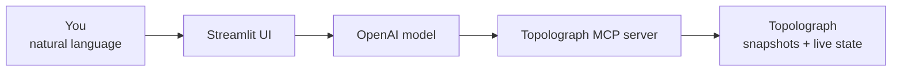

# AI Agent

The **OSPF & IS-IS AI Agent** is a natural-language assistant for your IGP. It
talks to real OSPF/IS-IS domains — pulling from Topolograph snapshots or live
[Watcher](../monitoring/index.md) state through the [MCP server](mcp-server.md) —
and answers questions in plain English through a Streamlit web UI.

[:simple-github: vadims06/ospf-isis-ai-agent](https://github.com/Vadims06/ospf-isis-ai-agent){ .md-button }
[:material-youtube: Demo video](https://youtu.be/92YBRXqZWUo){ .md-button }


## What you can ask

- *Which graphs are currently connected?*
- *What nodes are in the latest OSPF area 0 graph?*
- *Which networks are assigned to a specific host?*
- *What is the route between two IP addresses?*
- *What happened to the links after the topology changed?*


## How it fits together



The agent uses the [MCP server](mcp-server.md) as its bridge to Topolograph, so it
can answer with grounded, real network data rather than guesses.

## Quick start (Docker)

!!! info "Prerequisites"
    An **OpenAI API key** (the demo costs well under \$1). A local LLM option via
    vLLM is in development.

Because the current setup uses public OpenAI models, a **local** MCP endpoint must
be reachable from OpenAI — so you expose it with a tunnel.

=== "Cloudflare Tunnel"

    ```bash
    docker-compose --profile cloudflare up --build
    ```

    Watch the logs for a public URL like
    `https://your-tunnel-url.trycloudflare.com`.

=== "ngrok"

    ```bash
    ngrok http 8080   # Topolograph's MCP server (published via Nginx on 8080)
    ```

Then point the agent at the tunnel in `.env`:

```bash
MCP_SERVER_URL=https://your-tunnel-url.trycloudflare.com
```

Start it and open the UI:

```bash
docker-compose up --build
# http://localhost:8501
```

## Reproduce the demo

```bash
# 1. Topolograph + an OSPF lab
git clone https://github.com/Vadims06/topolograph-docker
cd topolograph-docker
sudo ./install.sh

# 2. The assistant (from this repo)
docker-compose up --build
```

## Local development

```bash
cp .env.template .env   # then edit
pip install -r requirements.txt
streamlit run app.py
```

---

**Related:** [MCP Server](mcp-server.md) · [Python SDK](python-sdk.md) ·
[Real-time monitoring](../monitoring/index.md)
