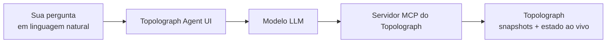

# Agente de IA

O **OSPF & IS-IS AI Agent** é um assistente em linguagem natural para o seu
IGP. Ele se comunica com domínios OSPF/IS-IS reais — usando snapshots do
Topolograph ou o estado ao vivo do [Watcher](../monitoring/index.md) através do
[servidor MCP](mcp-server.md) — e responde perguntas em linguagem natural por
meio de uma interface web.

[:simple-github: vadims06/ospf-isis-ai-agent](https://github.com/Vadims06/ospf-isis-ai-agent){ .md-button }
[:material-youtube: Vídeo de demonstração](https://youtu.be/92YBRXqZWUo){ .md-button }


!!! tip "Experimente o agente hospedado"
    Há uma instância pública em
    **[agent.topolograph.com](https://agent.topolograph.com)** — você pode
    fazer perguntas imediatamente. Ela roda no modelo próprio do Topolograph
    hospedado em GPU (um LLM baseado em **Qwen**), portanto não é preciso uma
    chave da OpenAI ali.

## O que você pode perguntar

- *Quais grafos estão conectados no momento?*
- *Quais nós estão no grafo mais recente da área 0 do OSPF?*
- *Quais redes estão atribuídas a um host específico?*
- *Qual é a rota entre dois endereços IP?*
- *O que aconteceu com os enlaces depois que a topologia mudou?*


## Como as peças se encaixam



O agente usa o [servidor MCP](mcp-server.md) como ponte para o Topolograph, de
forma que ele pode responder com dados reais e fundamentados da rede, em vez
de suposições.

## Início rápido (Docker)

!!! info "Pré-requisitos"
    Uma **chave de API da OpenAI** (a demonstração custa bem menos de \$1). Uma
    opção de LLM local via vLLM está em desenvolvimento.

Como a configuração atual usa modelos públicos da OpenAI, um endpoint MCP
**local** precisa estar acessível pela OpenAI — por isso você o expõe com um
túnel.

=== "Cloudflare Tunnel"

    ```bash
    docker-compose --profile cloudflare up --build
    ```

    Observe os logs em busca de uma URL pública como
    `https://your-tunnel-url.trycloudflare.com`.

=== "ngrok"

    ```bash
    ngrok http 8080   # Topolograph's MCP server (published via Nginx on 8080)
    ```

Depois, aponte o agente para o túnel no `.env`:

```bash
MCP_SERVER_URL=https://your-tunnel-url.trycloudflare.com
```

Inicie e abra a interface:

```bash
docker-compose up --build
# http://localhost:8501
```

## Reproduzindo a demonstração

```bash
# 1. Topolograph + an OSPF lab
git clone https://github.com/Vadims06/topolograph-docker
cd topolograph-docker
sudo ./install.sh

# 2. The assistant (from this repo)
docker-compose up --build
```

## Desenvolvimento local

```bash
cp .env.template .env   # then edit
pip install -r requirements.txt
streamlit run app.py
```

---

**Relacionado:** [Servidor MCP](mcp-server.md) · [SDK em Python](python-sdk.md) ·
[Monitoramento em tempo real](../monitoring/index.md)
