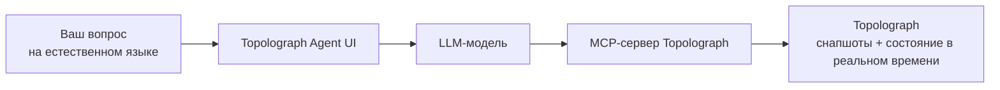

# AI Agent

**OSPF & IS-IS AI Agent** - это сетевой ассистент на естественном языке для
вашей сети. Он работает с реальными доменами OSPF/IS-IS - используя снапшоты
Topolograph или состояние [Watcher](../monitoring/index.md) в реальном
времени через [MCP-сервер](mcp-server.md) - и отвечает на вопросы на
естественном языке через веб-интерфейс.

[:simple-github: vadims06/ospf-isis-ai-agent](https://github.com/Vadims06/ospf-isis-ai-agent){ .md-button }
[:material-youtube: Демо-видео](https://youtu.be/92YBRXqZWUo){ .md-button }


!!! tip "Попробуйте размещённого агента"
    Публичный экземпляр работает на
    **[agent.topolograph.com](https://agent.topolograph.com)** - можно сразу
    задавать вопросы. Он использует собственную модель Topolograph на GPU
    (LLM на базе **Qwen**), поэтому ключ OpenAI там не нужен.

## Что можно спросить

- *Какие графы сейчас связны?*
- *Какие узлы есть в последнем графе OSPF area 0?*
- *Какие сети назначены определённому хосту?*
- *Какой маршрут между двумя IP-адресами?*
- *Что произошло с линками после изменения топологии?*


## Как это работает вместе



Агент использует [MCP-сервер](mcp-server.md) как мост к Topolograph, поэтому
отвечает на основе реальных данных сети, а не предположений.

## Быстрый старт (Docker)

!!! info "Требования"
    **Ключ OpenAI API** (демо стоит гораздо меньше \$1). Локальный вариант на
    базе vLLM находится в разработке.

Поскольку текущая настройка использует публичные модели OpenAI,
**локальный** эндпоинт MCP должен быть доступен со стороны OpenAI - поэтому
вы открываете его наружу через туннель.

=== "Cloudflare Tunnel"

    ```bash
    docker-compose --profile cloudflare up --build
    ```

    Смотрите в логах публичный URL вида
    `https://your-tunnel-url.trycloudflare.com`.

=== "ngrok"

    ```bash
    ngrok http 8080   # Topolograph's MCP server (published via Nginx on 8080)
    ```

Затем укажите агенту адрес туннеля в `.env`:

```bash
MCP_SERVER_URL=https://your-tunnel-url.trycloudflare.com
```

Запустите его и откройте интерфейс:

```bash
docker-compose up --build
# http://localhost:8501
```

## Повторить демо

```bash
# 1. Topolograph + an OSPF lab
git clone https://github.com/Vadims06/topolograph-docker
cd topolograph-docker
sudo ./install.sh

# 2. The assistant (from this repo)
docker-compose up --build
```

## Локальная разработка

```bash
cp .env.template .env   # then edit
pip install -r requirements.txt
streamlit run app.py
```

---

**См. также:** [MCP Server](mcp-server.md) · [Python SDK](python-sdk.md) ·
[Мониторинг в реальном времени](../monitoring/index.md)
