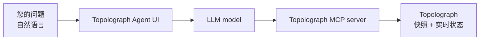

# AI Agent

**OSPF & IS-IS AI Agent** 是面向您的 IGP 的自然语言助手。它与真实的
OSPF/IS-IS 域对话——通过 [MCP server](mcp-server.md) 从 Topolograph 快照或
实时的 [Watcher](../monitoring/index.md) 状态中获取数据——并通过 Web UI
用通俗易懂的语言回答问题。

[:simple-github: vadims06/ospf-isis-ai-agent](https://github.com/Vadims06/ospf-isis-ai-agent){ .md-button }
[:material-youtube: 演示视频](https://youtu.be/92YBRXqZWUo){ .md-button }


!!! tip "试用托管代理"
    公共实例运行在
    **[agent.topolograph.com](https://agent.topolograph.com)**——可以直接向它提问。它使用
    Topolograph 自有的 GPU 托管模型（基于 **Qwen** 的 LLM），因此无需 OpenAI 密钥。

## 您可以问什么

- *当前哪些图是连通的？*
- *最新的 OSPF 区域 0 图中有哪些节点？*
- *哪些网络被分配给了某台特定的主机？*
- *两个 IP 地址之间的路由是什么？*
- *拓扑变化之后，链路发生了什么？*


## 各部分如何协同工作



该代理使用 [MCP server](mcp-server.md) 作为通往 Topolograph 的桥梁，因此它
能够基于真实的网络数据给出有依据的回答，而不是凭空猜测。

## 快速开始（Docker）

!!! info "前置条件"
    一个 **OpenAI API key**（演示成本远低于 1 美元）。基于 vLLM 的本地 LLM
    选项正在开发中。

由于当前的搭建使用的是公共 OpenAI 模型，**本地** MCP 端点必须能够被
OpenAI 访问——因此您需要通过隧道将其暴露出去。

=== "Cloudflare Tunnel"

    ```bash
    docker-compose --profile cloudflare up --build
    ```

    留意日志中出现的公网 URL，格式类似
    `https://your-tunnel-url.trycloudflare.com`。

=== "ngrok"

    ```bash
    ngrok http 8080   # Topolograph's MCP server (published via Nginx on 8080)
    ```

然后在 `.env` 中将该代理指向这个隧道：

```bash
MCP_SERVER_URL=https://your-tunnel-url.trycloudflare.com
```

启动它并打开 UI：

```bash
docker-compose up --build
# http://localhost:8501
```

## 重现该演示

```bash
# 1. Topolograph + an OSPF lab
git clone https://github.com/Vadims06/topolograph-docker
cd topolograph-docker
sudo ./install.sh

# 2. The assistant (from this repo)
docker-compose up --build
```

## 本地开发

```bash
cp .env.template .env   # then edit
pip install -r requirements.txt
streamlit run app.py
```

---

**相关内容：** [MCP Server](mcp-server.md) · [Python SDK](python-sdk.md) ·
[实时监控](../monitoring/index.md)
