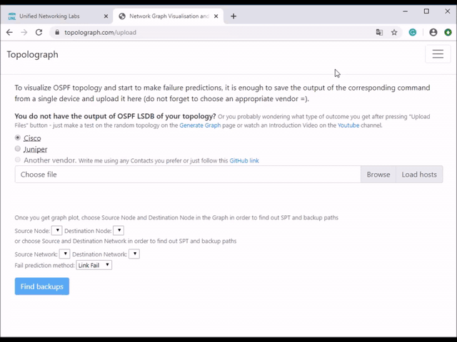
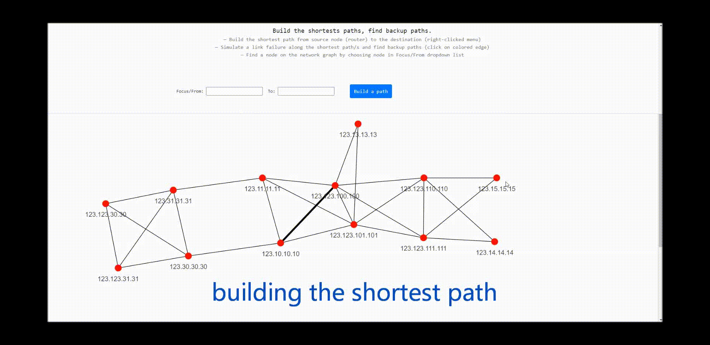

# Your First Topology

This walkthrough takes you from a freshly-running Topolograph to your first
analyzed graph using the simplest input: a **text file** copied from one router.

!!! info "You'll need"
    - A running Topolograph instance ([install with Docker](quickstart-docker.md)).
    - Access to **one** router in the OSPF or IS-IS area you want to map.

## 1. Grab the LSDB from one device

Because the whole area shares one database, you only need to collect it from a
single router. Pick the command for your platform — the full matrix is on the
[Supported Vendors](../reference/supported-vendors.md) page. For example:

=== "Cisco (OSPF)"

    ```
    show ip ospf database router
    show ip ospf database network
    show ip ospf database external
    ```

=== "Juniper (OSPF)"

    ```
    show ospf database router extensive | no-more
    show ospf database network extensive | no-more
    show ospf database external extensive | no-more
    ```

=== "FRRouting (OSPF)"

    ```
    show ip ospf database router
    show ip ospf database network
    show ip ospf database external
    ```

=== "Cisco (IS-IS)"

    ```
    show isis database detail
    ```

Save the output to a plain text file. You can paste the LSA 1 / 2 / 5 sections
into one file.

!!! tip "Richer links (optional)"
    For FRRouting OSPF, append the output of
    `show ip ospf database opaque-area` to the same file to pull in bandwidth,
    TE metric and admin-group data. This is optional — the graph still builds
    from LSA 1/2/5 alone. See [Traffic Engineering](../analysis/traffic-engineering.md).

## 2. Upload it

1. Open Topolograph at `http://localhost:8080/`.
2. Choose to upload a topology and paste (or upload) your text file.
3. Pick the **vendor** and **protocol** that match your capture.
4. Submit — Topolograph parses the LSDB and renders the graph.



The result is a **snapshot**: a frozen picture of the network state at the moment
you captured the database. Every analysis you run happens against this snapshot,
so nothing you do here can affect the live network.

## 3. Build a shortest path

With the graph on screen, pick a source and destination node and build the
shortest path between them. Topolograph highlights the path and shows its total
cost.



From here you can immediately:

- Reveal the **backup path** the network would use if the primary failed.
- **Shut a link or node** and watch traffic re-route.
- Open the **Network Heatmap** to find your busiest and least-protected links.

All of these are covered in [Analysis & Visualization](../analysis/index.md).

## 4. Where to go next

<div class="grid cards" markdown>

-   :material-transit-connection-variant:{ .lg .middle } __Stream it live__

    ---

    Tired of copy-pasting? Have a Watcher feed topology automatically over GRE
    or BGP-LS.

    [:octicons-arrow-right-24: Getting topology in](../ingestion/index.md)

-   :material-vector-polyline:{ .lg .middle } __Go deeper on analysis__

    ---

    Backup paths, ECMP, failure simulation, cost planning, and the heatmap.

    [:octicons-arrow-right-24: Analysis & visualization](../analysis/index.md)

-   :material-radar:{ .lg .middle } __Monitor continuously__

    ---

    Capture every adjacency and cost change and ship it to ELK, Zabbix or Slack.

    [:octicons-arrow-right-24: Real-time monitoring](../monitoring/index.md)

-   :material-console:{ .lg .middle } __Automate it__

    ---

    Collect and upload LSDBs with the `topo` CLI and Python SDK.

    [:octicons-arrow-right-24: Python SDK](../automation/python-sdk.md)

</div>
