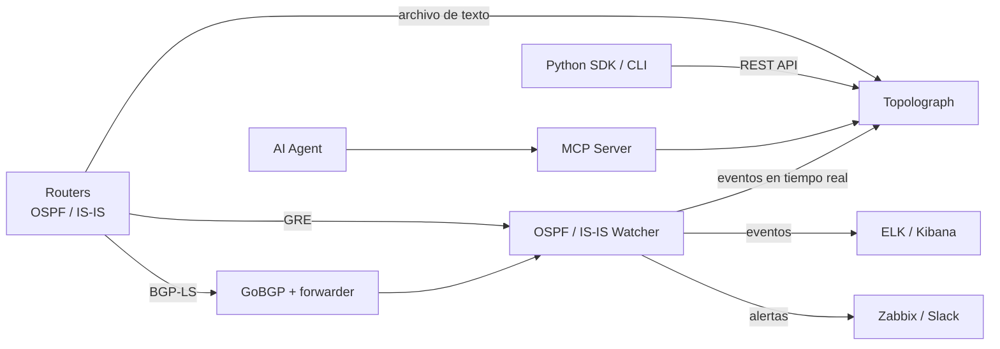

# ¿Qué es Topolograph?

**Topolograph** es una herramienta web para visualizar y analizar topologías
de red **OSPF** e **IS-IS** — sin conexión, autoalojada y sin necesidad de
inicios de sesión ni contraseñas.

Como OSPF e IS-IS son protocolos de *estado de enlace*, cada router de un área
mantiene una copia idéntica de la base de datos de estado de enlace (LSDB) de
esa área. Esto significa que Topolograph puede reconstruir **toda** la
topología a partir de la LSDB de un *único* dispositivo. Proporciónele esa
base de datos — como archivo de texto o como flujo en vivo — y construirá un
grafo interactivo de su red exactamente como la ve el protocolo.

## Por qué usarlo

Un IGP en funcionamiento lo sabe todo sobre su topología, pero ese
conocimiento es difícil de *ver* e imposible de *probar* en la red en
producción. Topolograph convierte la LSDB en algo que puede explorar y poner
a prueba:

- **Visualice** la topología OSPF/IS-IS como un grafo interactivo.
- **Construya rutas más cortas** entre dos nodos cualesquiera — y descubra las
  **rutas de respaldo** (incluidos los respaldos secundarios) que usaría la
  red.
- **Simule fallos** — apague un enlace o un router y observe cómo se redirige
  el tráfico, antes de tocar la producción.
- **Planifique los costos de enlace** — cambie las métricas del IGP al
  instante y vea el efecto en la selección de rutas.
- **Encuentre puntos débiles** — identifique los nodos y enlaces más cargados,
  los puntos únicos de fallo y las redes sin ruta de respaldo.
- **Compare instantáneas** — tome una instantánea de la topología, haga un
  cambio (por ejemplo, una redistribución mediante route-map), suba el nuevo
  estado y vea exactamente qué cambió.
- **Detecte enrutamiento asimétrico** entre cualquier par de extremos.
- **Monitoree en tiempo real** — reciba los cambios de la red en vivo y
  reciba alertas sobre ellos.

Todo esto ocurre sobre **su** instantánea de la topología, así que los
experimentos nunca afectan a la red en producción.

## Cómo entra una topología

Topolograph acepta los mismos datos de estado de enlace de tres formas
distintas. Consulte el panorama completo en
[Cómo obtener la topología](../ingestion/index.md):

| Método | Cómo funciona | Ideal para |
| --- | --- | --- |
| [Archivo de texto](../ingestion/text-file.md) | Pegue/suba la salida de `show ... database` de un router | Auditorías, análisis puntuales, planificación sin conexión |
| [Sesión GRE](../ingestion/gre.md) | Un Watcher forma una adyacencia GRE y reenvía LSAs/LSPs en vivo | Monitoreo continuo de una red existente |
| [Sesión BGP-LS](../ingestion/bgp-ls.md) | El estado de enlace se transporta de forma nativa por BGP-LS mediante GoBGP | Redes modernas, sin túnel, múltiples áreas/niveles |

También puede enviar la topología de forma programática mediante la
[API REST y el SDK de Python](../automation/python-sdk.md).

## La suite de Topolograph

Topolograph es la pieza central de una pequeña familia de componentes que
comparten el mismo modelo de datos:

| Componente | Función |
| --- | --- |
| **Topolograph** | La aplicación web — visualización, análisis de rutas, simulación de fallos, comparación, panel en tiempo real. |
| **OSPF Watcher** | Agente en contenedor que monitorea los cambios de OSPF en vivo (GRE o BGP-LS) y exporta eventos. |
| **IS-IS Watcher** | La misma idea para IS-IS, incluidos los niveles L1/L2 e IPv6. |
| **Python SDK** | Cliente REST orientado a objetos, recolector de LSDB por SSH (basado en Nornir) y la CLI `topo`. |
| **MCP Server** | Expone la API de Topolograph a agentes LLM mediante Model Context Protocol. |
| **AI Agent** | Un asistente en lenguaje natural que responde preguntas sobre su IGP. |

## Lo que Topolograph *no* es

- **No** es un demonio de enrutamiento — nunca inyecta rutas ni interactúa
  con el plano de reenvío. Los Watchers son oyentes *pasivos*.
- **No** es un reemplazo de NMS — se enfoca específicamente en la topología
  de IGP de estado de enlace y su análisis.
- **No** requiere credenciales de sus dispositivos para *analizar* una
  topología — un archivo de texto es suficiente. (Las credenciales solo son
  necesarias si deja que el SDK recolecte LSDBs por SSH por usted.)

---

**Siguiente:** [Inicio Rápido con Docker →](quickstart-docker.md)
