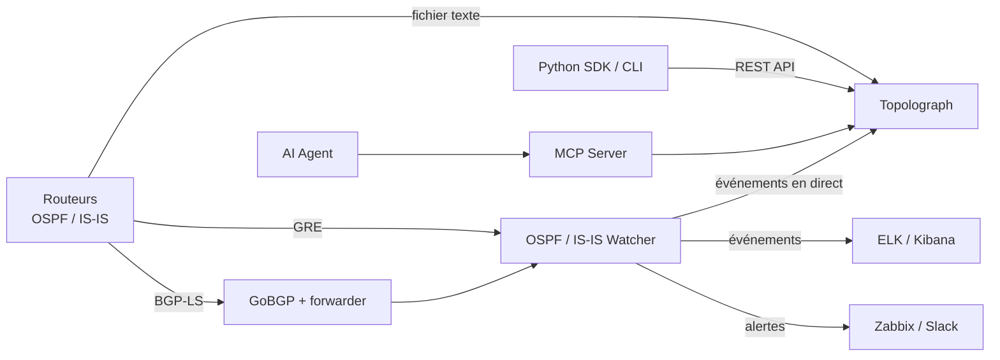

# Qu'est-ce que Topolograph ?

**Topolograph** est un outil web pour visualiser et analyser les topologies
de réseau **OSPF** et **IS-IS** — hors ligne, auto-hébergé, et sans
identifiants ni mots de passe requis.

Comme OSPF et IS-IS sont des protocoles à *état de liens*, chaque routeur
d'une zone conserve une copie identique de la base de données d'état de
liens (LSDB) de la zone. Cela signifie que Topolograph peut reconstruire
**toute** la topologie à partir de la LSDB d'un *seul* équipement.
Fournissez-lui cette base — sous forme de fichier texte ou de flux en direct
— et il construira un graphe interactif de votre réseau exactement tel que
le protocole le voit.

## Pourquoi l'utiliser

Un IGP en fonctionnement connaît tout de votre topologie, mais cette
connaissance est difficile à *voir* et impossible à *tester* sur le réseau
en production. Topolograph transforme la LSDB en quelque chose que vous
pouvez explorer et éprouver :

- **Visualisez** la topologie OSPF/IS-IS sous forme de graphe interactif.
- **Construisez des chemins les plus courts** entre deux nœuds quelconques
  — et découvrez les **chemins de secours** (y compris les secours
  secondaires) que le réseau utiliserait.
- **Simulez des pannes** — coupez un lien ou un routeur et observez comment
  le trafic se réachemine, avant de toucher à la production.
- **Planifiez les coûts de liens** — modifiez les métriques IGP à la volée
  et observez l'effet sur le choix des chemins.
- **Repérez les points faibles** — identifiez les nœuds et les liens les
  plus chargés, les points de défaillance uniques et les réseaux sans
  chemin de secours.
- **Comparez des instantanés** — prenez un instantané de la topologie,
  effectuez un changement (par exemple une redistribution via route-map),
  importez le nouvel état et voyez exactement ce qui a changé.
- **Détectez le routage asymétrique** entre n'importe quelle paire de
  points d'extrémité.
- **Surveillez en temps réel** — recevez les changements du réseau en
  direct et soyez alerté à leur sujet.

Tout cela se produit sur **votre** instantané de la topologie, si bien que
les expérimentations n'affectent jamais le réseau de production.

## Comment une topologie est importée

Topolograph accepte les mêmes données d'état de liens de trois façons
différentes. Consultez la vue d'ensemble dans
[Importer une topologie](../ingestion/index.md) :

| Méthode | Fonctionnement | Idéal pour |
| --- | --- | --- |
| [Fichier texte](../ingestion/text-file.md) | Collez/importez la sortie `show ... database` d'un routeur | Audits, analyses ponctuelles, planification hors ligne |
| [Session GRE](../ingestion/gre.md) | Un Watcher forme une adjacence GRE et transmet les LSA/LSP en direct | Surveillance continue d'un réseau existant |
| [Session BGP-LS](../ingestion/bgp-ls.md) | L'état de liens est transporté nativement via BGP-LS grâce à GoBGP | Réseaux modernes, sans tunnel, multi-zones/niveaux |

Vous pouvez aussi transmettre la topologie de manière programmatique via
l'[API REST et le SDK Python](../automation/python-sdk.md).

## La suite Topolograph

Topolograph est l'élément central d'une petite famille de composants qui
partagent le même modèle de données :

| Composant | Rôle |
| --- | --- |
| **Topolograph** | L'application web — visualisation, analyse de chemins, simulation de pannes, comparaison, tableau de bord en temps réel. |
| **OSPF Watcher** | Agent conteneurisé qui surveille les changements OSPF en direct (GRE ou BGP-LS) et exporte les événements. |
| **IS-IS Watcher** | Le même principe pour IS-IS, y compris les niveaux L1/L2 et IPv6. |
| **Python SDK** | Client REST orienté objet, collecteur de LSDB par SSH (basé sur Nornir), et la CLI `topo`. |
| **MCP Server** | Expose l'API Topolograph aux agents LLM via le Model Context Protocol. |
| **AI Agent** | Un assistant en langage naturel qui répond aux questions sur votre IGP. |

## Ce que Topolograph n'est *pas*

- Ce n'**est pas** un démon de routage — il n'injecte jamais de routes et
  n'interagit pas avec le plan de transfert. Les Watchers sont des
  observateurs *passifs*.
- Ce n'**est pas** un remplaçant de NMS — il se concentre spécifiquement sur
  la topologie IGP à état de liens et son analyse.
- Il **ne** nécessite **pas** d'identifiants sur vos équipements pour
  *analyser* une topologie — un fichier texte suffit. (Des identifiants ne
  sont nécessaires que si vous laissez le SDK collecter les LSDB par SSH
  pour vous.)

---

**Suivant :** [Démarrage rapide avec Docker →](quickstart-docker.md)
