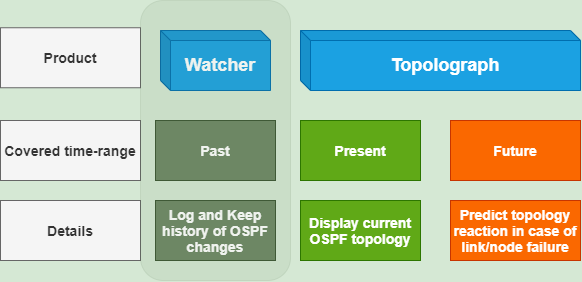
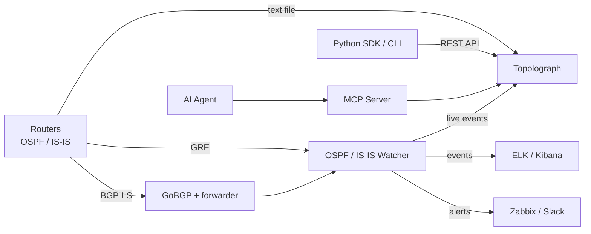

# What is Topolograph?

**Topolograph** is a web-based tool for visualizing and analyzing **OSPF** and
**IS-IS** network topologies — offline, self-hosted, and with no logins or
passwords required.

Because OSPF and IS-IS are *link-state* protocols, every router in an area holds
an identical copy of the area's Link-State Database (LSDB). That means
Topolograph can reconstruct the **entire** topology from the LSDB of a *single*
device. Feed it that database — as a text file, or as a live feed — and it
builds an interactive graph of your network exactly as the protocol sees it.

## Why use it

A running IGP knows everything about your topology, but that knowledge is hard to
*see* and impossible to *experiment* with on the live network. Topolograph turns
the LSDB into something you can explore and test:

- **Visualize** the OSPF/IS-IS topology as an interactive graph.
- **Build shortest paths** between any two nodes — and discover the **backup
  paths** (including secondary backups) the network would use.
- **Simulate failures** — shut a link or a router and watch how traffic
  re-routes, before you touch production.
- **Plan link costs** — change IGP metrics on the fly and see the effect on
  path selection.
- **Find weak spots** — identify the most loaded nodes and links, single points
  of failure, and networks that have no backup path.
- **Compare snapshots** — take a topology snapshot, make a change (e.g. a
  route-map redistribution), upload the new state, and see exactly what changed.
- **Detect asymmetric routing** between any pair of endpoints.
- **Monitor in real time** — stream live changes from the network and alert on
  them.

All of this happens on **your** snapshot of the topology, so experiments never
affect the production network.

## How a topology gets in

Topolograph accepts the same link-state data three different ways. See
[Getting Topology In](../ingestion/index.md) for the full picture:

| Method | How it works | Best for |
| --- | --- | --- |
| [Text file](../ingestion/text-file.md) | Paste/upload `show ... database` output from one router | Audits, one-off analysis, offline planning |
| [GRE session](../ingestion/gre.md) | A Watcher forms a GRE adjacency and forwards live LSAs/LSPs | Continuous monitoring of an existing network |
| [BGP-LS session](../ingestion/bgp-ls.md) | Link-state is carried natively over BGP-LS via GoBGP | Modern networks, no tunnel, multi-area/level |

You can also push topology programmatically through the
[REST API and Python SDK](../automation/python-sdk.md).

## The Topolograph suite

Topolograph is the centerpiece of a small family of components that share the
same data model:

| Component | Role |
| --- | --- |
| **Topolograph** | The web application — visualization, path analysis, failure simulation, comparison, real-time dashboard. |
| **OSPF Watcher** | Containerized agent that monitors live OSPF changes (GRE or BGP-LS) and exports events. |
| **IS-IS Watcher** | The same idea for IS-IS, including L1/L2 levels and IPv6. |
| **Python SDK** | Object-oriented REST client, SSH-based LSDB collector (Nornir), and the `topo` CLI. |
| **MCP Server** | Exposes the Topolograph API to LLM agents via the Model Context Protocol. |
| **AI Agent** | A natural-language assistant that answers questions about your IGP. |

## What Topolograph is *not*

- It is **not** a routing daemon — it never injects routes or talks to the
  forwarding plane. Watchers are *passive* listeners.
- It is **not** a NMS replacement — it focuses specifically on link-state IGP
  topology and its analysis.
- It does **not** require credentials to your devices to *analyze* a topology —
  a text file is enough. (Credentials are only needed if you let the SDK
  collect LSDBs over SSH for you.)

---

**Next:** [Quick Start with Docker →](quickstart-docker.md)
