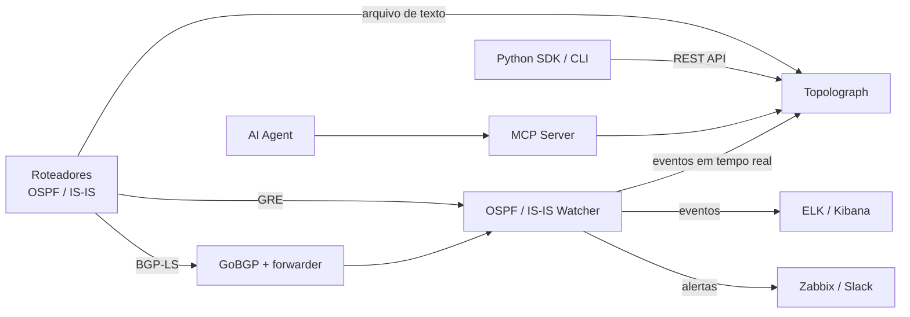

# O que é o Topolograph?

O **Topolograph** é uma ferramenta baseada na web para visualizar e analisar
topologias de rede **OSPF** e **IS-IS** — offline, auto-hospedada e sem
necessidade de logins ou senhas.

Como o OSPF e o IS-IS são protocolos de *estado de enlace*, cada roteador em
uma área mantém uma cópia idêntica do banco de dados de estado de enlace
(LSDB) da área. Isso significa que o Topolograph pode reconstruir **toda** a
topologia a partir da LSDB de um *único* dispositivo. Forneça a ele esse banco
de dados — como arquivo de texto ou como um fluxo ao vivo — e ele constrói um
grafo interativo da sua rede exatamente como o protocolo a vê.

## Por que usá-lo

Um IGP em execução sabe tudo sobre a sua topologia, mas esse conhecimento é
difícil de *ver* e impossível de *testar* na rede em produção. O Topolograph
transforma a LSDB em algo que você pode explorar e testar:

- **Visualize** a topologia OSPF/IS-IS como um grafo interativo.
- **Construa caminhos mais curtos** entre quaisquer dois nós — e descubra os
  **caminhos de backup** (incluindo backups secundários) que a rede usaria.
- **Simule falhas** — desligue um enlace ou um roteador e veja como o tráfego
  é redirecionado, antes de tocar na produção.
- **Planeje custos de enlace** — altere as métricas do IGP em tempo real e
  veja o efeito na escolha de caminhos.
- **Encontre pontos fracos** — identifique os nós e enlaces mais carregados,
  pontos únicos de falha e redes sem caminho de backup.
- **Compare snapshots** — capture um snapshot da topologia, faça uma mudança
  (por exemplo, uma redistribuição via route-map), envie o novo estado e veja
  exatamente o que mudou.
- **Detecte roteamento assimétrico** entre qualquer par de endpoints.
- **Monitore em tempo real** — receba mudanças da rede ao vivo e seja
  alertado sobre elas.

Tudo isso acontece no **seu** snapshot da topologia, então os experimentos
nunca afetam a rede em produção.

## Como uma topologia entra no sistema

O Topolograph aceita os mesmos dados de estado de enlace de três formas
diferentes. Veja o panorama completo em
[Obtendo a topologia](../ingestion/index.md):

| Método | Como funciona | Melhor para |
| --- | --- | --- |
| [Arquivo de texto](../ingestion/text-file.md) | Cole/envie a saída de `show ... database` de um roteador | Auditorias, análises pontuais, planejamento offline |
| [Sessão GRE](../ingestion/gre.md) | Um Watcher forma uma adjacência GRE e encaminha LSAs/LSPs ao vivo | Monitoramento contínuo de uma rede existente |
| [Sessão BGP-LS](../ingestion/bgp-ls.md) | O estado de enlace é transportado nativamente via BGP-LS usando o GoBGP | Redes modernas, sem túnel, múltiplas áreas/níveis |

Você também pode enviar topologia de forma programática pela
[API REST e o Python SDK](../automation/python-sdk.md).

## O conjunto de produtos Topolograph

O Topolograph é a peça central de uma pequena família de componentes que
compartilham o mesmo modelo de dados:

| Componente | Função |
| --- | --- |
| **Topolograph** | O aplicativo web — visualização, análise de caminhos, simulação de falhas, comparação, painel em tempo real. |
| **OSPF Watcher** | Agente containerizado que monitora mudanças OSPF ao vivo (GRE ou BGP-LS) e exporta eventos. |
| **IS-IS Watcher** | A mesma ideia para o IS-IS, incluindo os níveis L1/L2 e IPv6. |
| **Python SDK** | Cliente REST orientado a objetos, coletor de LSDB via SSH (baseado em Nornir) e a CLI `topo`. |
| **MCP Server** | Expõe a API do Topolograph a agentes de LLM via Model Context Protocol. |
| **AI Agent** | Um assistente em linguagem natural que responde a perguntas sobre o seu IGP. |

## O que o Topolograph *não* é

- **Não** é um daemon de roteamento — ele nunca injeta rotas nem interage com
  o plano de encaminhamento. Os Watchers são ouvintes *passivos*.
- **Não** é um substituto de NMS — ele foca especificamente na topologia de
  IGP link-state e em sua análise.
- **Não** exige credenciais dos seus dispositivos para *analisar* uma
  topologia — um arquivo de texto já é suficiente. (Credenciais só são
  necessárias se você deixar o SDK coletar LSDBs via SSH para você.)

---

**Próximo:** [Início Rápido com Docker →](quickstart-docker.md)
