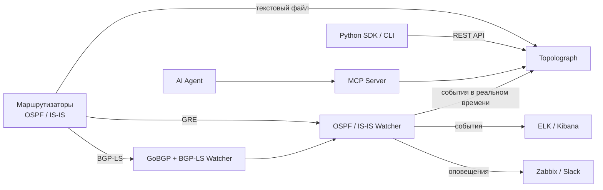

# Что такое Topolograph?

**Topolograph** - это веб-инструмент для визуализации и анализа топологий сетей
**OSPF** и **IS-IS**: офлайн, с локальным развёртыванием, без обращения к сети
и без логинов и паролей.

Поскольку OSPF и IS-IS - это протоколы link-state, каждый маршрутизатор в
области хранит идентичную копию LSDB области. Это значит, что Topolograph может
восстановить **всю** топологию по LSDB *одного* устройства. Передайте ему эту
базу - в виде текстового файла или в виде потока в реальном времени - и он
построит интерактивный граф вашей сети именно таким, каким его видит протокол.

## Зачем это нужно

Работающий IGP знает всё о вашей топологии, но эти знания сложно *увидеть* и
невозможно *проверить экспериментом* на живой сети. Topolograph превращает
LSDB в то, что можно исследовать и тестировать:

- **Визуализируйте** топологию OSPF/IS-IS как интерактивный граф.
- **Стройте кратчайшие пути** между любыми двумя узлами - и находите
  **резервные пути** (включая вторичные резервы), которые использовала бы сеть.
- **Моделируйте отказы** - выключите линк или маршрутизатор и посмотрите, как
  перестроится трафик, до того как изменения попадут в реальную сеть.
- **Планируйте метрики линков** - меняйте метрики IGP на лету и смотрите, как
  это влияет на выбор пути.
- **Находите слабые места** - определяйте самые нагруженные узлы и линки,
  единые точки отказа и сети без резервного пути.
- **Сравнивайте состояние сети в разные моменты времени** - сделайте снимок
  топологии, внесите изменение (например, редистрибуцию через route-map),
  загрузите новое состояние и посмотрите, что именно изменилось.
- **Обнаруживайте асимметричную маршрутизацию** между любой парой конечных точек.
- **Мониторьте в реальном времени** - получайте изменения из сети в реальном
  времени и получайте оповещения о них.

Всё это происходит на **вашем** снимке топологии, поэтому эксперименты никогда
не затрагивают реальную сеть.

## Как топология попадает в систему

Topolograph принимает одни и те же данные LSDB тремя разными способами.
Подробнее - в разделе [Получение топологии](../ingestion/index.md):

| Способ | Как это работает | Для чего подходит |
| --- | --- | --- |
| [Текстовый файл](../ingestion/text-file.md) | Вставьте/загрузите вывод `show ... database` с одного маршрутизатора | Аудиты, разовый анализ, офлайн-планирование |
| [Сессия GRE](../ingestion/gre.md) | Watcher устанавливает соседство по GRE и передаёт актуальные LSA/LSP | Непрерывный мониторинг существующей сети |
| [Сессия BGP-LS](../ingestion/bgp-ls.md) | LSDB передаётся нативно через BGP-LS с помощью GoBGP | Современные сети, без туннеля, несколько областей/уровней |

Вы также можете передавать топологию программно через
[REST API и Python SDK](../automation/python-sdk.md).

## Продукты Topolograph

Topolograph - центральный элемент небольшого семейства компонентов,
использующих одну и ту же модель данных:

| Компонент | Роль |
| --- | --- |
| **Topolograph** | Веб-приложение - визуализация, анализ путей, симуляция отказов, сравнение, дашборд в реальном времени. |
| **OSPF Watcher** | Контейнеризированный агент, который мониторит изменения OSPF в реальном времени (GRE или BGP-LS) и экспортирует события. |
| **IS-IS Watcher** | То же самое для IS-IS, включая уровни L1/L2 и IPv6. |
| **Python SDK** | Объектно-ориентированный REST-клиент, SSH-коллектор LSDB (на основе Nornir) и CLI `topo`. |
| **MCP Server** | Предоставляет API Topolograph LLM-агентам через Model Context Protocol. |
| **AI Agent** | Сетевой ассистент на естественном языке, который отвечает на вопросы о вашей сети (не только про IGP). |

## Чем Topolograph *не* является

- Это **не** маршрутизирующий демон - он никогда не добавляет маршруты и не
  участвует в передаче трафика (data plane). Watcher-ы - это *пассивные*
  наблюдатели.
- Это **не** замена NMS - инструмент сфокусирован именно на топологии
  link-state IGP и её анализе.
- Для *анализа* топологии учётные данные к устройствам **не** нужны -
  достаточно текстового файла. (Учётные данные нужны, только если вы
  разрешаете SDK собирать LSDB по SSH за вас.)

---

**Далее:** [Быстрый старт с Docker →](quickstart-docker.md)
