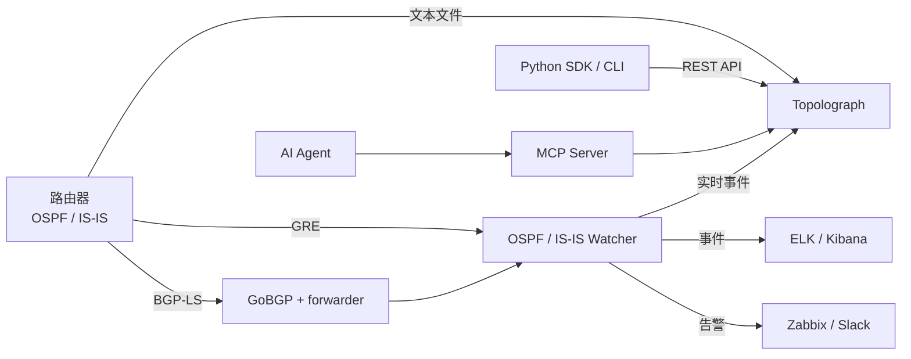

# 什么是 Topolograph？

**Topolograph** 是一款基于 Web 的工具，用于可视化和分析 **OSPF** 与 **IS-IS**
网络拓扑——离线运行、自托管，无需登录或密码。

由于 OSPF 和 IS-IS 都是*链路状态*协议，一个区域内的每台路由器都保存着该区域链路
状态数据库（LSDB）的完全相同的副本。这意味着 Topolograph 可以仅凭*单台*设备的
LSDB 重建**整个**拓扑。将该数据库提供给它——无论是文本文件还是实时数据流——
它都会构建出与协议所见完全一致的交互式网络图。

## 为什么要使用它

正在运行的 IGP 掌握着您拓扑的一切信息，但这些信息很难*看见*，也无法在生产
网络上进行*实验*。Topolograph 将 LSDB 转变为可以探索和测试的对象：

- **可视化** OSPF/IS-IS 拓扑，呈现为交互式图。
- **构建任意两个节点之间的最短路径**——并发现网络会使用的**备份路径**
  （包括次要备份）。
- **模拟故障**——关闭一条链路或一台路由器，观察流量如何重新路由，全程无需
  触碰生产网络。
- **规划链路开销**——实时修改 IGP 开销，查看其对路径选择的影响。
- **发现薄弱环节**——找出负载最高的节点和链路、单点故障，以及没有备份路径
  的网络。
- **比较快照**——为拓扑创建快照，进行一次变更（例如通过 route-map 重新
  分发路由），上传新状态，精确查看发生了哪些变化。
- **检测**任意一对端点之间的**非对称路由**。
- **实时监控**——从网络中获取实时变化并发出告警。

所有这些操作都基于**您自己的**拓扑快照，因此实验永远不会影响生产网络。

## 拓扑数据如何导入

Topolograph 以三种不同方式接受相同的链路状态数据。完整介绍请参阅
[获取拓扑数据](../ingestion/index.md)：

| 方式 | 工作原理 | 最适合场景 |
| --- | --- | --- |
| [文本文件](../ingestion/text-file.md) | 粘贴/上传一台路由器的 `show ... database` 输出 | 审计、临时分析、离线规划 |
| [GRE 会话](../ingestion/gre.md) | Watcher 建立 GRE 邻接并转发实时 LSA/LSP | 对现有网络进行持续监控 |
| [BGP-LS 会话](../ingestion/bgp-ls.md) | 通过 GoBGP 原生地在 BGP-LS 上承载链路状态 | 现代网络、无需隧道、多区域/多级别 |

您也可以通过 [REST API 与 Python SDK](../automation/python-sdk.md) 以编程方式
推送拓扑数据。

## Topolograph 产品套件

Topolograph 是一组共享同一数据模型的组件家族的核心：

| 组件 | 角色 |
| --- | --- |
| **Topolograph** | Web 应用程序——可视化、路径分析、故障模拟、比较、实时仪表盘。 |
| **OSPF Watcher** | 容器化代理，实时监控 OSPF 变化（GRE 或 BGP-LS）并导出事件。 |
| **IS-IS Watcher** | 面向 IS-IS 的同类工具，涵盖 L1/L2 级别和 IPv6。 |
| **Python SDK** | 面向对象的 REST 客户端、基于 SSH 的 LSDB 采集器（基于 Nornir），以及 `topo` CLI。 |
| **MCP Server** | 通过 Model Context Protocol 将 Topolograph API 暴露给 LLM 代理。 |
| **AI Agent** | 用自然语言回答您关于 IGP 问题的助手。 |

## Topolograph *不是*什么

- 它**不是**路由守护进程——它从不注入路由，也不与转发平面交互。Watcher 只
  是*被动*监听者。
- 它**不是** NMS 的替代品——它专注于链路状态 IGP 拓扑及其分析。
- *分析*拓扑**不需要**设备凭据——一个文本文件就足够了。（只有当您让 SDK
  通过 SSH 为您采集 LSDB 时，才需要凭据。）

---

**下一步：** [使用 Docker 快速开始 →](quickstart-docker.md)
