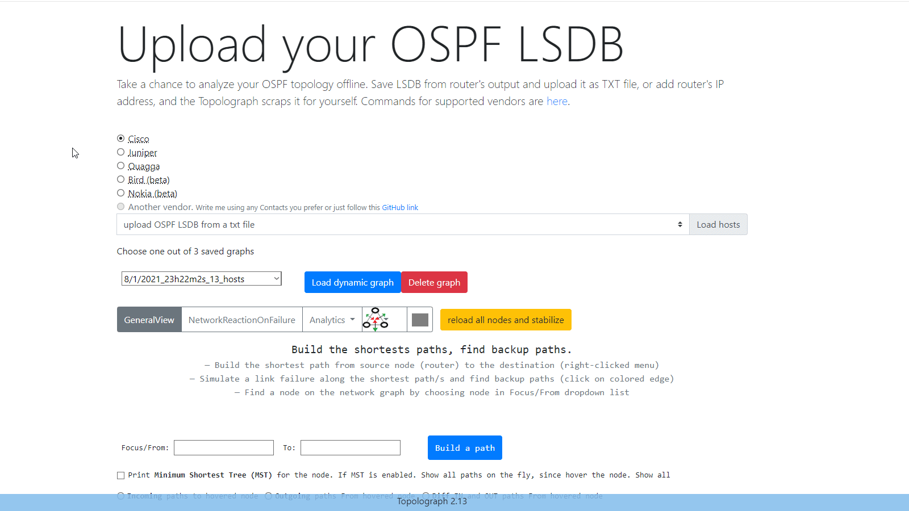

<h1 class="tg-hero__title">See your OSPF & IS-IS network the way the protocol does</h1>

Topolograph builds your OSPF/IS-IS topology from a single device's Link-State
Database — then lets you trace shortest and backup paths, simulate link and node
failures, plan link costs, and watch your IGP change in real time. Self-hosted,
offline, no logins or passwords required.

[Get started :material-rocket-launch:](getting-started/quickstart-docker.md){ .md-button .tg-cta }
[What is Topolograph? :material-help-circle-outline:](getting-started/what-is-topolograph.md){ .md-button }
[View on GitHub :fontawesome-brands-github:](https://github.com/Vadims06/topolograph){ .md-button }

Cisco Cisco NX-OS Juniper Nokia
Huawei FRRouting Arista MikroTik
Palo Alto Fortinet Extreme Bird
Ruckus Allied Telesis Ericsson Ubiquiti

---

## What you can do

-   :material-graph-outline:{ .lg .middle } __Visualize the topology__

    ---

    Upload an LSDB text file or stream it live, and get an interactive OSPF/IS-IS
    graph that reflects exactly what the routers see.

    [:octicons-arrow-right-24: Getting topology in](ingestion/index.md)

-   :material-vector-polyline:{ .lg .middle } __Build paths & backups__

    ---

    Compute shortest paths between any two nodes, then reveal primary and
    secondary backup paths and ECMP behavior.

    [:octicons-arrow-right-24: Analysis & visualization](analysis/visualizing.md)

-   :material-flash-alert:{ .lg .middle } __Simulate failures__

    ---

    Shut a link or a router and instantly see how traffic re-routes — before you
    touch the production network.

    [:octicons-arrow-right-24: Failure simulation](analysis/visualizing.md#simulating-failures)

-   :material-radar:{ .lg .middle } __Monitor in real time__

    ---

    Run OSPF Watcher or IS-IS Watcher to capture every adjacency, cost and
    network change, and ship events to ELK, Zabbix, or Slack.

    [:octicons-arrow-right-24: Real-time monitoring](monitoring/index.md)

-   :material-fire:{ .lg .middle } __Find weak spots__

    ---

    Use the Network Heatmap and analytics to spot the most loaded links, single
    points of failure, and networks without backup.

    [:octicons-arrow-right-24: Network heatmap](analysis/visualizing.md#network-heatmap)

-   :material-robot-happy-outline:{ .lg .middle } __Automate & ask in plain English__

    ---

    Drive everything through the Python SDK and CLI, the REST API, an MCP server,
    or a natural-language AI agent.

    [:octicons-arrow-right-24: Automation & APIs](automation/index.md)

## Three ways to feed your topology in

-   __:material-file-document-outline: Text file__

    Paste or upload the LSDB output from one router. Great for ad-hoc analysis,
    audits, and offline what-if planning.

    [:octicons-arrow-right-24: Text file upload](ingestion/text-file.md)

-   __:material-tunnel: GRE session__

    A Watcher peers with a router over a GRE adjacency and forwards live
    link-state changes into Topolograph.

    [:octicons-arrow-right-24: GRE session](ingestion/gre.md)

-   __:material-transit-connection-variant: BGP-LS session__

    Carry OSPF or IS-IS link-state natively over BGP-LS — no GRE tunnel — via
    GoBGP and the Watcher forwarder.

    [:octicons-arrow-right-24: BGP-LS session](ingestion/bgp-ls.md)

## The Topolograph suite

| Component | What it is | Docs |
| --- | --- | --- |
| **Topolograph** | The web app: visualize, analyze, simulate, compare | [Analysis & Visualization](analysis/index.md) |
| **OSPF Watcher** | Live OSPF change monitoring (GRE or BGP-LS) | [OSPF Watcher](monitoring/ospf-watcher.md) |
| **IS-IS Watcher** | Live IS-IS change monitoring (GRE or BGP-LS) | [IS-IS Watcher](monitoring/isis-watcher.md) |
| **Python SDK** | Object-oriented API client + SSH collector + `topo` CLI | [Python SDK](automation/python-sdk.md) |
| **MCP Server** | Model Context Protocol wrapper for LLM agents | [MCP Server](automation/mcp-server.md) |
| **AI Agent** | Natural-language assistant for your IGP | [AI Agent](automation/ai-agent.md) |

---

Ready to try it? <a href="getting-started/quickstart-docker.md"><strong>Spin up a local instance with Docker in a few minutes →</strong></a>

