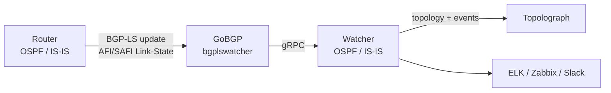

# Sesión BGP-LS

**BGP-LS** (BGP Link-State, [RFC 7752](https://datatracker.ietf.org/doc/html/rfc7752))
permite a un router exportar su base de datos de estado de enlace de OSPF o
IS-IS dentro de BGP. En **modo BGP-LS**, un Watcher recibe esas
actualizaciones y alimenta la topología hacia Topolograph **sin ningún túnel
GRE ni adyacencia de IGP** — lo que lo convierte en el método en vivo más
fácil de implementar, especialmente en múltiples áreas o niveles de IS-IS.

!!! note "Versiones mínimas"
    La ingesta por BGP-LS es compatible desde la imagen Docker
    **`vadims06/ospf-watcher:v3.1.0`** (y la imagen equivalente de IS-IS
    Watcher). Las imágenes anteriores son solo GRE.

## Cómo funciona



1. El **router** se configura para anunciar su topología OSPF/IS-IS mediante
   **BGP-LS**.
2. **GoBGP** — empaquetado como el componente `bgplswatcher` — establece la
   sesión BGP y recibe las actualizaciones de la familia de direcciones
   Link-State.
3. `bgplswatcher` reenvía esas actualizaciones al Watcher mediante **gRPC**.
4. El **Watcher** las procesa y publica la topología (y los eventos de
   cambio) en Topolograph.

Como no hay túnel GRE ni adyacencia OSPF/IS-IS que mantener, el modo BGP-LS
es más simple de implementar en entornos donde los túneles no son
prácticos, y una única sesión puede transportar la topología de todo el
dominio de IGP.

!!! info "¿Por qué un reenviador?"
    GoBGP maneja la mecánica de BGP y habla la familia de direcciones
    Link-State; `bgplswatcher` (Go) conecta GoBGP con el Watcher de Python
    mediante gRPC, de modo que se reutiliza el mismo flujo de eventos del
    Watcher tanto para el modo GRE como para el modo BGP-LS.

## 1. Configure BGP-LS en el router

Habilite la familia de direcciones **Link-State** de BGP y haga que BGP
distribuya la información de estado de enlace del IGP, luego establezca la
sesión con el host que ejecuta el GoBGP del Watcher. Las órdenes exactas
dependen del proveedor: consulte la documentación de su proveedor para la
configuración de la address family BGP-LS. Apunte el vecino BGP-LS al host del Watcher para
que GoBGP pueda recibir las actualizaciones.

## 2. Implemente el Watcher en modo BGP-LS

Use la variante BGP-LS del Watcher, que levanta el contenedor
`bgplswatcher` (GoBGP) junto con el Watcher. Los detalles de configuración y
los archivos compose están en los repositorios del Watcher:
[OSPF Watcher](https://github.com/Vadims06/ospfwatcher) ·
[IS-IS Watcher](https://github.com/Vadims06/isiswatcher).

## 3. Verifique la sesión BGP-LS { #3-verify-the-bgp-ls-session }

El Watcher publica la topología en Topolograph **después** de que la sesión
BGP se establece, así que empiece por confirmar la sesión y las rutas
Link-State.

Revise los registros del contenedor `bgplswatcher`:

```bash
docker logs watcher<num>-bgpls-ospf-bgplswatcher
```

Inspeccione la sesión con la CLI `gobgp` incluida:

```bash
# List BGP neighbors and session state
docker exec -it watcher<num>-bgpls-ospf-bgplswatcher gobgp neighbor

# Detailed status for one neighbor
docker exec -it watcher<num>-bgpls-ospf-bgplswatcher gobgp neighbor <neighbor-ip>

# Link-State routes received from a neighbor
docker exec -it watcher<num>-bgpls-ospf-bgplswatcher gobgp neighbor <neighbor-ip> adj-in -a ls

# Everything in the Link-State RIB
docker exec -it watcher<num>-bgpls-ospf-bgplswatcher gobgp global rib -a ls
```

Una vez que el vecino muestre **Established** y aparezcan rutas Link-State
en la RIB, el Watcher comenzará a publicar la topología en Topolograph.

## Traffic Engineering mediante BGP-LS

BGP-LS transporta atributos de TE de forma nativa — grupo/color
administrativo, ancho de banda máximo y reservable, ancho de banda no
reservado y la métrica TE por defecto — así que obtiene datos de enlace más
completos sin el truco de la opaque LSA que necesitan las cargas de
archivo de texto. Consulte
[Traffic Engineering](../analysis/traffic-engineering.md).

## BGP-LS vs GRE

| | GRE | BGP-LS |
| --- | --- | --- |
| Túnel requerido | ✅ GRE | ❌ |
| Adyacencia de IGP | ✅ (FRR sobre GRE) | ❌ |
| Función del router | GRE + OSPF/IS-IS | exportación BGP-LS |
| Escala entre áreas/niveles | por punto de conexión | sesión única |
| Imagen mínima del Watcher | cualquiera | `v3.1.0`+ |

[:octicons-arrow-right-24: Comparar con GRE](gre.md)

---

**Siguiente:** vea qué hace el Watcher con el flujo →
[OSPF Watcher](../monitoring/ospf-watcher.md) ·
[IS-IS Watcher](../monitoring/isis-watcher.md)
