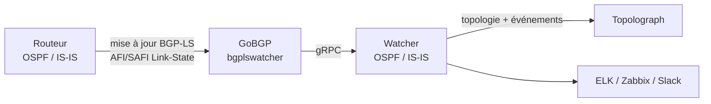

# Session BGP-LS

**BGP-LS** (BGP Link-State, [RFC 7752](https://datatracker.ietf.org/doc/html/rfc7752))
permet à un routeur d'exporter sa base de données d'état de liens OSPF ou
IS-IS dans BGP. En **mode BGP-LS**, un Watcher reçoit ces mises à jour et
alimente la topologie dans Topolograph **sans aucun tunnel GRE ni adjacence
IGP** — ce qui en fait la méthode en direct la plus simple à déployer,
surtout à travers plusieurs zones ou niveaux IS-IS.

!!! note "Versions minimales"
    L'import BGP-LS est pris en charge à partir de l'image Docker
    **`vadims06/ospf-watcher:v3.1.0`** (et l'image équivalente d'IS-IS
    Watcher). Les images plus anciennes ne prennent en charge que le GRE.

## Fonctionnement



1. Le **routeur** est configuré pour annoncer sa topologie OSPF/IS-IS via
   **BGP-LS**.
2. **GoBGP** — packagé comme composant `bgplswatcher` — établit la session
   BGP et reçoit les mises à jour de la famille d'adresses Link-State.
3. `bgplswatcher` transmet ces mises à jour au Watcher via **gRPC**.
4. Le **Watcher** les traite et publie la topologie (et les événements de
   changement) vers Topolograph.

Comme il n'y a ni tunnel GRE ni adjacence OSPF/IS-IS à maintenir, le mode
BGP-LS est plus simple à déployer dans les environnements où les tunnels ne
sont pas pratiques, et une seule session peut transporter la topologie de
tout le domaine IGP.

!!! info "Pourquoi un forwarder ?"
    GoBGP gère la mécanique BGP et parle la famille d'adresses Link-State ;
    `bgplswatcher` (Go) fait le pont entre GoBGP et le Watcher Python via
    gRPC, afin que le même pipeline d'événements du Watcher soit réutilisé
    pour les modes GRE et BGP-LS.

## 1. Configurer BGP-LS sur le routeur

Activez la **famille d'adresses BGP Link-State** et faites distribuer par
BGP les informations d'état de liens de l'IGP, puis établissez un peering
vers l'hôte exécutant le GoBGP du Watcher. Les commandes exactes dépendent du
fournisseur : consultez la documentation de votre fournisseur pour la
configuration de l'address family BGP-LS. Pointez le pair BGP-LS vers l'hôte du Watcher pour
que GoBGP puisse recevoir les mises à jour.

## 2. Déployer le Watcher en mode BGP-LS

Utilisez la variante BGP-LS du Watcher, qui démarre le conteneur
`bgplswatcher` (GoBGP) aux côtés du Watcher. Les détails de configuration et
les fichiers compose se trouvent dans les dépôts des Watchers :
[OSPF Watcher](https://github.com/Vadims06/ospfwatcher) ·
[IS-IS Watcher](https://github.com/Vadims06/isiswatcher).

## 3. Vérifier la session BGP-LS { #3-verify-the-bgp-ls-session }

Le Watcher publie la topologie vers Topolograph **après** l'établissement de
la session BGP, donc commencez par confirmer la session et les routes
Link-State.

Consultez les logs du conteneur `bgplswatcher` :

```bash
docker logs watcher<num>-bgpls-ospf-bgplswatcher
```

Inspectez la session avec la CLI `gobgp` intégrée :

```bash
# List BGP neighbors and session state
docker exec -it watcher<num>-bgpls-ospf-bgplswatcher gobgp neighbor

# Detailed status for one neighbor
docker exec -it watcher<num>-bgpls-ospf-bgplswatcher gobgp neighbor <neighbor-ip>

# Link-State routes received from a neighbor
docker exec -it watcher<num>-bgpls-ospf-bgplswatcher gobgp neighbor <neighbor-ip> adj-in -a ls

# Everything in the Link-State RIB
docker exec -it watcher<num>-bgpls-ospf-bgplswatcher gobgp global rib -a ls
```

Une fois que le voisin affiche **Established** et que des routes Link-State
apparaissent dans la RIB, le Watcher commencera à publier la topologie vers
Topolograph.

## Ingénierie de trafic via BGP-LS

BGP-LS transporte nativement les attributs TE — groupe/couleur
administratif, bande passante maximale et réservable, bande passante non
réservée, et la métrique TE par défaut — vous obtenez donc des données de
lien riches sans l'astuce du LSA opaque nécessaire pour les imports de
fichier texte. Voir [Ingénierie de trafic](../analysis/traffic-engineering.md).

## BGP-LS vs GRE

| | GRE | BGP-LS |
| --- | --- | --- |
| Tunnel requis | ✅ GRE | ❌ |
| Adjacence IGP | ✅ (FRR via GRE) | ❌ |
| Fonctionnalité du routeur | GRE + OSPF/IS-IS | export BGP-LS |
| S'étend à travers les zones/niveaux | par point de rattachement | session unique |
| Image Watcher min. | toutes | `v3.1.0`+ |

[:octicons-arrow-right-24: Comparer avec GRE](gre.md)

---

**Suivant :** voir ce que le Watcher fait du flux →
[OSPF Watcher](../monitoring/ospf-watcher.md) ·
[IS-IS Watcher](../monitoring/isis-watcher.md)
