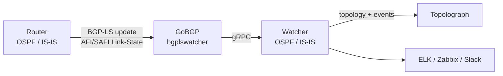

# BGP-LS Session

**BGP-LS** (BGP Link-State, [RFC 7752](https://datatracker.ietf.org/doc/html/rfc7752))
lets a router export its OSPF or IS-IS link-state database into BGP. In **BGP-LS
mode**, a Watcher receives those updates and feeds the topology into Topolograph
**without any GRE tunnel or IGP adjacency** — which makes it the easiest live
method to deploy, especially across multiple areas or IS-IS levels.

!!! note "Minimum versions"
    BGP-LS ingestion is supported from Docker image
    **`vadims06/ospf-watcher:v3.1.0`** (and the equivalent IS-IS Watcher image).
    Older images are GRE-only.

## How it works



1. The **router** is configured to advertise its OSPF/IS-IS topology over
   **BGP-LS**.
2. **GoBGP** — packaged as the `bgplswatcher` component — establishes the BGP
   session and receives the Link-State address-family updates.
3. `bgplswatcher` forwards those updates to the Watcher over **gRPC**.
4. The **Watcher** processes them and posts the topology (and change events) to
   Topolograph.

Because there's no GRE tunnel and no OSPF/IS-IS adjacency to maintain, BGP-LS
mode is simpler to deploy in environments where tunnels aren't practical, and a
single session can carry topology from across the IGP domain.

!!! info "Why the BGP-LS Watcher?"
    GoBGP handles the BGP machinery and speaks the Link State address family.
    The BGP-LS Watcher (Go) bridges GoBGP to the Python Watcher over gRPC and
    keeps GRE and BGP-LS modes behaving identically.

## 1. Configure BGP-LS on the router

Enable the BGP **Link State address family** and configure BGP to distribute the
IGP's link-state information (activate BGP-LS). The exact commands are
vendor-specific — consult your vendor's documentation for the BGP-LS address
family configuration. Point the BGP-LS peer at the Watcher host so GoBGP can
receive the updates.

## 2. Deploy the Watcher in BGP-LS mode

Use the BGP-LS variant of the Watcher, which brings up the `bgplswatcher`
(GoBGP) container alongside the Watcher. Setup details and compose files are in
the Watcher repositories:
[OSPF Watcher](https://github.com/Vadims06/ospfwatcher) ·
[IS-IS Watcher](https://github.com/Vadims06/isiswatcher).

## 3. Verify the BGP-LS session { #3-verify-the-bgp-ls-session }

The Watcher posts topology to Topolograph **after** the BGP session comes up, so
start by confirming the session and the Link-State routes.

Check the `bgplswatcher` container logs:

```bash
docker logs watcher<num>-bgpls-ospf-bgplswatcher
```

Inspect the session with the bundled `gobgp` CLI:

```bash
# List BGP neighbors and session state
docker exec -it watcher<num>-bgpls-ospf-bgplswatcher gobgp neighbor

# Detailed status for one neighbor
docker exec -it watcher<num>-bgpls-ospf-bgplswatcher gobgp neighbor <neighbor-ip>

# Link-State routes received from a neighbor
docker exec -it watcher<num>-bgpls-ospf-bgplswatcher gobgp neighbor <neighbor-ip> adj-in -a ls

# Everything in the Link-State RIB
docker exec -it watcher<num>-bgpls-ospf-bgplswatcher gobgp global rib -a ls
```

Once the neighbor shows **Established** and Link-State routes appear in the RIB,
the Watcher will start posting topology to Topolograph.

## Traffic Engineering over BGP-LS

BGP-LS carries TE attributes natively — administrative group/color, maximum and
reservable bandwidth, unreserved bandwidth, and the TE default metric — so you
get rich link data with TE attributes by default.
See [Traffic Engineering](../analysis/traffic-engineering.md).

## BGP-LS vs GRE

| | GRE | BGP-LS |
| --- | --- | --- |
| Tunnel required | ✅ GRE | ❌ |
| IGP adjacency | ✅ (FRR over GRE) | ❌ |
| Router feature | GRE + OSPF/IS-IS | BGP-LS export |
| Scales across areas/levels | per attachment point | single session |
| Min. Watcher image | any | `v3.1.0`+ |

[:octicons-arrow-right-24: Compare with GRE](gre.md)

---

**Next:** see what the Watcher does with the feed →
[OSPF Watcher](../monitoring/ospf-watcher.md) ·
[IS-IS Watcher](../monitoring/isis-watcher.md)
