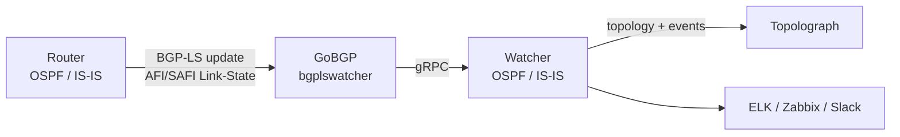

# Sessão BGP-LS

O **BGP-LS** (BGP Link-State, [RFC 7752](https://datatracker.ietf.org/doc/html/rfc7752))
permite que um roteador exporte seu banco de dados de estado de enlace do
OSPF ou IS-IS para o BGP. No **modo BGP-LS**, um Watcher recebe essas
atualizações e alimenta a topologia no Topolograph **sem nenhum túnel GRE
ou adjacência IGP** — o que o torna o método ao vivo mais fácil de
implantar, especialmente em múltiplas áreas ou níveis do IS-IS.

!!! note "Versões mínimas"
    A ingestão via BGP-LS é suportada a partir da imagem Docker
    **`vadims06/ospf-watcher:v3.1.0`** (e a imagem equivalente do IS-IS
    Watcher). Imagens mais antigas são apenas GRE.

## Como funciona



1. O **roteador** é configurado para anunciar sua topologia OSPF/IS-IS via
   **BGP-LS**.
2. O **GoBGP** — empacotado como o componente `bgplswatcher` — estabelece a
   sessão BGP e recebe as atualizações da address-family de Link-State.
3. O `bgplswatcher` encaminha essas atualizações para o Watcher via
   **gRPC**.
4. O **Watcher** as processa e envia a topologia (e os eventos de mudança)
   para o Topolograph.

Como não há túnel GRE nem adjacência OSPF/IS-IS para manter, o modo BGP-LS
é mais simples de implantar em ambientes onde túneis não são práticos, e
uma única sessão pode carregar a topologia de todo o domínio IGP.

!!! info "Por que um encaminhador?"
    O GoBGP cuida da mecânica do BGP e fala a address-family de Link-State;
    o `bgplswatcher` (Go) faz a ponte entre o GoBGP e o Watcher em Python
    via gRPC, de forma que o mesmo pipeline de eventos do Watcher é
    reutilizado tanto para o modo GRE quanto para o BGP-LS.

## 1. Configure o BGP-LS no roteador

Habilite a **address family de Link-State** do BGP e faça o BGP distribuir
as informações de estado de enlace do IGP, depois estabeleça peering com o
host que executa o GoBGP do Watcher. Os comandos exatos são específicos de cada
fornecedor: consulte a documentação do seu fornecedor para a configuração da
address family BGP-LS. Aponte o peer BGP-LS para o host do Watcher para
que o GoBGP possa receber as atualizações.

## 2. Implante o Watcher em modo BGP-LS

Use a variante BGP-LS do Watcher, que sobe o contêiner `bgplswatcher`
(GoBGP) junto com o Watcher. Os detalhes de configuração e os arquivos
compose estão nos repositórios do Watcher:
[OSPF Watcher](https://github.com/Vadims06/ospfwatcher) ·
[IS-IS Watcher](https://github.com/Vadims06/isiswatcher).

## 3. Verifique a sessão BGP-LS { #3-verify-the-bgp-ls-session }

O Watcher envia a topologia para o Topolograph **depois** que a sessão BGP
fica ativa, então comece confirmando a sessão e as rotas de Link-State.

Verifique os logs do contêiner `bgplswatcher`:

```bash
docker logs watcher<num>-bgpls-ospf-bgplswatcher
```

Inspecione a sessão com a CLI `gobgp` incluída:

```bash
# List BGP neighbors and session state
docker exec -it watcher<num>-bgpls-ospf-bgplswatcher gobgp neighbor

# Detailed status for one neighbor
docker exec -it watcher<num>-bgpls-ospf-bgplswatcher gobgp neighbor <neighbor-ip>

# Link-State routes received from a neighbor
docker exec -it watcher<num>-bgpls-ospf-bgplswatcher gobgp neighbor <neighbor-ip> adj-in -a ls

# Everything in the Link-State RIB
docker exec -it watcher<num>-bgpls-ospf-bgplswatcher gobgp global rib -a ls
```

Assim que o vizinho mostrar **Established** e as rotas de Link-State
aparecerem na RIB, o Watcher começará a enviar a topologia para o
Topolograph.

## Traffic Engineering via BGP-LS

O BGP-LS carrega atributos de TE nativamente — administrative group/color,
largura de banda máxima e reservável, largura de banda não reservada e a
métrica padrão de TE — então você obtém dados de enlace ricos sem o truque
da LSA opaca necessário para envios de arquivo de texto. Veja
[Traffic Engineering](../analysis/traffic-engineering.md).

## BGP-LS vs GRE

| | GRE | BGP-LS |
| --- | --- | --- |
| Túnel necessário | ✅ GRE | ❌ |
| Adjacência IGP | ✅ (FRR sobre GRE) | ❌ |
| Recurso do roteador | GRE + OSPF/IS-IS | Exportação BGP-LS |
| Escala entre áreas/níveis | por ponto de conexão | sessão única |
| Imagem mínima do Watcher | qualquer | `v3.1.0`+ |

[:octicons-arrow-right-24: Compare com o GRE](gre.md)

---

**Próximo:** veja o que o Watcher faz com o feed →
[OSPF Watcher](../monitoring/ospf-watcher.md) ·
[IS-IS Watcher](../monitoring/isis-watcher.md)
