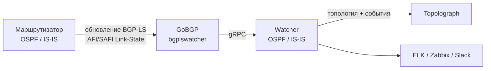

# Сессия BGP-LS

**BGP-LS** (BGP Link-State, [RFC 7752](https://datatracker.ietf.org/doc/html/rfc7752))
позволяет маршрутизатору экспортировать свою LSDB
OSPF или IS-IS в BGP. В **режиме BGP-LS** Watcher принимает эти обновления и
передаёт топологию в Topolograph **без какого-либо туннеля GRE или соседства
IGP** - что делает его самым простым в развёртывании способом передачи
данных в реальном времени, особенно для нескольких областей или уровней
IS-IS.

!!! note "Минимальные версии"
    Передача данных через BGP-LS поддерживается начиная с образа Docker
    **`vadims06/ospf-watcher:v3.1.0`** (и соответствующего образа IS-IS
    Watcher). Более старые образы работают только через GRE.

## Как это работает



1. **Маршрутизатор** настроен на анонсирование своей топологии OSPF/IS-IS
   через **BGP-LS**.
2. **GoBGP** - упакованный как компонент `bgplswatcher` - устанавливает
   сессию BGP и принимает обновления адресного семейства Link-State.
3. `bgplswatcher` передаёт эти обновления Watcher-у по **gRPC**.
4. **Watcher** обрабатывает их и отправляет топологию (и события изменений)
   в Topolograph.

Поскольку туннель GRE и соседство OSPF/IS-IS не требуются и их не нужно
поддерживать, режим BGP-LS проще развернуть в средах, где туннели
непрактичны, а одна сессия может передавать топологию всего домена IGP.

!!! info "Зачем нужен BGP-LS Watcher?"
    GoBGP занимается механикой BGP и говорит на address family Link State.
    BGP-LS Watcher (на Go) связывает GoBGP с Python-Watcher-ом по gRPC и
    обеспечивает единообразие режимов GRE и BGP-LS.

## 1. Настройте BGP-LS на маршрутизаторе

Включите address family BGP **Link State** и настройте распространение
информации link-state IGP (активируйте BGP-LS). Точные команды зависят от
производителя - обратитесь к документации производителя вашего оборудования
для уточнения настроек BGP-LS address family. Укажите хост Watcher-а в
качестве пира BGP-LS, чтобы GoBGP мог принимать обновления.

## 2. Разверните Watcher в режиме BGP-LS

Используйте вариант Watcher-а для BGP-LS, который поднимает контейнер
`bgplswatcher` (GoBGP) вместе с Watcher-ом. Детали настройки и
compose-файлы - в репозиториях Watcher-ов:
[OSPF Watcher](https://github.com/Vadims06/ospfwatcher) ·
[IS-IS Watcher](https://github.com/Vadims06/isiswatcher).

## 3. Проверьте сессию BGP-LS { #3-verify-the-bgp-ls-session }

Watcher отправляет топологию в Topolograph **после** установления сессии
BGP, поэтому начните с проверки самой сессии и маршрутов Link-State.

Проверьте логи контейнера `bgplswatcher`:

```bash
docker logs watcher<num>-bgpls-ospf-bgplswatcher
```

Изучите сессию с помощью встроенного CLI `gobgp`:

```bash
# List BGP neighbors and session state
docker exec -it watcher<num>-bgpls-ospf-bgplswatcher gobgp neighbor

# Detailed status for one neighbor
docker exec -it watcher<num>-bgpls-ospf-bgplswatcher gobgp neighbor <neighbor-ip>

# Link-State routes received from a neighbor
docker exec -it watcher<num>-bgpls-ospf-bgplswatcher gobgp neighbor <neighbor-ip> adj-in -a ls

# Everything in the Link-State RIB
docker exec -it watcher<num>-bgpls-ospf-bgplswatcher gobgp global rib -a ls
```

Как только сосед перейдёт в состояние **Established** и в RIB появятся
маршруты Link-State, Watcher начнёт отправлять топологию в Topolograph.

## Traffic Engineering через BGP-LS

BGP-LS нативно передаёт атрибуты TE - административную группу/цвет,
максимальную и резервируемую пропускную способность, нерезервированную
полосу пропускания и метрику TE по умолчанию - так что вы получаете
подробные данные о линках с учётом TE-атрибутов по умолчанию. См. [Traffic Engineering](../analysis/traffic-engineering.md).

## BGP-LS против GRE

| | GRE | BGP-LS |
| --- | --- | --- |
| Требуется туннель | ✅ GRE | ❌ |
| Смежность IGP | ✅ (FRR через GRE) | ❌ |
| Требование к маршрутизатору | GRE + OSPF/IS-IS | экспорт BGP-LS |
| Масштабирование на области/уровни | по точке подключения | одна сессия |
| Мин. версия образа Watcher | любая | `v3.1.0`+ |

[:octicons-arrow-right-24: Сравнение с GRE](gre.md)

---

**Далее:** посмотрите, что Watcher делает с полученным потоком →
[OSPF Watcher](../monitoring/ospf-watcher.md) ·
[IS-IS Watcher](../monitoring/isis-watcher.md)
