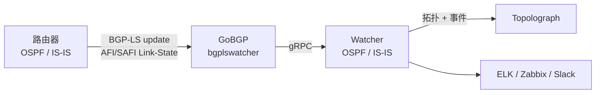

# BGP-LS 会话

**BGP-LS**（BGP Link-State，[RFC 7752](https://datatracker.ietf.org/doc/html/rfc7752)）
让路由器可以将其 OSPF 或 IS-IS 链路状态数据库导出到 BGP 中。在 **BGP-LS 模式**
下，Watcher 接收这些更新，并**无需任何 GRE 隧道或 IGP 邻接关系**即可将拓扑
数据提供给 Topolograph——这使它成为最容易部署的实时方式，尤其是跨多个区域
或 IS-IS 级别时。

!!! note "最低版本要求"
    BGP-LS 导入自 Docker 镜像 **`vadims06/ospf-watcher:v3.1.0`**（以及对应的
    IS-IS Watcher 镜像）起支持。更早的镜像仅支持 GRE。

## 工作原理



1. **路由器**被配置为通过 **BGP-LS** 通告其 OSPF/IS-IS 拓扑。
2. **GoBGP**——打包为 `bgplswatcher` 组件——建立 BGP 会话并接收 Link-State
   地址族的更新。
3. `bgplswatcher` 通过 **gRPC** 将这些更新转发给 Watcher。
4. **Watcher** 处理这些更新，并将拓扑（以及变化事件）提交给 Topolograph。

由于不需要维护 GRE 隧道，也不需要维护 OSPF/IS-IS 邻接关系，BGP-LS 模式在隧道
不易实施的环境中部署起来更简单，并且单个会话就可以承载整个 IGP 域的拓扑数据。

!!! info "为什么需要一个转发器？"
    GoBGP 负责处理 BGP 机制并支持 Link-State 地址族；`bgplswatcher`（Go 编写）
    将 GoBGP 桥接到 Python 编写的 Watcher，通过 gRPC 传递数据，从而使 GRE 和
    BGP-LS 两种模式复用同一套 Watcher 事件处理流程。

## 1. 在路由器上配置 BGP-LS

启用 BGP 的 **Link-State 地址族**，让 BGP 分发 IGP 的链路状态信息，然后与运行
Watcher 的 GoBGP 的主机建立对等关系。具体命令因厂商而异：请查阅厂商文档以了解
BGP-LS address family 的配置方法。将 BGP-LS 对等体
指向 Watcher 主机，以便 GoBGP 可以接收更新。

## 2. 以 BGP-LS 模式部署 Watcher

使用 Watcher 的 BGP-LS 变体，它会在 Watcher 旁边启动 `bgplswatcher`（GoBGP）
容器。设置细节和 compose 文件位于 Watcher 各自的代码仓库中：
[OSPF Watcher](https://github.com/Vadims06/ospfwatcher) ·
[IS-IS Watcher](https://github.com/Vadims06/isiswatcher)。

## 3. 验证 BGP-LS 会话 { #3-verify-the-bgp-ls-session }

Watcher 是在 BGP 会话建立**之后**才将拓扑提交给 Topolograph 的，因此请先确认
会话状态和 Link-State 路由。

检查 `bgplswatcher` 容器日志：

```bash
docker logs watcher<num>-bgpls-ospf-bgplswatcher
```

使用附带的 `gobgp` CLI 检查会话：

```bash
# List BGP neighbors and session state
docker exec -it watcher<num>-bgpls-ospf-bgplswatcher gobgp neighbor

# Detailed status for one neighbor
docker exec -it watcher<num>-bgpls-ospf-bgplswatcher gobgp neighbor <neighbor-ip>

# Link-State routes received from a neighbor
docker exec -it watcher<num>-bgpls-ospf-bgplswatcher gobgp neighbor <neighbor-ip> adj-in -a ls

# Everything in the Link-State RIB
docker exec -it watcher<num>-bgpls-ospf-bgplswatcher gobgp global rib -a ls
```

一旦邻居显示为 **Established** 并且 Link-State 路由出现在 RIB 中，Watcher 就会
开始将拓扑提交给 Topolograph。

## 通过 BGP-LS 的流量工程

BGP-LS 原生携带 TE 属性——管理组/颜色、最大带宽和可预留带宽、未预留带宽，以及
TE 默认度量——因此您无需借助文本文件上传所需的 opaque-LSA 技巧，就能获得丰富的
链路数据。参见[流量工程](../analysis/traffic-engineering.md)。

## BGP-LS 与 GRE 对比

| | GRE | BGP-LS |
| --- | --- | --- |
| 需要隧道 | ✅ GRE | ❌ |
| IGP 邻接关系 | ✅（通过 GRE 的 FRR） | ❌ |
| 路由器功能要求 | GRE + OSPF/IS-IS | BGP-LS 导出 |
| 跨区域/级别扩展 | 每个接入点一条 | 单个会话 |
| 最低 Watcher 镜像版本 | 任意 | `v3.1.0`+ |

[:octicons-arrow-right-24: 与 GRE 对比](gre.md)

---

**下一步：**看看 Watcher 如何处理这些数据 →
[OSPF Watcher](../monitoring/ospf-watcher.md) ·
[IS-IS Watcher](../monitoring/isis-watcher.md)
