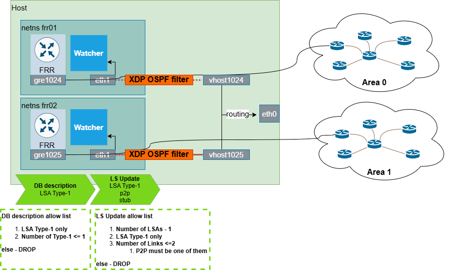

# GRE Session

In **GRE mode**, a Watcher forms a real OSPF/IS-IS adjacency with one of your
routers over a **GRE tunnel**, then passively forwards every link-state change
into Topolograph. Unlike a text file, this is a *live* feed — the graph and the
event timeline update as the network changes.

GRE mode works with essentially any router that can build a GRE tunnel and run
OSPF/IS-IS over it, which makes it the most broadly compatible live-ingestion
option.



## How it works

- The Watcher runs an **FRR** instance inside an isolated network namespace.
- That FRR forms an OSPF (or IS-IS) adjacency with your router **over a GRE
  tunnel**.
- Once adjacent, the router floods its LSDB to the Watcher just like any other
  neighbor — and the Watcher turns each change into an event for Topolograph,
  ELK, Zabbix, or Slack.

!!! warning "The Watcher is passive — and protected"
    The Watcher is a **listen-only** participant. An **XDP OSPF filter** inspects
    everything the FRR instance tries to advertise and drops any DB description
    or LSUpdate that announces more than the Watcher's own GRE tunnel network.
    This guarantees the Watcher can never inject unexpected prefixes into your
    OSPF domain. See [Listen-only mode](../monitoring/ospf-watcher.md#listen-only-mode-xdp).

Each Watcher keeps all routes and updates inside its **own namespace**, so it
never affects host routing or other Watchers.

## 1. Configure the tunnel on the router

Build a GRE tunnel from the device to the host running the Watcher. A Cisco
example:

```text
interface Tunnel0
 ip address <gre-tunnel-ip>
 tunnel mode gre
 tunnel source <router-ip>
 tunnel destination <host-ip>
 ip ospf network type point-to-point
```

Then include the GRE tunnel network in the router's OSPF/IS-IS configuration so
an adjacency can form across it.

## 2. Configure the Watcher

On the Watcher side, the GRE tunnel network is set in the FRR config
(`quagga/config/ospfd.conf` for OSPF). Deploying the Watcher lab namespace, for
example via containerlab, creates:

- an isolated network namespace for the Watcher and its FRR,
- a tap-interface pair connecting the Watcher to the Linux host,
- the **GRE tunnel** inside the Watcher's namespace,
- NAT for the GRE traffic,
- the FRR + Watcher processes,
- the **XDP OSPF filter** bound to the Watcher's tap interface.

The exact steps live in the Watcher repositories:
[OSPF Watcher](https://github.com/Vadims06/ospfwatcher) ·
[IS-IS Watcher](https://github.com/Vadims06/isiswatcher).

!!! tip "No router handy? Use test mode"
    Set `TEST_MODE=True` to feed a Watcher from a static demo LSDB file and
    replay sample changes (adjacency loss, metric change) — perfect for trying
    the pipeline end-to-end without any device. There's also a ready-made
    [containerlab lab](../monitoring/ospf-watcher.md#quick-lab-containerlab).

## 3. Verify the adjacency

Confirm the Watcher's FRR sees your router as a neighbor:

```text
show ip ospf neighbor      # OSPF
show isis neighbor         # IS-IS
```

Your network device should appear in the output. If it doesn't, the Watcher
ships a diagnostic script — see the troubleshooting section on the
[OSPF Watcher](../monitoring/ospf-watcher.md) /
[IS-IS Watcher](../monitoring/isis-watcher.md) pages.

## GRE vs BGP-LS

GRE mode needs a tunnel and an IGP adjacency per attachment point. If your
routers can export topology over **BGP-LS**, that mode avoids tunnels entirely
and scales more easily across areas/levels.

[:octicons-arrow-right-24: Compare with BGP-LS](bgp-ls.md)

---

**Next:** see what the Watcher does with the feed →
[OSPF Watcher](../monitoring/ospf-watcher.md) ·
[IS-IS Watcher](../monitoring/isis-watcher.md)
