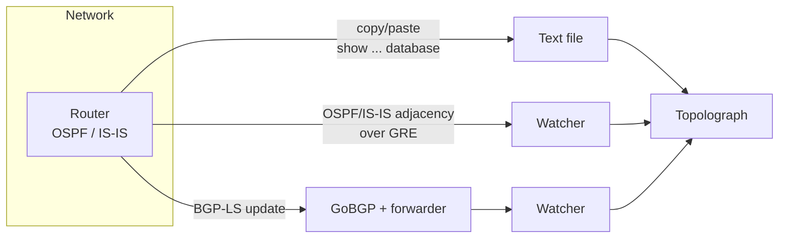

# Cómo Obtener la Topología

Todo lo que hace Topolograph comienza con su base de datos de estado de
enlace. Hay tres formas de introducirla — elija la que se ajuste al nivel de
implicación que desee tener.

## Elegir un método

-   :material-file-document-outline:{ .lg .middle } __Carga de archivo de texto__

    ---

    Copie la salida de `show ... database` de **un** router y péguela. Nada
    que implementar; nada que toque la red.

    **Ideal para:** auditorías, análisis puntuales, planificación offline de
    escenarios hipotéticos.

    [:octicons-arrow-right-24: Carga de archivo de texto](text-file.md)

-   :material-tunnel:{ .lg .middle } __Sesión GRE__

    ---

    Un Watcher forma una adyacencia OSPF/IS-IS mediante un **túnel GRE** y
    reenvía los cambios de estado de enlace en vivo. Funciona con cualquier
    router que pueda construir un túnel GRE.

    **Ideal para:** monitoreo continuo de una red existente.

    [:octicons-arrow-right-24: Sesión GRE](gre.md)

-   :material-transit-connection-variant:{ .lg .middle } __Sesión BGP-LS__

    ---

    El router exporta su topología OSPF/IS-IS mediante **BGP-LS**; GoBGP y el
    reenviador del Watcher lo convierten en un flujo en vivo. **Sin túnel
    GRE.**

    **Ideal para:** redes modernas, multi-área/nivel, implementación sencilla.

    [:octicons-arrow-right-24: Sesión BGP-LS](bgp-ls.md)

## De un vistazo

| | Archivo de texto | Sesión GRE | Sesión BGP-LS |
| --- | --- | --- | --- |
| Actualizaciones en vivo | ❌ solo instantánea | ✅ | ✅ |
| Implementar un Watcher | ❌ | ✅ | ✅ |
| Túnel requerido | — | ✅ GRE | ❌ |
| Configuración del router | ninguna | túnel GRE + OSPF/IS-IS | exportación BGP-LS |
| Transporta atributos de TE | ✅ (opaque LSA) | ✅ | ✅ |
| Bueno para monitoreo/alertas | ❌ | ✅ | ✅ |

!!! tip "Carga programática"
    Los tres métodos colocan una instantánea de topología en el mismo lugar.
    También puede enviar el texto de la LSDB mediante la
    [API REST y el SDK de Python](../automation/python-sdk.md) — incluida la
    recolección automática desde dispositivos por SSH.

## ¿Y el monitoreo?

Las sesiones GRE y BGP-LS funcionan gracias a **OSPF Watcher** e **IS-IS
Watcher**. Una vez que un Watcher está conectado, no solo alimenta el grafo —
también registra cada cambio como un evento que puede buscar, visualizar y
usar para generar alertas. Ese aspecto de los Watchers se cubre en
[Monitoreo en Tiempo Real](../monitoring/index.md).
