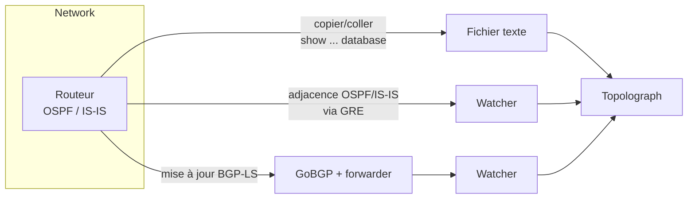

# Importer la topologie

Tout ce que fait Topolograph part de votre base de données d'état de liens. Il
existe trois façons de l'importer — choisissez celle qui correspond au niveau
d'implication que vous souhaitez.

## Choisir une méthode

-   :material-file-document-outline:{ .lg .middle } __Import de fichier texte__

    ---

    Copiez la sortie `show ... database` d'**un seul** routeur et collez-la.
    Rien à déployer ; rien ne touche au réseau.

    **Idéal pour :** audits, analyses ponctuelles, planification hors ligne de
    scénarios hypothétiques.

    [:octicons-arrow-right-24: Import de fichier texte](text-file.md)

-   :material-tunnel:{ .lg .middle } __Session GRE__

    ---

    Un Watcher établit une adjacence OSPF/IS-IS via un **tunnel GRE** et
    transmet les changements d'état de liens en direct. Fonctionne avec tout
    routeur capable de construire un tunnel GRE.

    **Idéal pour :** surveillance continue d'un réseau existant.

    [:octicons-arrow-right-24: Session GRE](gre.md)

-   :material-transit-connection-variant:{ .lg .middle } __Session BGP-LS__

    ---

    Le routeur exporte sa topologie OSPF/IS-IS via **BGP-LS** ; GoBGP et le
    forwarder du Watcher la transforment en flux en direct. **Aucun tunnel
    GRE.**

    **Idéal pour :** réseaux modernes, multi-zones/niveaux, déploiement
    simple.

    [:octicons-arrow-right-24: Session BGP-LS](bgp-ls.md)

## En un coup d'œil

| | Fichier texte | Session GRE | Session BGP-LS |
| --- | --- | --- | --- |
| Mises à jour en direct | ❌ instantané uniquement | ✅ | ✅ |
| Déployer un Watcher | ❌ | ✅ | ✅ |
| Tunnel requis | — | ✅ GRE | ❌ |
| Config du routeur | aucune | tunnel GRE + OSPF/IS-IS | export BGP-LS |
| Transporte les attributs TE | ✅ (LSA opaque) | ✅ | ✅ |
| Adapté à la surveillance/alerte | ❌ | ✅ | ✅ |

!!! tip "Import programmatique"
    Les trois méthodes placent un instantané de topologie au même endroit.
    Vous pouvez aussi transmettre le texte de la LSDB via l'
    [API REST et le SDK Python](../automation/python-sdk.md) — y compris en
    la collectant automatiquement depuis vos équipements via SSH.

## Qu'en est-il de la surveillance ?

Les sessions GRE et BGP-LS reposent sur **OSPF Watcher** et **IS-IS
Watcher**. Une fois un Watcher connecté, il n'alimente pas seulement le
graphe — il enregistre aussi chaque changement comme un événement que vous
pouvez rechercher, visualiser et sur lequel vous pouvez déclencher des
alertes. Ce volet des Watchers est couvert dans
[Surveillance en temps réel](../monitoring/index.md).
