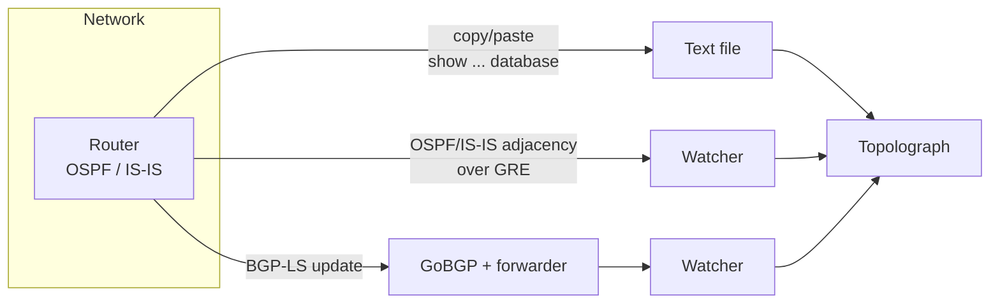

# Getting Topology In

Everything Topolograph does starts with your link-state database. There are three
ways to get it in — pick the one that matches how hands-on you want to be.

## Choosing a method

-   :material-file-document-outline:{ .lg .middle } __Text file upload__

    ---

    Copy the `show ... database` output from **one** router and paste it in.
    Nothing to deploy; nothing touches the network.

    **Best for:** audits, one-off analysis, offline what-if planning.

    [:octicons-arrow-right-24: Text file upload](text-file.md)

-   :material-tunnel:{ .lg .middle } __GRE session__

    ---

    A Watcher forms an OSPF/IS-IS adjacency over a **GRE tunnel** and forwards
    live link-state changes. Works with any router that can build a GRE tunnel.

    **Best for:** continuous monitoring of an existing network.

    [:octicons-arrow-right-24: GRE session](gre.md)

-   :material-transit-connection-variant:{ .lg .middle } __BGP-LS session__

    ---

    The router exports its OSPF/IS-IS topology over **BGP-LS**; GoBGP and the
    Watcher forwarder turn it into a live feed. **No GRE tunnel.**

    **Best for:** modern networks, multi-area/level, easy deployment.

    [:octicons-arrow-right-24: BGP-LS session](bgp-ls.md)

## At a glance

| | Text file | GRE session | BGP-LS session |
| --- | --- | --- | --- |
| Live updates | ❌ snapshot only | ✅ | ✅ |
| Deploy a Watcher | ❌ | ✅ | ✅ |
| Tunnel required | — | ✅ GRE | ❌ |
| Router config | none | GRE tunnel + OSPF/IS-IS | BGP-LS export |
| Carries TE attributes | ✅ (opaque LSA) | ✅ | ✅ |
| Good for monitoring/alerting | ❌ | ✅ | ✅ |

!!! tip "Programmatic upload"
    All three methods put a topology snapshot into the same place. You can also
    push LSDB text through the [REST API and Python SDK](../automation/python-sdk.md) —
    including collecting it from devices over SSH automatically.

## What about monitoring?

GRE and BGP-LS sessions are powered by the **OSPF Watcher** and **IS-IS
Watcher**. Once a Watcher is connected, it doesn't just feed the graph — it also
records every change as an event you can search, visualize and alert on. That
side of the Watchers is covered in [Real-Time Monitoring](../monitoring/index.md).
