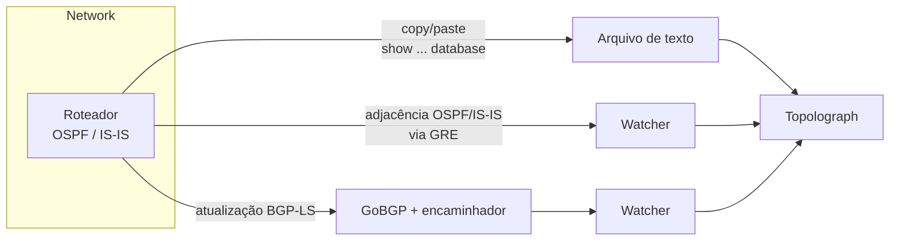

# Obtendo a topologia

Tudo o que o Topolograph faz começa com o seu banco de dados de estado de
enlace (LSDB). Existem três formas de importá-lo — escolha a que combina com o
quanto você quer se envolver na operação.

## Escolhendo um método

-   :material-file-document-outline:{ .lg .middle } __Envio de arquivo de texto__

    ---

    Copie a saída de `show ... database` de **um** roteador e cole-a. Nada
    para implantar; nada toca a rede.

    **Ideal para:** auditorias, análises pontuais, planejamento offline de cenários hipotéticos.

    [:octicons-arrow-right-24: Envio de arquivo de texto](text-file.md)

-   :material-tunnel:{ .lg .middle } __Sessão GRE__

    ---

    Um Watcher forma uma adjacência OSPF/IS-IS via **túnel GRE** e encaminha
    as mudanças de estado de enlace em tempo real. Funciona com qualquer
    roteador capaz de construir um túnel GRE.

    **Ideal para:** monitoramento contínuo de uma rede existente.

    [:octicons-arrow-right-24: Sessão GRE](gre.md)

-   :material-transit-connection-variant:{ .lg .middle } __Sessão BGP-LS__

    ---

    O roteador exporta sua topologia OSPF/IS-IS via **BGP-LS**; o GoBGP e o
    encaminhador do Watcher transformam isso em um fluxo ao vivo. **Sem túnel
    GRE.**

    **Ideal para:** redes modernas, múltiplas áreas/níveis, implantação simples.

    [:octicons-arrow-right-24: Sessão BGP-LS](bgp-ls.md)

## Em resumo

| | Arquivo de texto | Sessão GRE | Sessão BGP-LS |
| --- | --- | --- | --- |
| Atualizações ao vivo | ❌ apenas instantâneo | ✅ | ✅ |
| Implantar um Watcher | ❌ | ✅ | ✅ |
| Túnel necessário | — | ✅ GRE | ❌ |
| Configuração do roteador | nenhuma | túnel GRE + OSPF/IS-IS | exportação BGP-LS |
| Carrega atributos de TE | ✅ (LSA opaco) | ✅ | ✅ |
| Bom para monitoramento/alertas | ❌ | ✅ | ✅ |

!!! tip "Envio programático"
    Os três métodos colocam um instantâneo da topologia no mesmo lugar. Você
    também pode enviar texto de LSDB através da [API REST e do SDK Python](../automation/python-sdk.md) —
    incluindo a coleta automática a partir dos dispositivos via SSH.

## E o monitoramento?

As sessões GRE e BGP-LS são impulsionadas pelo **OSPF Watcher** e pelo **IS-IS
Watcher**. Uma vez conectado, o Watcher não apenas alimenta o grafo — ele
também registra cada mudança como um evento que você pode pesquisar,
visualizar e usar para configurar alertas. Esse lado dos Watchers é abordado
em [Monitoramento em tempo real](../monitoring/index.md).
