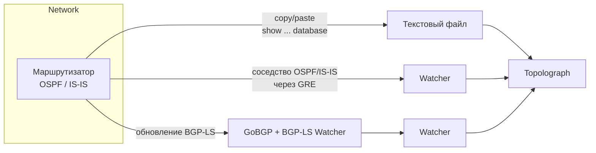

# Получение топологии

Всё, что делает Topolograph, начинается с вашей LSDB. Есть три способа передать её - выберите тот, который соответствует
тому, насколько глубоко вы хотите участвовать в процессе.

## Выбор способа

-   :material-file-document-outline:{ .lg .middle } __Загрузка текстового файла__

    ---

    Скопируйте вывод `show ... database` с **одного** маршрутизатора и
    вставьте его. Ничего разворачивать не нужно; сеть не затрагивается.

    **Лучше всего подходит для:** аудитов, разовых разборов, офлайн-планирования "что если".

    [:octicons-arrow-right-24: Загрузка текстового файла](text-file.md)

-   :material-tunnel:{ .lg .middle } __Сессия GRE__

    ---

    Watcher устанавливает соседство OSPF/IS-IS через **туннель GRE** и
    передаёт изменения LSDB в реальном времени. Работает с любым
    маршрутизатором, способным построить туннель GRE.

    **Лучше всего подходит для:** непрерывного мониторинга существующей сети.

    [:octicons-arrow-right-24: Сессия GRE](gre.md)

-   :material-transit-connection-variant:{ .lg .middle } __Сессия BGP-LS__

    ---

    Маршрутизатор экспортирует свою топологию OSPF/IS-IS через **BGP-LS**;
    GoBGP и BGP-LS Watcher превращают это в поток данных в реальном
    времени. **Туннель GRE не требуется.**

    **Лучше всего подходит для:** современных сетей, нескольких зон/уровней, простого развёртывания.

    [:octicons-arrow-right-24: Сессия BGP-LS](bgp-ls.md)

## Коротко о главном

| | Текстовый файл | Сессия GRE | Сессия BGP-LS |
| --- | --- | --- | --- |
| Обновления в реальном времени | ❌ только снимок | ✅ | ✅ |
| Развёртывание Watcher | ❌ | ✅ | ✅ |
| Требуется туннель | - | ✅ GRE | ❌ |
| Конфигурация маршрутизатора | не требуется | туннель GRE + OSPF/IS-IS | экспорт BGP-LS |
| Передаёт атрибуты TE | ✅ (opaque LSA) | ✅ | ✅ |
| Подходит для мониторинга/оповещений | ❌ | ✅ | ✅ |

!!! tip "Программная загрузка"
    Все три способа помещают снимок топологии в одно и то же место. Вы также
    можете отправлять текст LSDB через [REST API и Python SDK](../automation/python-sdk.md) - в том числе автоматически собирая его с устройств по SSH.

## А что насчёт мониторинга?

Сессии GRE и BGP-LS работают на базе **OSPF Watcher** и **IS-IS Watcher**.
После подключения Watcher не просто передаёт данные для графа - он также
записывает каждое изменение как событие, которое можно искать, визуализировать
и по которому можно настраивать оповещения. Эта сторона работы Watcher-ов
описана в разделе [Мониторинг в реальном времени](../monitoring/index.md).
