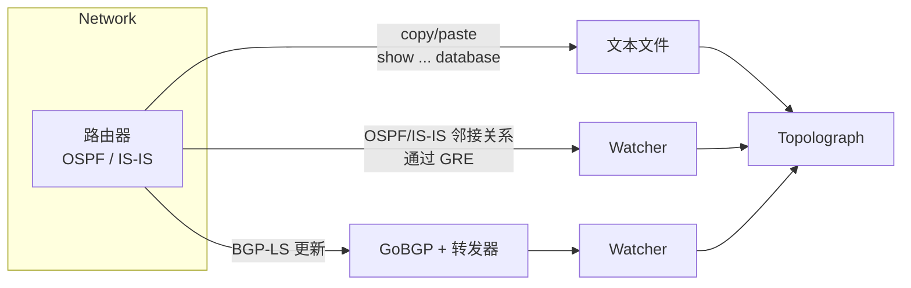

# 获取拓扑数据

Topolograph 的一切都始于您的链路状态数据库（LSDB）。有三种方式可以导入它——
选择与您希望的参与程度相匹配的方式。

## 选择一种方式

-   :material-file-document-outline:{ .lg .middle } __上传文本文件__

    ---

    从**一台**路由器复制 `show ... database` 的输出并粘贴进去。无需部署任何东西，也不会触碰网络。

    **最适合：** 审计、临时分析、离线假设场景规划。

    [:octicons-arrow-right-24: 上传文本文件](text-file.md)

-   :material-tunnel:{ .lg .middle } __GRE 会话__

    ---

    Watcher 通过 **GRE 隧道** 建立 OSPF/IS-IS 邻接关系，并实时转发链路状态变化。
    适用于任何能够建立 GRE 隧道的路由器。

    **最适合：** 对现有网络进行持续监控。

    [:octicons-arrow-right-24: GRE 会话](gre.md)

-   :material-transit-connection-variant:{ .lg .middle } __BGP-LS 会话__

    ---

    路由器通过 **BGP-LS** 导出其 OSPF/IS-IS 拓扑；GoBGP 和 Watcher 转发器将其转换为
    实时数据流。**无需 GRE 隧道。**

    **最适合：** 现代网络、多区域/多级别环境、便捷部署。

    [:octicons-arrow-right-24: BGP-LS 会话](bgp-ls.md)

## 一览对比

| | 文本文件 | GRE 会话 | BGP-LS 会话 |
| --- | --- | --- | --- |
| 实时更新 | ❌ 仅快照 | ✅ | ✅ |
| 部署 Watcher | ❌ | ✅ | ✅ |
| 需要隧道 | — | ✅ GRE | ❌ |
| 路由器配置 | 无 | GRE 隧道 + OSPF/IS-IS | BGP-LS 导出 |
| 携带 TE 属性 | ✅（opaque LSA） | ✅ | ✅ |
| 适合监控/告警 | ❌ | ✅ | ✅ |

!!! tip "程序化上传"
    以上三种方式都会将拓扑快照存入同一位置。您也可以通过
    [REST API 和 Python SDK](../automation/python-sdk.md) 推送 LSDB 文本——
    甚至可以自动通过 SSH 从设备上采集数据。

## 那监控呢？

GRE 和 BGP-LS 会话由 **OSPF Watcher** 和 **IS-IS Watcher** 驱动。Watcher
一旦连接，不仅会为拓扑图提供数据——还会将每一次变化记录为可搜索、可视化并可配置告警的事件。
Watcher 的这部分功能在[实时监控](../monitoring/index.md)中有详细介绍。
