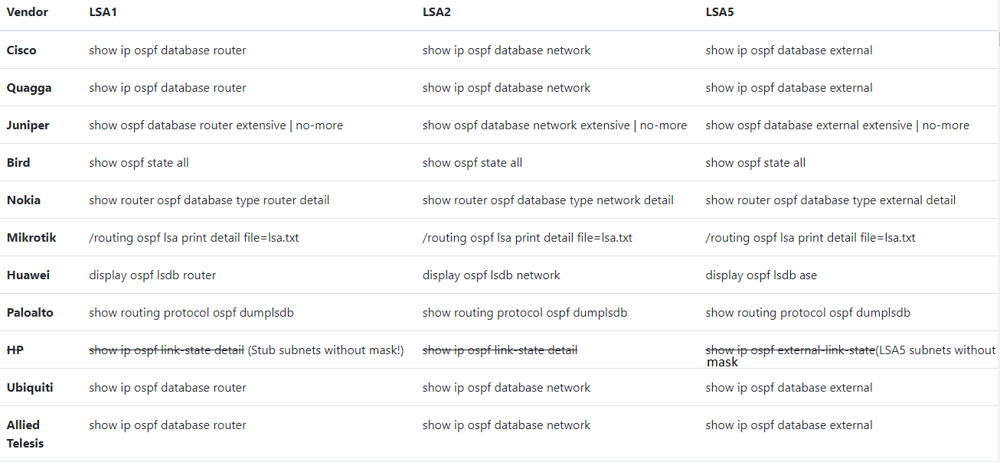

# Text File Upload

The simplest way to get a topology into Topolograph: copy the Link-State
Database from **one** router and paste (or upload) it. No agents, no tunnels,
nothing that touches the live network.

This is the **Manual** ingestion method.


## Why one router is enough

OSPF and IS-IS are link-state protocols: every router inside an area/level holds
an **identical** copy of the area's database. Topolograph reconstructs the whole
topology from that single copy — so you only ever need to collect it once, from
one device.

## 1. Collect the database

Run the LSA/LSP database commands for your platform and save the output to a
plain text file. A few common examples are below; the
[Supported Vendors](../reference/supported-vendors.md) page has the full matrix
for all 16 supported platforms.

=== "OSPF"

    | Vendor | LSA 1 (router) | LSA 2 (network) | LSA 5 (external) |
    | --- | --- | --- | --- |
    | Cisco | `show ip ospf database router` | `show ip ospf database network` | `show ip ospf database external` |
    | Juniper | `show ospf database router extensive \| no-more` | `show ospf database network extensive \| no-more` | `show ospf database external extensive \| no-more` |
    | Nokia | `show router ospf database type router detail` | `show router ospf database type network detail` | `show router ospf database type external detail` |
    | Huawei | `display ospf lsdb router` | `display ospf lsdb network` | `display ospf lsdb ase` |
    | FRRouting | `show ip ospf database router` | `show ip ospf database network` | `show ip ospf database external` |

=== "IS-IS"

    | Vendor | Database command |
    | --- | --- |
    | Cisco | `show isis database detail` |
    | Juniper | `show isis database extensive` |
    | Nokia | `show router isis database detail` |
    | Huawei | `display isis lsdb verbose` |
    | FRRouting | `show isis database detail` |



You can place the LSA 1 / 2 / 5 sections (OSPF) into a single file — Topolograph
parses them together.

!!! tip "Optional: richer links with TE data"
    For FRRouting OSPF, append `show ip ospf database opaque-area` to the same
    file to include link bandwidth, TE metric and administrative group. The graph
    still builds without it. See [Traffic Engineering](../analysis/traffic-engineering.md).

## 2. Upload it

1. Open Topolograph (`http://localhost:8080/` for a
   [local install](../getting-started/quickstart-docker.md)).
2. Start a topology upload and paste or attach your text file.
3. Select the matching **vendor** and **protocol** (OSPF / IS-IS).
4. Submit. Topolograph parses the database and renders the graph.

The result is a **snapshot** — a frozen picture of the network at capture time.
Every analysis runs against the snapshot, so nothing you try affects production.

## 3. Compare states over time

Upload another capture later and Topolograph can **diff** the two snapshots,
highlighting exactly what changed — new/removed nodes and links, cost changes,
and appearing/disappearing networks. See
[Comparing Network States](../analysis/comparing-states.md).

## Uploading via API instead

Anything you can paste, you can also `POST`. The
[Python SDK](../automation/python-sdk.md) wraps this — and can even collect the
LSDB from your devices over SSH and upload it in one step:

```bash
topo ingest inventory.yaml --upload --url http://localhost:8080
```

```python
graph = topo.uploader.upload_raw(
    lsdb_text=raw_text,
    vendor="FRR",
    protocol="isis",
)
```

---

**Want live updates instead of snapshots?** Stream the topology with a
[GRE](gre.md) or [BGP-LS](bgp-ls.md) Watcher session.
