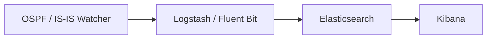

# Integración con ELK / Kibana

Para búsqueda de texto completo, paneles y un historial de largo plazo de
los eventos de topología, envíe la salida del Watcher al **Elastic Stack
(ELK)**. **Logstash** (o **Fluent Bit**) reenvía cada evento;
**Elasticsearch** lo indexa; **Kibana** le permite explorarlo.

Esto corresponde al
[tamaño de implementación #3](index.md#deployment-sizes).

## Flujo



!!! info "Logstash vs Fluent Bit"
    - **Logstash** (perfil por defecto) arranca junto con un contenedor
      creador de índices y habilita la ruta a Zabbix. Levántelo con
      `docker compose up -d`.
    - **Fluent Bit** es una alternativa más ligera (perfil `fluent-bit`,
      solo salida HTTP/Webhook):
      ```bash
      docker compose --profile fluent-bit up -d fluent-bit
      ```
      Ambos envían payloads HTTP con formas ligeramente distintas — téngalo
      en cuenta si escribe consumidores personalizados.

## Conectar su ELK

Si ya ejecuta ELK, establezca `ELASTIC_IP` en el `.env` del Watcher y
descomente el bloque de Elastic en `logstash/pipeline/logstash.conf`. Puede
crear las plantillas de índice con:

```bash
sudo docker run -it --rm --env-file=./.env \
  -v ./logstash/index_template/create.py:/home/watcher/watcher/create.py \
  vadims06/ospf-watcher:latest python3 ./create.py
```

¿Aún no tiene ELK? Levante uno desde
[docker-elk](https://github.com/deviantony/docker-elk). Para una demo,
configure la licencia como basic y deshabilite la seguridad en
`docker-elk/elasticsearch/config/elasticsearch.yml`:

```yaml
xpack.license.self_generated.type: basic
xpack.security.enabled: false
```

!!! tip "La salida de Elastic bloquea otras salidas ante un fallo"
    Si la salida de Elastic no puede alcanzar su host, bloquea las *otras*
    salidas y sigue reintentando sin importar `EXPORT_TO_ELASTICSEARCH_BOOL`.
    Habilite (descomente) la configuración de Elastic solo cuando realmente
    tenga ELK en ejecución.

## Configuración de Kibana

Las **plantillas de índice** se crean automáticamente mediante el
contenedor creador de índices. En
**Management → Stack Management → Index Management → Index Templates**
debería ver entradas como:

- `ospf-watcher-costs-changes`
- `ospf-watcher-updown-events`


Luego cree una **data view** sobre los índices del watcher para empezar a
explorar:


## Explorar eventos

Una vez que los datos fluyen, los eventos crudos son buscables en
**Discover**:

=== "Cambios de costo"

    

=== "Adyacencia arriba/abajo"

    

=== "Registro de TE"

    

Para TE, puede filtrar por atributos como el grupo administrativo:


---

**Relacionado:** [Zabbix](zabbix.md) · [Webhooks y Slack](webhooks.md) ·
[Traffic Engineering](../analysis/traffic-engineering.md)
