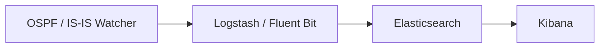
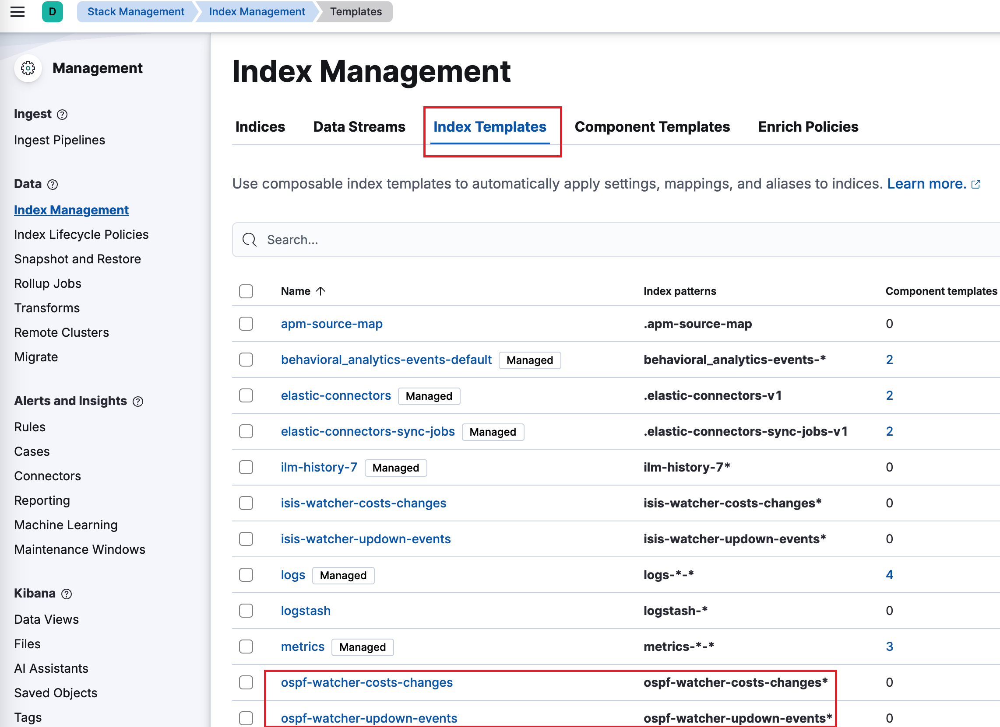
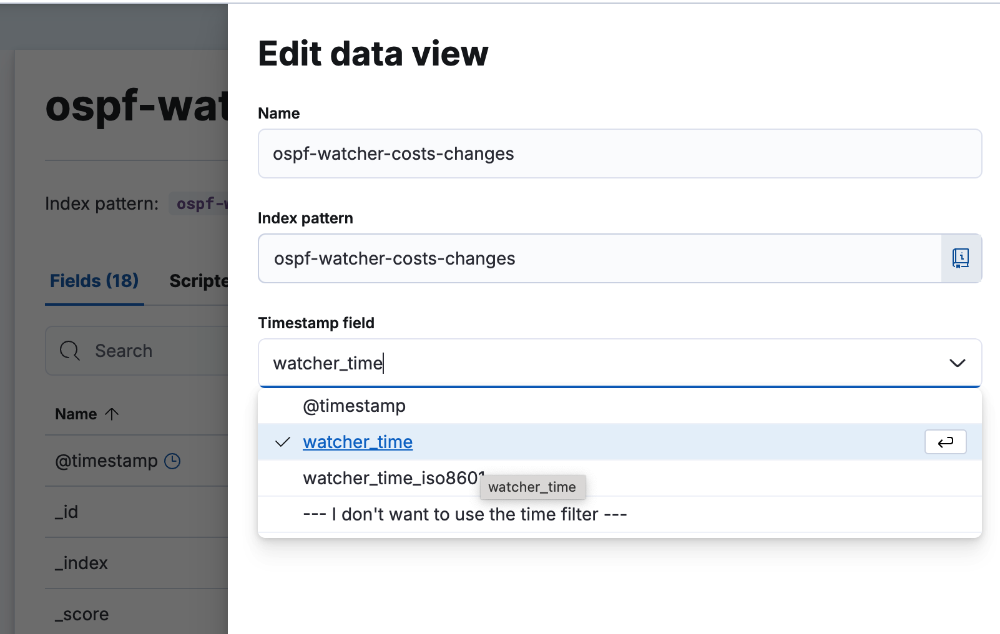
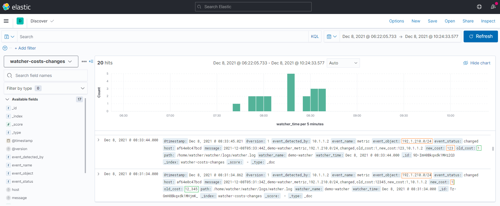
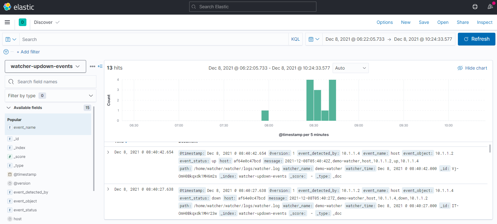
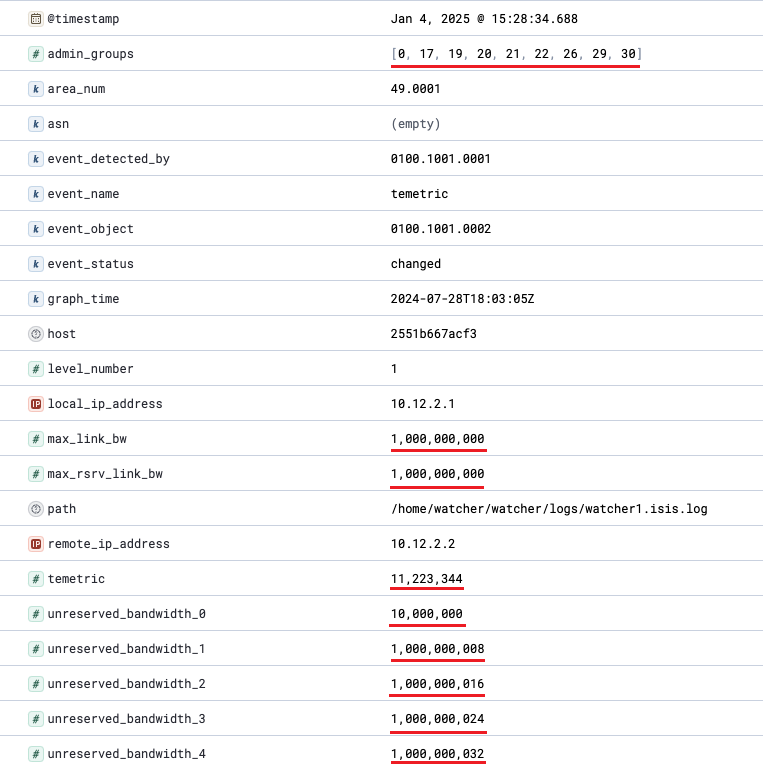
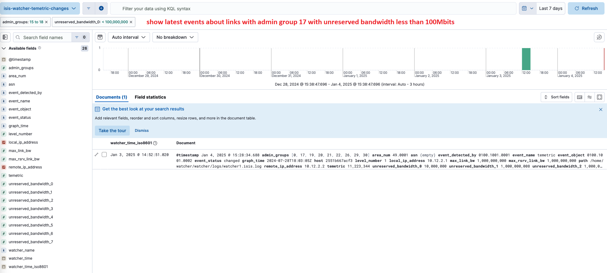

# Intégration ELK / Kibana

Pour la recherche full-text, les tableaux de bord et l'historique de long
terme des événements de topologie, envoyez la sortie du Watcher vers
l'**Elastic Stack (ELK)**. **Logstash** (ou **Fluent Bit**) transmet
chaque événement ; **Elasticsearch** l'indexe ; **Kibana** vous permet de
l'explorer.

Cela correspond à la [taille de déploiement #3](index.md#deployment-sizes).

## Pipeline



!!! info "Logstash vs Fluent Bit"
    - **Logstash** (profil par défaut) démarre avec un conteneur
      index-creator et active le chemin Zabbix. Lancez-le avec
      `docker compose up -d`.
    - **Fluent Bit** est une alternative plus légère (profil
      `fluent-bit`, sortie HTTP/Webhook uniquement) :
      ```bash
      docker compose --profile fluent-bit up -d fluent-bit
      ```
      Les deux envoient des payloads HTTP dans des formats légèrement
      différents — gardez cela à l'esprit si vous écrivez des
      consommateurs personnalisés.

## Connecter votre ELK

Si vous exploitez déjà ELK, définissez `ELASTIC_IP` dans le `.env` du
Watcher et décommentez le bloc Elastic dans
`logstash/pipeline/logstash.conf`. Vous pouvez créer les index templates
avec :

```bash
sudo docker run -it --rm --env-file=./.env \
  -v ./logstash/index_template/create.py:/home/watcher/watcher/create.py \
  vadims06/ospf-watcher:latest python3 ./create.py
```

Pas encore d'ELK ? Lancez-en un à partir de
[docker-elk](https://github.com/deviantony/docker-elk). Pour une démo,
réglez la licence sur basic et désactivez la sécurité dans
`docker-elk/elasticsearch/config/elasticsearch.yml` :

```yaml
xpack.license.self_generated.type: basic
xpack.security.enabled: false
```

!!! tip "La sortie Elastic bloque les autres sorties en cas d'échec"
    Si la sortie Elastic ne peut pas atteindre son hôte, elle bloque les
    *autres* sorties et continue de réessayer, indépendamment de
    `EXPORT_TO_ELASTICSEARCH_BOOL`. N'activez (ne décommentez) la
    configuration Elastic que lorsque vous avez réellement ELK en cours
    d'exécution.

## Configuration de Kibana

Les **index templates** sont créés automatiquement par le conteneur
index-creator. Sous **Management → Stack Management → Index Management →
Index Templates**, vous devriez voir des entrées telles que :

- `ospf-watcher-costs-changes`
- `ospf-watcher-updown-events`



Créez ensuite une **data view** sur les index du watcher pour commencer à
explorer :



## Explorer les événements

Une fois les données en train de circuler, les événements bruts sont
consultables dans **Discover** :

=== "Changements de coût"

    

=== "Adjacence up/down"

    

=== "Log TE"

    

Pour le TE, vous pouvez filtrer par attributs tels que le groupe
administratif :



---

**Voir aussi :** [Zabbix](zabbix.md) · [Webhooks et Slack](webhooks.md) ·
[Ingénierie de trafic](../analysis/traffic-engineering.md)
