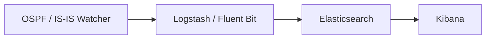

# ELK / Kibana Integration

For full-text search, dashboards and long-term history of topology events, ship
Watcher output into the **Elastic Stack (ELK)**. **Logstash** (or **Fluent Bit**)
forwards each event; **Elasticsearch** indexes it; **Kibana** lets you explore
it.

This corresponds to [deployment size #3](index.md#deployment-sizes).

## Pipeline



!!! info "Logstash vs Fluent Bit"
    - **Logstash** (default profile) starts together with an index-creator
      container and enables the Zabbix path. Bring it up with
      `docker compose up -d`.
    - **Fluent Bit** is a lighter alternative (profile `fluent-bit`,
      HTTP/Webhook output only):
      ```bash
      docker compose --profile fluent-bit up -d fluent-bit
      ```
      The two send HTTP payloads in slightly different shapes — keep that in mind
      if you write custom consumers.

## Connecting your ELK

If you already run ELK, set `ELASTIC_IP` in the Watcher's `.env` and uncomment
the Elastic block in `logstash/pipeline/logstash.conf`. You can create the index
templates with:

```bash
sudo docker run -it --rm --env-file=./.env \
  -v ./logstash/index_template/create.py:/home/watcher/watcher/create.py \
  vadims06/ospf-watcher:latest python3 ./create.py
```

No ELK yet? Spin one up from
[docker-elk](https://github.com/deviantony/docker-elk). For a demo, set the
license to basic and disable security in
`docker-elk/elasticsearch/config/elasticsearch.yml`:

```yaml
xpack.license.self_generated.type: basic
xpack.security.enabled: false
```

!!! tip "Elastic output blocks other outputs on failure"
    If the Elastic output can't reach its host it blocks the *other* outputs and
    keeps retrying regardless of `EXPORT_TO_ELASTICSEARCH_BOOL`. Only enable
    (uncomment) the Elastic config when you actually have ELK running.

## Kibana setup

**Index templates** are created automatically by the index-creator container.
Under **Management → Stack Management → Index Management → Index Templates** you
should see entries such as:

- `ospf-watcher-costs-changes`
- `ospf-watcher-updown-events`


Then create a **data view** over the watcher indices to start exploring:


## Exploring events

Once data flows, raw events are searchable in **Discover**:

=== "Cost changes"

    

=== "Adjacency up/down"

    

=== "TE log"

    

For TE, you can filter by attributes such as administrative group:


---

**Related:** [Zabbix](zabbix.md) · [Webhooks & Slack](webhooks.md) ·
[Traffic Engineering](../analysis/traffic-engineering.md)
