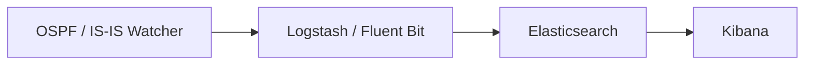

# Integração com ELK / Kibana

Para busca full-text, dashboards e histórico de longo prazo dos eventos de
topologia, envie a saída do Watcher para a **Elastic Stack (ELK)**. O
**Logstash** (ou o **Fluent Bit**) encaminha cada evento; o
**Elasticsearch** o indexa; o **Kibana** permite explorá-lo.

Isso corresponde ao [tamanho de implantação #3](index.md#deployment-sizes).

## Pipeline



!!! info "Logstash vs Fluent Bit"
    - O **Logstash** (perfil padrão) sobe junto com um container
      index-creator e habilita o caminho do Zabbix. Suba com
      `docker compose up -d`.
    - O **Fluent Bit** é uma alternativa mais leve (perfil `fluent-bit`,
      apenas saída HTTP/Webhook):
      ```bash
      docker compose --profile fluent-bit up -d fluent-bit
      ```
      Os dois enviam payloads HTTP em formatos ligeiramente diferentes —
      tenha isso em mente se você escrever consumidores personalizados.

## Conectando seu ELK

Se você já roda o ELK, defina `ELASTIC_IP` no `.env` do Watcher e
descomente o bloco Elastic em `logstash/pipeline/logstash.conf`. Você pode
criar os index templates com:

```bash
sudo docker run -it --rm --env-file=./.env \
  -v ./logstash/index_template/create.py:/home/watcher/watcher/create.py \
  vadims06/ospf-watcher:latest python3 ./create.py
```

Ainda não tem ELK? Suba um a partir do
[docker-elk](https://github.com/deviantony/docker-elk). Para uma demo,
defina a licença como basic e desabilite a segurança em
`docker-elk/elasticsearch/config/elasticsearch.yml`:

```yaml
xpack.license.self_generated.type: basic
xpack.security.enabled: false
```

!!! tip "A saída Elastic bloqueia outras saídas em caso de falha"
    Se a saída Elastic não conseguir alcançar seu host, ela bloqueia as
    *outras* saídas e continua tentando de novo, independentemente de
    `EXPORT_TO_ELASTICSEARCH_BOOL`. Só habilite (descomente) a configuração
    Elastic quando você realmente tiver o ELK rodando.

## Configuração do Kibana

**Index templates** são criados automaticamente pelo container
index-creator. Em **Management → Stack Management → Index Management →
Index Templates** você deve ver entradas como:

- `ospf-watcher-costs-changes`
- `ospf-watcher-updown-events`


Em seguida, crie uma **data view** sobre os índices do watcher para
começar a explorar:


## Explorando eventos

Depois que os dados começarem a fluir, os eventos brutos ficam
pesquisáveis no **Discover**:

=== "Mudanças de custo"

    

=== "Adjacência up/down"

    

=== "Log de TE"

    

Para TE, você pode filtrar por atributos como administrative group:


---

**Relacionado:** [Zabbix](zabbix.md) · [Webhooks e Slack](webhooks.md) ·
[Traffic Engineering](../analysis/traffic-engineering.md)
