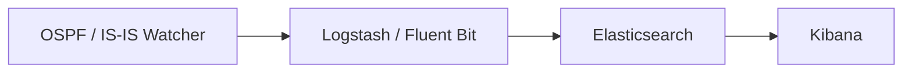

# Интеграция ELK / Kibana

Для полнотекстового поиска, дашбордов и долгосрочной истории событий
топологии отправляйте вывод Watcher-а в **Elastic Stack (ELK)**.
**Logstash** (или **Fluent Bit**) пересылает каждое событие;
**Elasticsearch** индексирует его; **Kibana** позволяет его исследовать.

Это соответствует [размеру развёртывания №3](index.md#deployment-sizes).

## Конвейер



!!! info "Logstash или Fluent Bit"
    - **Logstash** (профиль по умолчанию) запускается вместе с контейнером
      создания индексов и включает путь к Zabbix. Поднимите его командой
      `docker compose up -d`.
    - **Fluent Bit** - более лёгкая альтернатива (профиль `fluent-bit`,
      только вывод HTTP/Webhook):
      ```bash
      docker compose --profile fluent-bit up -d fluent-bit
      ```
      Оба отправляют HTTP-полезную нагрузку в слегка разных форматах - учитывайте это, если пишете собственных потребителей.

## Подключение вашего ELK

Если у вас уже есть ELK, задайте `ELASTIC_IP` в `.env` Watcher-а и
раскомментируйте блок Elastic в `logstash/pipeline/logstash.conf`. Шаблоны
индексов можно создать так:

```bash
sudo docker run -it --rm --env-file=./.env \
  -v ./logstash/index_template/create.py:/home/watcher/watcher/create.py \
  vadims06/ospf-watcher:latest python3 ./create.py
```

Ещё нет ELK? Разверните его из
[docker-elk](https://github.com/deviantony/docker-elk). Для демонстрации
установите лицензию basic и отключите безопасность в
`docker-elk/elasticsearch/config/elasticsearch.yml`:

```yaml
xpack.license.self_generated.type: basic
xpack.security.enabled: false
```

!!! tip "Вывод Elastic блокирует остальные при сбое"
    Если вывод Elastic не может достучаться до своего хоста, он блокирует
    *остальные* выводы и продолжает повторные попытки независимо от
    `EXPORT_TO_ELASTICSEARCH_BOOL`. Включайте (раскомментируйте)
    конфигурацию Elastic только тогда, когда ELK реально запущен.

## Настройка Kibana

**Шаблоны индексов** создаются автоматически контейнером создания
индексов. В разделе **Management → Stack Management → Index Management →
Index Templates** должны появиться записи вроде:

- `ospf-watcher-costs-changes`
- `ospf-watcher-updown-events`


Затем создайте **data view** поверх индексов Watcher-а, чтобы начать
исследование:


## Исследование событий

Как только данные начинают поступать, сырые события становятся доступны
для поиска в **Discover**:

=== "Изменения метрики"

    

=== "Подъём/разрыв соседства"

    

=== "Журнал TE"

    

Для TE можно фильтровать по атрибутам, например по административной
группе:


---

**Связанные страницы:** [Zabbix](zabbix.md) · [Webhooks и Slack](webhooks.md) ·
[Traffic Engineering](../analysis/traffic-engineering.md)
