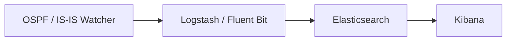

# ELK / Kibana 集成

若需要对拓扑事件进行全文搜索、构建仪表盘并保留长期历史记录，请将 Watcher
的输出发送到 **Elastic Stack（ELK）**。**Logstash**（或 **Fluent Bit**）
转发每一条事件；**Elasticsearch** 对其建立索引；**Kibana** 让您探索这些数据。

这对应于[部署规模 #3](index.md#deployment-sizes)。

## 流水线



!!! info "Logstash 与 Fluent Bit 对比"
    - **Logstash**（默认 profile）会与一个 index-creator 容器一起启动，并
      启用 Zabbix 路径。使用 `docker compose up -d` 启动它。
    - **Fluent Bit** 是一个更轻量的替代方案（profile 为 `fluent-bit`，仅支持
      HTTP/Webhook 输出）：
      ```bash
      docker compose --profile fluent-bit up -d fluent-bit
      ```
      两者发送的 HTTP payload 格式略有不同——如果您编写自定义的消费端，请
      留意这一点。

## 连接您自己的 ELK

如果您已经在运行 ELK，请在 Watcher 的 `.env` 中设置 `ELASTIC_IP`，并取消
`logstash/pipeline/logstash.conf` 中 Elastic 代码块的注释。您可以用以下命令
创建索引模板：

```bash
sudo docker run -it --rm --env-file=./.env \
  -v ./logstash/index_template/create.py:/home/watcher/watcher/create.py \
  vadims06/ospf-watcher:latest python3 ./create.py
```

还没有 ELK？可以从 [docker-elk](https://github.com/deviantony/docker-elk)
启动一个。对于演示环境，可以在
`docker-elk/elasticsearch/config/elasticsearch.yml` 中将许可证设置为 basic
并禁用安全功能：

```yaml
xpack.license.self_generated.type: basic
xpack.security.enabled: false
```

!!! tip "Elastic 输出失败时会阻塞其他输出"
    如果 Elastic 输出无法连接到其主机，它会阻塞*其他*输出，并不断重试，
    无论 `EXPORT_TO_ELASTICSEARCH_BOOL` 设置为何值。只有在您确实运行了 ELK
    时才启用（取消注释）Elastic 配置。

## Kibana 设置

**索引模板**由 index-creator 容器自动创建。在
**Management → Stack Management → Index Management → Index Templates** 下，
您应该能看到如下条目：

- `ospf-watcher-costs-changes`
- `ospf-watcher-updown-events`


然后针对 watcher 索引创建一个 **data view**，即可开始探索：


## 探索事件

数据开始流入后，原始事件可在 **Discover** 中被搜索到：

=== "开销变化"

    

=== "邻接关系 up/down"

    

=== "TE 日志"

    

对于 TE，您可以按诸如管理组之类的属性进行筛选：


---

**相关内容：** [Zabbix](zabbix.md) · [Webhooks & Slack](webhooks.md) ·
[流量工程](../analysis/traffic-engineering.md)
