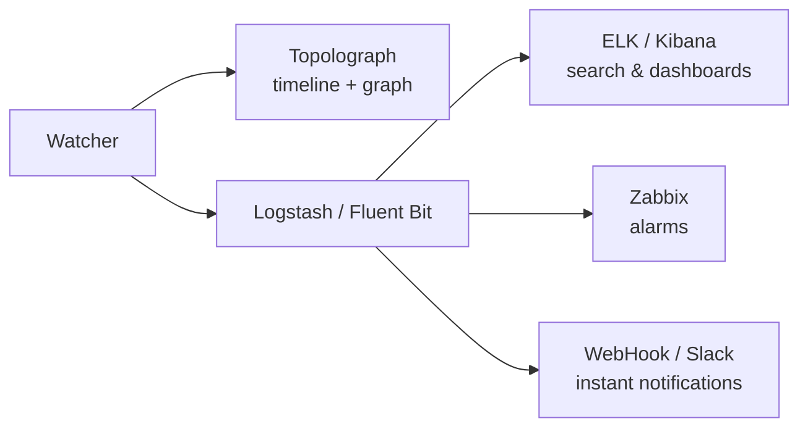

# Monitoreo en Tiempo Real

Una instantánea de archivo de texto le dice cómo se ve la red *ahora*. Los
**Watchers** le dicen qué está *haciendo* — cada adyacencia que oscila, cada
costo que cambia, cada prefijo que aparece y desaparece — y convierten cada
uno en un evento buscable y con capacidad de generar alertas.

Hay tres Watchers, uno por protocolo, construidos sobre la misma arquitectura:

-   :material-router-network:{ .lg .middle } __OSPF Watcher__

    ---

    Monitorea los cambios de topología OSPF en vivo mediante GRE o BGP-LS.

    [:octicons-arrow-right-24: OSPF Watcher](ospf-watcher.md)

-   :material-router-network:{ .lg .middle } __IS-IS Watcher__

    ---

    Lo mismo para IS-IS — incluidos los niveles L1/L2 e IPv6.

    [:octicons-arrow-right-24: IS-IS Watcher](isis-watcher.md)

-   :material-transit-connection-variant:{ .lg .middle } __BMP Watcher__

    ---

    Sesiones BGP, rutas y contexto de VPN y EVPN mediante una estación BMP pasiva.

    [:octicons-arrow-right-24: BMP Watcher](bmp-watcher.md)

## Qué hace un Watcher

Un Watcher escucha de forma pasiva el plano de control del IGP — mediante
una [adyacencia GRE](../ingestion/gre.md) o una
[sesión BGP-LS](../ingestion/bgp-ls.md) — y ante cada cambio:

1. **alimenta la topología** en Topolograph (para que el grafo se mantenga
   actualizado), y
2. **emite un evento** que puede enviarse a uno o más destinos:

El Watcher almacena el **historial** de eventos (qué pasó y cuándo);
Topolograph muestra el estado **presente** y le permite explorar resultados
**futuros potenciales**.

## Eventos detectados

Ambos Watchers detectan las mismas clases de cambio:

- **Adyacencia de vecino** arriba / abajo
- Cambios de **costo de enlace** (métrica anterior → nueva)
- **Redes/prefijos** que aparecen o desaparecen
- **Atributos de TE** — grupo administrativo, ancho de banda
  máximo/reservable/no reservado, métrica de TE
  (consulte [Traffic Engineering](../analysis/traffic-engineering.md))

IS-IS además agrupa todo por **nivel (L1/L2)**.

## Modos de conexión

La configuración de la conexión está en
[Cómo Obtener la Topología](../ingestion/index.md):

- [**Sesión GRE**](../ingestion/gre.md) — ampliamente compatible; necesita
  un túnel GRE y una adyacencia de IGP por área/nivel.
- [**Sesión BGP-LS**](../ingestion/bgp-ls.md) — sin túnel; una única sesión
  transporta todo el dominio. Requiere imagen del Watcher `v3.1.0`+.

## Tamaños de implementación { #deployment-sizes }

Puede empezar tan pequeño como una demo de containerlab y crecer hasta una
pila completa de Watcher + Topolograph + ELK. Una progresión típica:

| # | Deployment | Text logs | View on map | Zabbix / Slack | Search events |
| --- | --- | :---: | :---: | :---: | :---: |
| 1 | Mínimo indispensable (containerlab) | ✅ | ❌ | ❌ | ❌ |
| 2 | Topolograph local + Watcher (ELK apagado) | ✅ | ✅ | ✅ | ❌ |
| 3 | Topolograph local + Watcher + ELK | ✅ | ✅ | ✅ | ✅ |
| 4 | Como el #2 pero **Fluent Bit** en lugar de Logstash | ✅ | ✅ | Solo HTTP/Webhook | ❌ |

El script `install.sh` de
[topolograph-docker](https://github.com/Vadims06/topolograph-docker) puede
levantar Topolograph y un Watcher juntos.

## Heartbeats del Watcher

Cada Watcher puede enviar periódicamente un **heartbeat** (POST) a
Topolograph, así la interfaz lista cada Watcher registrado con un estado de
actividad (`up` / `stale` / `down`) — independientemente de si la red está
produciendo eventos en ese momento.

!!! note "Organizaciones con varios watchers"
    Los Watchers que deban aparecer juntos en la interfaz deben compartir
    **un mismo usuario / token de API de Topolograph**. Requiere
    Topolograph v3.x o posterior.

## Exportación de eventos

-   :simple-elasticsearch:{ .lg .middle } __ELK / Kibana__

    ---

    Indexe eventos, búsquelos y construya paneles.

    [:octicons-arrow-right-24: ELK / Kibana](elk-kibana.md)

-   :material-bell-alert:{ .lg .middle } __Zabbix__

    ---

    Genere alarmas por eventos de adyacencia, costo y red.

    [:octicons-arrow-right-24: Zabbix](zabbix.md)

-   :material-webhook:{ .lg .middle } __Webhooks y Slack__

    ---

    Reciba notificaciones instantáneas en su herramienta de chat.

    [:octicons-arrow-right-24: Webhooks y Slack](webhooks.md)

