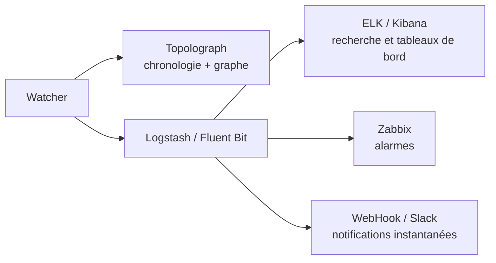

# Surveillance en temps réel

Un instantané de fichier texte vous montre à quoi ressemble le réseau
*maintenant*. Les **Watchers** vous montrent ce qu'il *fait* — chaque
adjacence qui flappe, chaque coût qui change, chaque préfixe qui apparaît
et disparaît — et transforment chacun en un événement consultable et
générateur d'alertes.

Il existe trois Watchers, un par protocole, construits sur la même
architecture :

-   :material-router-network:{ .lg .middle } __OSPF Watcher__

    ---

    Surveille les changements de topologie OSPF en direct via GRE ou
    BGP-LS.

    [:octicons-arrow-right-24: OSPF Watcher](ospf-watcher.md)

-   :material-router-network:{ .lg .middle } __IS-IS Watcher__

    ---

    La même chose pour IS-IS — y compris les niveaux L1/L2 et IPv6.

    [:octicons-arrow-right-24: IS-IS Watcher](isis-watcher.md)

-   :material-transit-connection-variant:{ .lg .middle } __BMP Watcher__

    ---

    Sessions BGP, routes et contexte VPN et EVPN via une station BMP passive.

    [:octicons-arrow-right-24: BMP Watcher](bmp-watcher.md)

## Ce que fait un Watcher

Un Watcher écoute passivement le plan de contrôle de l'IGP — via une
[adjacence GRE](../ingestion/gre.md) ou une
[session BGP-LS](../ingestion/bgp-ls.md) — et pour chaque changement il :

1. **alimente la topologie** dans Topolograph (pour que le graphe reste à
   jour), et
2. **émet un événement** qui peut être transmis vers une ou plusieurs
   destinations :

Le Watcher stocke l'**historique** des événements (ce qui s'est passé et
quand) ; Topolograph montre l'état **présent** et vous permet d'explorer
les résultats **futurs potentiels**.

## Événements détectés

Les deux Watchers détectent les mêmes classes de changements :

- Adjacence de **voisin** en service / hors service
- Changements de **coût de lien** (ancienne → nouvelle métrique)
- **Réseaux/préfixes** apparaissant ou disparaissant
- **Attributs TE** — groupe administratif, bande passante max/réservable/non
  réservée, métrique TE
  (voir [Ingénierie de trafic](../analysis/traffic-engineering.md))

IS-IS regroupe en plus tout par **niveau (L1/L2)**.

## Modes de connexion

La mise en place de la connexion se trouve sous
[Importer la topologie](../ingestion/index.md) :

- [**Session GRE**](../ingestion/gre.md) — largement compatible ; nécessite
  un tunnel GRE et une adjacence IGP par zone/niveau.
- [**Session BGP-LS**](../ingestion/bgp-ls.md) — aucun tunnel ; une seule
  session transporte tout le domaine. Nécessite l'image Watcher `v3.1.0`+.

## Tailles de déploiement { #deployment-sizes }

Vous pouvez commencer aussi petit qu'une démo containerlab et évoluer vers
une pile complète Watcher + Topolograph + ELK. Une progression typique :

| # | Déploiement | Logs texte | Vue sur la carte | Zabbix / Slack | Recherche d'événements |
| --- | --- | :---: | :---: | :---: | :---: |
| 1 | Minimum absolu (containerlab) | ✅ | ❌ | ❌ | ❌ |
| 2 | Topolograph local + Watcher (ELK désactivé) | ✅ | ✅ | ✅ | ❌ |
| 3 | Topolograph local + Watcher + ELK | ✅ | ✅ | ✅ | ✅ |
| 4 | Comme #2 mais **Fluent Bit** au lieu de Logstash | ✅ | ✅ | HTTP/Webhook uniquement | ❌ |

Le script `install.sh` de
[topolograph-docker](https://github.com/Vadims06/topolograph-docker) peut
démarrer Topolograph et un Watcher ensemble.

## Battements de cœur du Watcher

Chaque Watcher peut envoyer périodiquement un **battement de cœur**
(heartbeat) en POST vers Topolograph, afin que l'interface liste chaque
Watcher enregistré avec un statut de disponibilité (`up` / `stale` /
`down`) — indépendamment du fait que le réseau produise actuellement des
événements ou non.

!!! note "Organisations multi-watcher"
    Les Watchers qui doivent apparaître ensemble dans l'interface doivent
    partager **un seul utilisateur / jeton API Topolograph**. Nécessite
    Topolograph v3.x ou ultérieur.

## Exporter les événements

-   :simple-elasticsearch:{ .lg .middle } __ELK / Kibana__

    ---

    Indexez les événements, recherchez-les, et construisez des tableaux de
    bord.

    [:octicons-arrow-right-24: ELK / Kibana](elk-kibana.md)

-   :material-bell-alert:{ .lg .middle } __Zabbix__

    ---

    Déclenchez des alarmes sur les événements d'adjacence, de coût et de
    réseau.

    [:octicons-arrow-right-24: Zabbix](zabbix.md)

-   :material-webhook:{ .lg .middle } __Webhooks et Slack__

    ---

    Recevez des notifications instantanées dans votre outil de discussion.

    [:octicons-arrow-right-24: Webhooks et Slack](webhooks.md)

