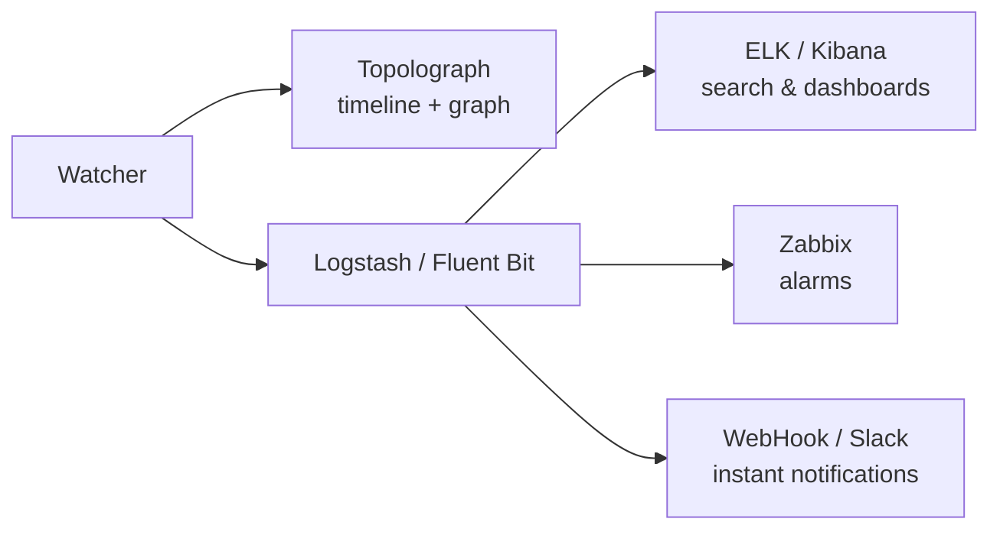
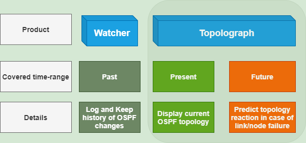

# Real-Time Monitoring

A text-file snapshot tells you what the network looks like *now*. The **Watchers**
tell you what it's *doing* — every adjacency that flaps, every cost that changes,
every prefix that comes and goes — and turn each into a searchable, alertable
event.

There are three Watchers, one per protocol, built on the same architecture:

-   :material-router-network:{ .lg .middle } __OSPF Watcher__

    ---

    Monitors live OSPF topology changes via GRE or BGP-LS.

    [:octicons-arrow-right-24: OSPF Watcher](ospf-watcher.md)

-   :material-router-network:{ .lg .middle } __IS-IS Watcher__

    ---

    The same for IS-IS — including L1/L2 levels and IPv6.

    [:octicons-arrow-right-24: IS-IS Watcher](isis-watcher.md)

-   :material-transit-connection-variant:{ .lg .middle } __BMP Watcher__

    ---

    BGP sessions, routes and VPN context over a passive BMP station.

    [:octicons-arrow-right-24: BMP Watcher](bmp-watcher.md)

## What a Watcher does

A Watcher passively listens to the IGP control plane — over a
[GRE adjacency](../ingestion/gre.md) or a [BGP-LS session](../ingestion/bgp-ls.md) —
and for every change it:

1. **feeds the topology** into Topolograph (so the graph stays current), and
2. **emits an event** that can be shipped to one or more destinations:

The Watcher lets you see which events happened in the past; Topolograph
shows the **present** state and lets you explore **potential future** outcomes.

## Detected events

Both Watchers detect the same classes of change:

- **Neighbor adjacency** up / down
- **Link cost** changes (old → new metric)
- **Networks/prefixes** appearing or disappearing
- **TE attributes** added, changed, or removed — admin group,
  max/reservable/unreserved bandwidth, TE metric
  (see [Traffic Engineering](../analysis/traffic-engineering.md))

IS-IS additionally groups everything by **level (L1/L2)**.

## Connection modes

Connection setup lives under [Getting Topology In](../ingestion/index.md):

- [**GRE session**](../ingestion/gre.md) — broadly compatible; needs a GRE tunnel
  and an IGP adjacency per area/level.
- [**BGP-LS session**](../ingestion/bgp-ls.md) — no tunnel; a single session
  carries the whole domain. Needs Watcher image `v3.1.0`+.

## Deployment sizes { #deployment-sizes }

You can start as small as a containerlab demo and grow to a full Watcher +
Topolograph + ELK stack. A typical progression:

| # | Deployment | Text logs | View on map | Zabbix / Slack | Search events |
| --- | --- | :---: | :---: | :---: | :---: |
| 1 | Bare minimum (containerlab) | ✅ | ❌ | ❌ | ❌ |
| 2 | Local Topolograph + Watcher (ELK off) | ✅ | ✅ | ✅ | ❌ |
| 3 | Local Topolograph + Watcher + ELK | ✅ | ✅ | ✅ | ✅ |
| 4 | As #2 but **Fluent Bit** instead of Logstash | ✅ | ✅ | HTTP/Webhook only | ❌ |

The `install.sh` script from
[topolograph-docker](https://github.com/Vadims06/topolograph-docker) can bring up
Topolograph and a Watcher together.

## Watcher heartbeats

Each Watcher can periodically POST a **heartbeat** to Topolograph, so the UI
lists every registered Watcher with a liveness status (`up` / `stale` / `down`) —
independent of whether the network is currently producing events.

!!! note "Multi-watcher organisations"
    Watchers that should appear together in the UI must share **one Topolograph
    user / API token**. Requires Topolograph v3.x or later.

## Exporting events

-   :simple-elasticsearch:{ .lg .middle } __ELK / Kibana__

    ---

    Index events, search them, and build dashboards.

    [:octicons-arrow-right-24: ELK / Kibana](elk-kibana.md)

-   :material-bell-alert:{ .lg .middle } __Zabbix__

    ---

    Raise alarms on adjacency, cost and network events.

    [:octicons-arrow-right-24: Zabbix](zabbix.md)

-   :material-webhook:{ .lg .middle } __Webhooks & Slack__

    ---

    Get instant notifications in your chat tool.

    [:octicons-arrow-right-24: Webhooks & Slack](webhooks.md)

