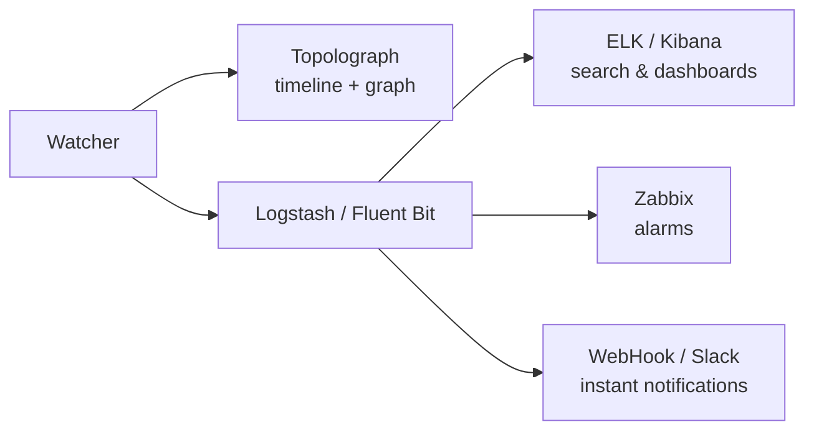

# Monitoramento em tempo real

Um snapshot de arquivo de texto mostra como a rede está *agora*. Os
**Watchers** mostram o que ela está *fazendo* — cada adjacência que oscila,
cada custo que muda, cada prefixo que aparece e desaparece — e transformam
cada um em um evento pesquisável e passível de alerta.

Existem três Watchers, um por protocolo, construídos sobre a mesma
arquitetura:

-   :material-router-network:{ .lg .middle } __OSPF Watcher__

    ---

    Monitora mudanças de topologia OSPF ao vivo via GRE ou BGP-LS.

    [:octicons-arrow-right-24: OSPF Watcher](ospf-watcher.md)

-   :material-router-network:{ .lg .middle } __IS-IS Watcher__

    ---

    O mesmo para o IS-IS — incluindo os níveis L1/L2 e IPv6.

    [:octicons-arrow-right-24: IS-IS Watcher](isis-watcher.md)

-   :material-transit-connection-variant:{ .lg .middle } __BMP Watcher__

    ---

    Sessões BGP, rotas e contexto de VPN e EVPN por uma estação BMP passiva.

    [:octicons-arrow-right-24: BMP Watcher](bmp-watcher.md)

## O que um Watcher faz

Um Watcher escuta passivamente o plano de controle do IGP — via
[adjacência GRE](../ingestion/gre.md) ou [sessão BGP-LS](../ingestion/bgp-ls.md) —
e, para cada mudança, ele:

1. **alimenta a topologia** no Topolograph (para que o grafo permaneça
   atualizado), e
2. **emite um evento** que pode ser enviado a um ou mais destinos:

O Watcher armazena o **histórico** de eventos (o que aconteceu e quando); o
Topolograph mostra o estado **presente** e permite explorar resultados
**futuros potenciais**.

## Eventos detectados

Ambos os Watchers detectam as mesmas classes de mudança:

- **Adjacência de vizinho** up / down
- Mudanças de **custo de enlace** (métrica antiga → nova)
- **Redes/prefixos** aparecendo ou desaparecendo
- **Atributos de TE** — admin group, largura de banda máxima/reservável/não
  reservada, métrica de TE (veja
  [Traffic Engineering](../analysis/traffic-engineering.md))

O IS-IS adicionalmente agrupa tudo por **nível (L1/L2)**.

## Modos de conexão

A configuração da conexão está em [Obtendo a topologia](../ingestion/index.md):

- [**Sessão GRE**](../ingestion/gre.md) — amplamente compatível; precisa de
  um túnel GRE e de uma adjacência IGP por área/nível.
- [**Sessão BGP-LS**](../ingestion/bgp-ls.md) — sem túnel; uma única sessão
  carrega todo o domínio. Requer imagem do Watcher `v3.1.0`+.

## Tamanhos de implantação { #deployment-sizes }

Você pode começar tão pequeno quanto uma demonstração em containerlab e
crescer para uma pilha completa de Watcher + Topolograph + ELK. Uma
progressão típica:

| # | Implantação | Logs de texto | Ver no mapa | Zabbix / Slack | Pesquisar eventos |
| --- | --- | :---: | :---: | :---: | :---: |
| 1 | Mínimo absoluto (containerlab) | ✅ | ❌ | ❌ | ❌ |
| 2 | Topolograph local + Watcher (ELK desligado) | ✅ | ✅ | ✅ | ❌ |
| 3 | Topolograph local + Watcher + ELK | ✅ | ✅ | ✅ | ✅ |
| 4 | Como #2, mas com **Fluent Bit** em vez de Logstash | ✅ | ✅ | Apenas HTTP/Webhook | ❌ |

O script `install.sh` do
[topolograph-docker](https://github.com/Vadims06/topolograph-docker) pode
subir o Topolograph e um Watcher juntos.

## Heartbeats do Watcher

Cada Watcher pode enviar periodicamente um **heartbeat** via POST para o
Topolograph, para que a interface liste cada Watcher registrado com um
status de atividade (`up` / `stale` / `down`) — independentemente de a
rede estar ou não produzindo eventos no momento.

!!! note "Organizações com múltiplos watchers"
    Watchers que devem aparecer juntos na interface precisam compartilhar
    **um único usuário/token de API do Topolograph**. Requer Topolograph
    v3.x ou posterior.

## Exportando eventos

-   :simple-elasticsearch:{ .lg .middle } __ELK / Kibana__

    ---

    Indexe eventos, pesquise-os e construa painéis.

    [:octicons-arrow-right-24: ELK / Kibana](elk-kibana.md)

-   :material-bell-alert:{ .lg .middle } __Zabbix__

    ---

    Gere alarmes sobre eventos de adjacência, custo e rede.

    [:octicons-arrow-right-24: Zabbix](zabbix.md)

-   :material-webhook:{ .lg .middle } __Webhooks e Slack__

    ---

    Receba notificações instantâneas na sua ferramenta de chat.

    [:octicons-arrow-right-24: Webhooks e Slack](webhooks.md)

