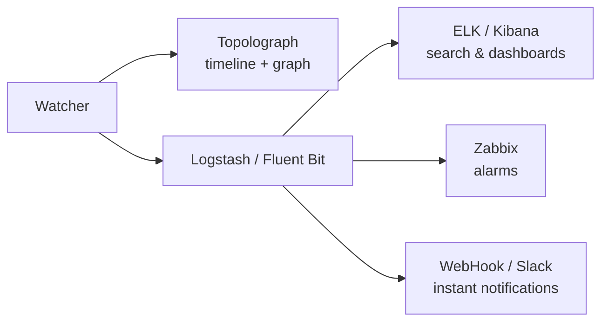

# Мониторинг в реальном времени

Снимок текстового файла показывает, как выглядит сеть *сейчас*. **Watcher**
показывает, что она *делает* - каждое соседство, которое флапает, каждую
метрику, которая меняется, каждый префикс, который появляется и исчезает - и
превращает всё это в событие, которое можно искать и на которое можно
настроить алерт.

Есть три Watcher, по одному на протокол, построенных на одной архитектуре:

-   :material-router-network:{ .lg .middle } __OSPF Watcher__

    ---

    Отслеживает изменения топологии OSPF в реальном времени через GRE или BGP-LS.

    [:octicons-arrow-right-24: OSPF Watcher](ospf-watcher.md)

-   :material-router-network:{ .lg .middle } __IS-IS Watcher__

    ---

    То же самое для IS-IS - включая уровни L1/L2 и IPv6.

    [:octicons-arrow-right-24: IS-IS Watcher](isis-watcher.md)

-   :material-transit-connection-variant:{ .lg .middle } __BMP Watcher__

    ---

    Сессии BGP, маршруты, контекст VPN и EVPN через пассивную станцию BMP.

    [:octicons-arrow-right-24: BMP Watcher](bmp-watcher.md)

## Что делает Watcher

Watcher пассивно слушает control plane IGP - через
[GRE-соседство](../ingestion/gre.md) или [сессию BGP-LS](../ingestion/bgp-ls.md) - и при каждом изменении:

1. **передаёт топологию** в Topolograph (граф остаётся актуальным), и
2. **генерирует событие**, которое можно отправить в одно или несколько мест
   назначения:

Watcher позволяет увидеть, какие события произошли в прошлом; Topolograph
показывает **текущее** состояние и позволяет исследовать **возможные будущие**
варианты.

## Обнаруживаемые события

Оба Watcher-а обнаруживают одни и те же классы изменений:

- **Событие соседства** - установление / потеря
- **Изменения метрики линка** (старая → новая метрика)
- **Появление или исчезновение сетей/префиксов**
- **Атрибуты TE** - появление, изменение или удаление одного или нескольких
  атрибутов TE: административная группа, максимальная / резервируемая /
  нерезервированная полоса пропускания, метрика TE
  (см. [Traffic Engineering](../analysis/traffic-engineering.md))

IS-IS дополнительно группирует всё по **уровню (L1/L2)**.

## Режимы подключения

Настройка подключения описана в разделе [Получение топологии](../ingestion/index.md):

- [**Сессия GRE**](../ingestion/gre.md) - широко совместима; требует GRE-туннель
  и соседство IGP на каждую область/уровень.
- [**Сессия BGP-LS**](../ingestion/bgp-ls.md) - без туннеля; один сеанс несёт
  весь домен целиком. Требует образ Watcher `v3.1.0`+.

## Размеры развёртывания { #deployment-sizes }

Можно начать с демо на containerlab и вырасти до полного стека Watcher +
Topolograph + ELK. Типичная последовательность:

| # | Развёртывание | Текстовые логи | Просмотр на карте | Zabbix / Slack | Поиск событий |
| --- | --- | :---: | :---: | :---: | :---: |
| 1 | Минимальный набор (containerlab) | ✅ | ❌ | ❌ | ❌ |
| 2 | Локальный Topolograph + Watcher (без ELK) | ✅ | ✅ | ✅ | ❌ |
| 3 | Локальный Topolograph + Watcher + ELK | ✅ | ✅ | ✅ | ✅ |
| 4 | Как #2, но **Fluent Bit** вместо Logstash | ✅ | ✅ | Только HTTP/Webhook | ❌ |

Скрипт `install.sh` из
[topolograph-docker](https://github.com/Vadims06/topolograph-docker) может
поднять Topolograph и Watcher вместе.

## Heartbeat Watcher

Каждый Watcher может периодически отправлять POST-запрос с **heartbeat** в
Topolograph, чтобы UI показывал каждый зарегистрированный Watcher со статусом
активности (`up` / `stale` / `down`) - независимо от того, генерирует ли сеть
события в данный момент.

!!! note "Организации с несколькими Watcher"
    Watcher, которые должны отображаться вместе в UI, должны использовать
    **один пользователь / API-токен Topolograph**. Требуется Topolograph v3.x
    или новее.

## Экспорт событий

-   :simple-elasticsearch:{ .lg .middle } __ELK / Kibana__

    ---

    Индексируйте события, ищите их и стройте дашборды.

    [:octicons-arrow-right-24: ELK / Kibana](elk-kibana.md)

-   :material-bell-alert:{ .lg .middle } __Zabbix__

    ---

    Настраивайте алармы по событиям соседства, метрики и сети.

    [:octicons-arrow-right-24: Zabbix](zabbix.md)

-   :material-webhook:{ .lg .middle } __Webhooks и Slack__

    ---

    Получайте мгновенные уведомления в вашем чат-инструменте.

    [:octicons-arrow-right-24: Webhooks и Slack](webhooks.md)

