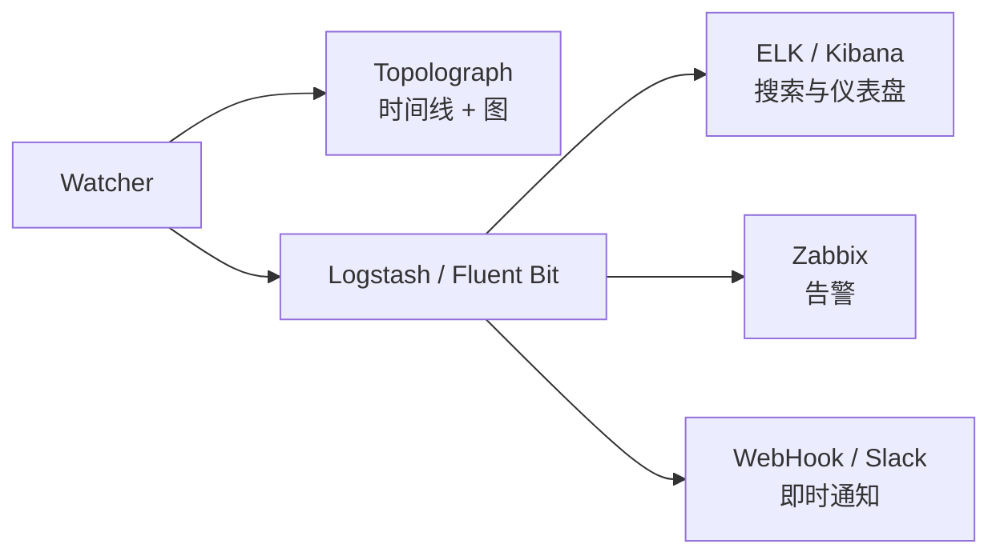

# 实时监控

文本文件快照能告诉您网络*现在*是什么样子。**Watcher** 则会告诉您网络*正在
发生*什么——每一次邻接关系抖动、每一次开销变化、每一个前缀的出现和消失——
并将每一次变化都转变为可搜索、可告警的事件。

有三种 Watcher，每种协议一个，基于相同的架构构建：

-   :material-router-network:{ .lg .middle } __OSPF Watcher__

    ---

    通过 GRE 或 BGP-LS 监控实时的 OSPF 拓扑变化。

    [:octicons-arrow-right-24: OSPF Watcher](ospf-watcher.md)

-   :material-router-network:{ .lg .middle } __IS-IS Watcher__

    ---

    面向 IS-IS 的同类工具——包括 L1/L2 级别和 IPv6。

    [:octicons-arrow-right-24: IS-IS Watcher](isis-watcher.md)

-   :material-transit-connection-variant:{ .lg .middle } __BMP Watcher__

    ---

    通过被动 BMP 站点采集 BGP 会话、路由与 VPN 上下文。

    [:octicons-arrow-right-24: BMP Watcher](bmp-watcher.md)

## Watcher 做什么

Watcher 通过 [GRE 邻接关系](../ingestion/gre.md)或 [BGP-LS 会话](../ingestion/bgp-ls.md)
被动监听 IGP 控制平面——对于每一次变化，它都会：

1. 将拓扑数据**提供**给 Topolograph（保持图形是最新的），并
2. **发出一个事件**，可以将其发送到一个或多个目标：

Watcher 存储的是事件的**历史**（发生了什么，以及何时发生）；Topolograph 展示的是
**当前**状态，并让您探索**潜在的未来**结果。

## 检测到的事件

两种 Watcher 都会检测同样的一类变化：

- **邻居邻接关系** up / down
- **链路开销**变化（旧度量 → 新度量）
- **网络/前缀**的出现或消失
- **TE 属性**——管理组、最大/可预留/未预留带宽、TE 度量
  （参见[流量工程](../analysis/traffic-engineering.md)）

IS-IS 还会额外按**级别（L1/L2）**对所有内容进行分组。

## 连接方式

连接的建立方式记录在[获取拓扑数据](../ingestion/index.md)中：

- [**GRE 会话**](../ingestion/gre.md) —— 兼容性广泛；每个区域/级别都需要一条
  GRE 隧道和一个 IGP 邻接关系。
- [**BGP-LS 会话**](../ingestion/bgp-ls.md) —— 无需隧道；单个会话即可承载整个域。
  需要 Watcher 镜像 `v3.1.0` 或更高版本。

## 部署规模 { #deployment-sizes }

您可以从一个小小的 containerlab 演示开始，逐步扩展到完整的 Watcher +
Topolograph + ELK 技术栈。一个典型的演进路径：

| # | 部署 | 文本日志 | 在地图上查看 | Zabbix / Slack | 搜索事件 |
| --- | --- | :---: | :---: | :---: | :---: |
| 1 | 最小化部署（containerlab） | ✅ | ❌ | ❌ | ❌ |
| 2 | 本地 Topolograph + Watcher（ELK 关闭） | ✅ | ✅ | ✅ | ❌ |
| 3 | 本地 Topolograph + Watcher + ELK | ✅ | ✅ | ✅ | ✅ |
| 4 | 与 #2 相同，但用 **Fluent Bit** 代替 Logstash | ✅ | ✅ | 仅 HTTP/Webhook | ❌ |

来自 [topolograph-docker](https://github.com/Vadims06/topolograph-docker) 的
`install.sh` 脚本可以一并启动 Topolograph 和一个 Watcher。

## Watcher 心跳

每个 Watcher 都可以定期向 Topolograph POST 一次**心跳**，因此 UI 会列出每个已
注册的 Watcher 及其存活状态（`up` / `stale` / `down`）——无论网络当前是否正在
产生事件。

!!! note "多 Watcher 组织"
    需要在 UI 中一起显示的多个 Watcher 必须共享**同一个 Topolograph
    用户/API 令牌**。需要 Topolograph v3.x 或更高版本。

## 导出事件

-   :simple-elasticsearch:{ .lg .middle } __ELK / Kibana__

    ---

    对事件建立索引、进行搜索，并构建仪表盘。

    [:octicons-arrow-right-24: ELK / Kibana](elk-kibana.md)

-   :material-bell-alert:{ .lg .middle } __Zabbix__

    ---

    针对邻接关系、开销和网络事件触发告警。

    [:octicons-arrow-right-24: Zabbix](zabbix.md)

-   :material-webhook:{ .lg .middle } __Webhooks & Slack__

    ---

    在您的聊天工具中获取即时通知。

    [:octicons-arrow-right-24: Webhooks & Slack](webhooks.md)

