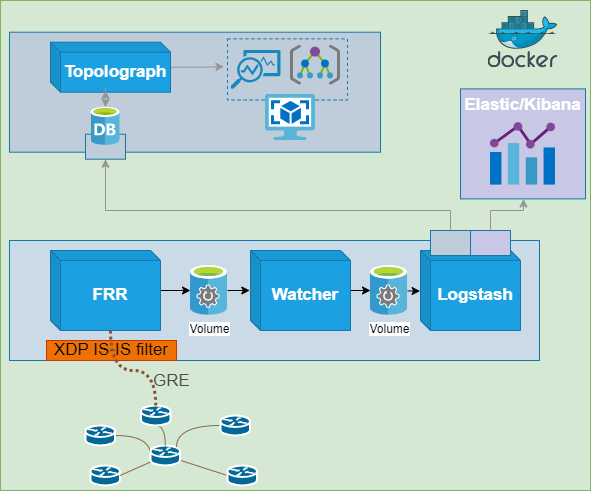
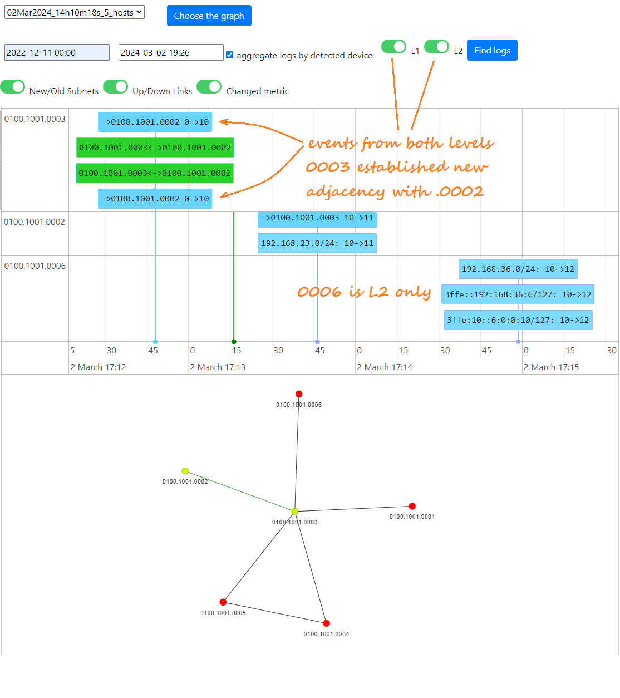
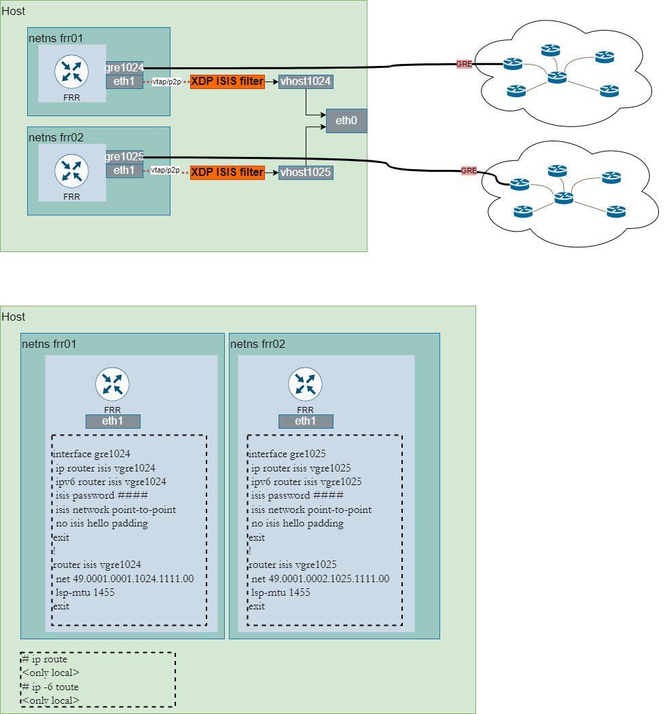

# IS-IS Watcher

O **IS-IS Watcher** é a contraparte para IS-IS do [OSPF Watcher](ospf-watcher.md).
Ele escuta passivamente o plano de controle do IS-IS — via
[adjacência GRE](../ingestion/gre.md) ou [BGP-LS](../ingestion/bgp-ls.md) — e
registra ou exporta cada mudança para o **ELK**, o **Zabbix**, **WebHooks**
e o painel de monitoramento do **Topolograph**. Assim como o OSPF Watcher,
ele é distribuído como contêineres.

[:simple-github: vadims06/isiswatcher](https://github.com/Vadims06/isiswatcher){ .md-button }

## Eventos detectados

- Adjacência de vizinho IS-IS **Up/Down**
- **Mudanças de custo** de enlace IS-IS
- Redes IS-IS **aparecendo/desaparecendo**
- **Atributos de TE** do IS-IS: administrative group, largura de banda
  máxima do enlace, largura de banda máxima reservável, largura de banda
  não reservada, métrica padrão de TE e shared risk link group (SRLG)
- **Flags de nó** do IS-IS: transições de **overload (OL)** e
  **attached (ATT)** (além de ABR/ASBR derivados via BGP-LS)

Tudo é agrupado por **nível do IS-IS (L1/L2)** na linha do tempo:

!!! example "Como os níveis aparecem"
    Uma captura típica pode mostrar: uma mudança de métrica em um enlace
    aparecendo como **logs duplicados tanto para L1 quanto para L2**; um
    roteador ficando **down apenas para L2** depois que
    `isis circuit-type level-1` é aplicado; uma mudança de métrica
    posterior vista **apenas em L1**; e uma nova rede stub aparecendo
    **em L2**.

## Conectando-o

A configuração da conexão está em [Obtendo a topologia](../ingestion/index.md):

- [**Modo GRE**](../ingestion/gre.md) — o FRR forma uma adjacência IS-IS
  via um túnel GRE; um **filtro XDP para IS-IS** mantém o Watcher
  somente-escuta descartando qualquer LSP que anuncie mais do que a
  própria rede do Watcher.
- [**Modo BGP-LS**](../ingestion/bgp-ls.md) — o roteador exporta a
  topologia IS-IS via BGP-LS; o GoBGP + o encaminhador alimentam o
  Watcher.

!!! warning "Um túnel GRE por área"
    O IS-IS, assim como o OSPF, inunda por área/nível. No modo GRE, você
    precisa de **pelo menos um túnel GRE em cada área** que quiser
    monitorar — isso é uma propriedade da inundação de estado de enlace,
    não uma limitação da ferramenta. O BGP-LS evita isso ao carregar todo o
    domínio em uma única sessão.

!!! note "Compatibilidade"
    Mudanças de rede do IS-IS aparecem no grafo a partir do
    [topolograph v2.38](https://github.com/Vadims06/topolograph/releases/tag/v2.38)
    ou posterior.

## Suporte a TLV e métricas

O IS-IS Watcher analisa tanto métricas no estilo antigo (narrow) quanto no
estilo novo (wide), e suporta alcançabilidade IPv6. As TLVs que ele
entende — e a matriz de suporte por fornecedor — são resumidas na página
[Fornecedores suportados](../reference/supported-vendors.md#is-is-tlv-support).

TLVs principais: IS Reachability (2), Extended IS Reachability (22), IPv4
Internal/Extended Reachability (128/135), e IPv6 Reachability (236).

!!! info "Build customizado do FRR"
    Executar o IS-IS sobre GRE requer um build do FRR capaz disso; o
    repositório do IS-IS Watcher fornece o build necessário. Veja o
    [repositório](https://github.com/Vadims06/isiswatcher) para detalhes.

## Laboratório rápido (containerlab)

O repositório inclui uma topologia containerlab para testar o
monitoramento de IS-IS de ponta a ponta — veja o diretório `containerlab/`
e a tabela de [tamanhos de implantação](index.md#deployment-sizes) para
saber como adicionar o Topolograph e o ELK.

!!! tip "Sem dispositivo? Modo de teste"
    Assim como no OSPF Watcher, o `TEST_MODE` reproduz eventos de IS-IS de
    demonstração a partir de um arquivo estático, para que você possa
    testar todo o pipeline sem hardware.

## Formato do log de eventos

O IS-IS Watcher emite os mesmos registros de eventos separados por vírgula
que o OSPF Watcher (com o **nível** do IS-IS incluído junto) — então as
integrações com [ELK](elk-kibana.md), [Zabbix](zabbix.md) e
[Webhook](webhooks.md) funcionam de forma idêntica. Veja o
[formato de log do OSPF Watcher](ospf-watcher.md#event-log-format) para
uma explicação campo a campo.

---

**Relacionado:** [OSPF Watcher](ospf-watcher.md) ·
[Traffic Engineering](../analysis/traffic-engineering.md) ·
[ELK / Kibana](elk-kibana.md)
