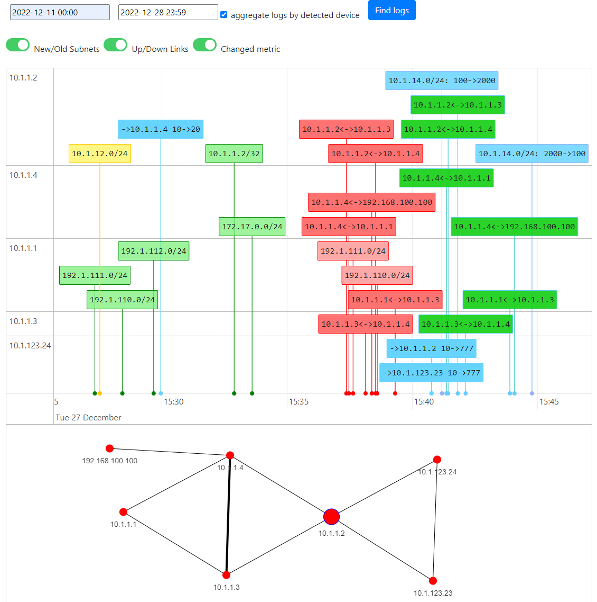
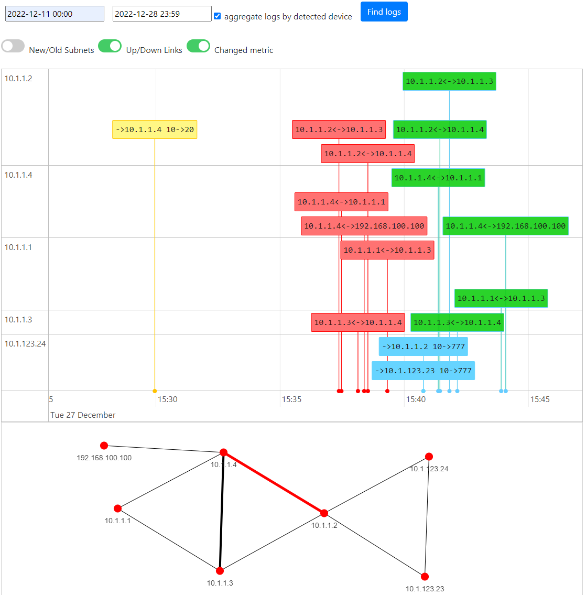
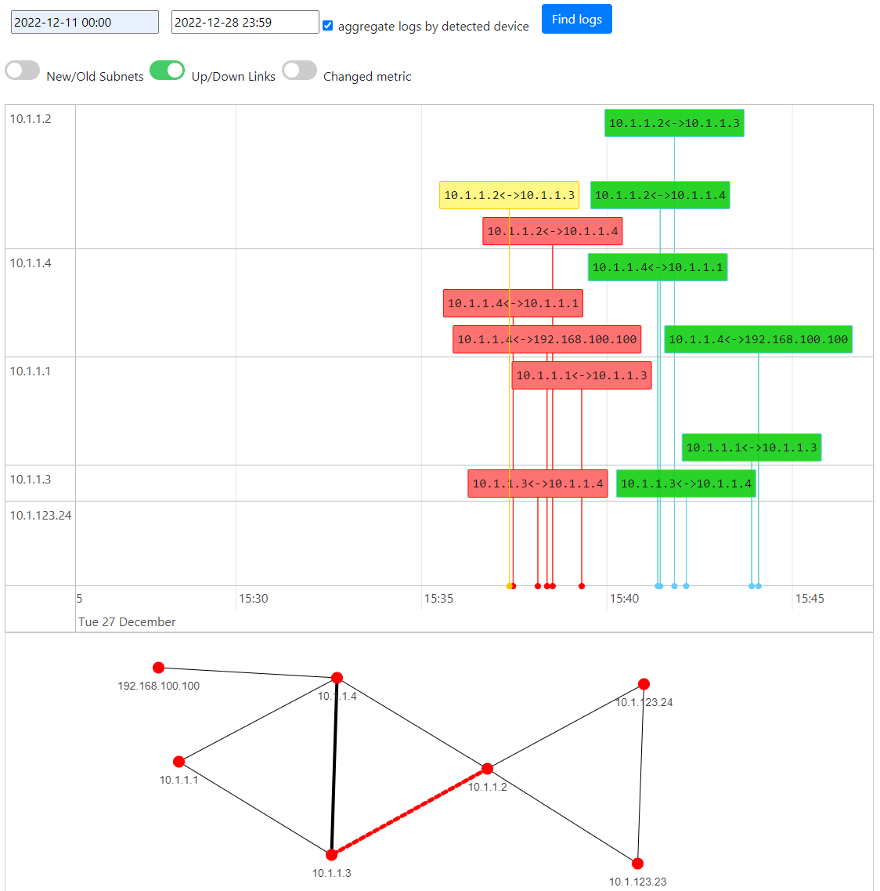
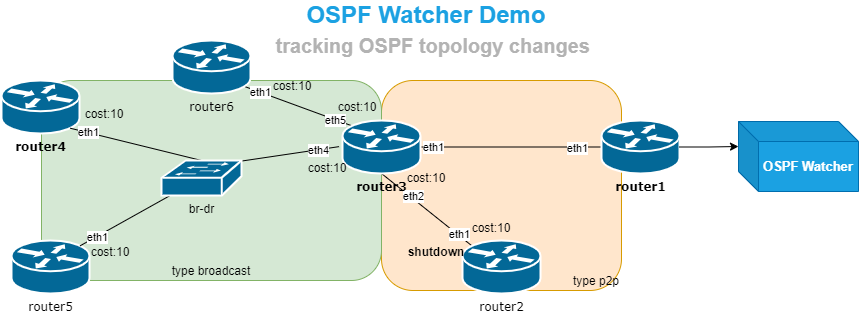
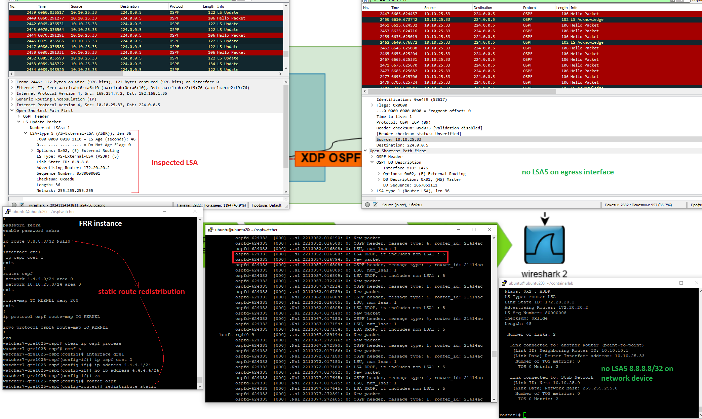

# OSPF Watcher

**OSPF Watcher** is a monitoring tool for OSPF topology changes. It passively
listens to the OSPF control plane — over a [GRE adjacency](../ingestion/gre.md) or
[BGP-LS](../ingestion/bgp-ls.md) — and logs every change and/or exports it (via
Logstash or Fluent Bit) to **ELK**, **Zabbix**, **WebHooks**, and the
**Topolograph** monitoring dashboard. Everything ships as containers, so it
starts fast.

[:simple-github: vadims06/ospfwatcher](https://github.com/Vadims06/ospfwatcher){ .md-button }


## Detected events

- OSPF neighbor adjacency **Up/Down**
- OSPF link **cost changes**
- OSPF networks **appearing/disappearing**
- OSPF **TE attributes** (via opaque LSA or BGP-LS): administrative group,
  maximum link bandwidth, maximum reservable bandwidth, unreserved bandwidth, and
  TE default metric







## Connecting it

The connection itself is set up under [Getting Topology In](../ingestion/index.md):

- [**GRE mode**](../ingestion/gre.md) — FRR forms an OSPF adjacency over a GRE
  tunnel. An **XDP OSPF filter** guarantees the Watcher stays listen-only.
- [**BGP-LS mode**](../ingestion/bgp-ls.md) — the router exports OSPF topology over
  BGP-LS; GoBGP + the forwarder feed the Watcher. Requires image
  **`vadims06/ospf-watcher:v3.1.0`** or newer.

!!! note "Compatibility"
    OSPF network changes appear on the Topolograph graph with
    [topolograph v2.27](https://github.com/Vadims06/topolograph/releases/tag/v2.27)
    or later.

## Quick lab (containerlab)

A ready-made lab under `containerlab/frr01` lets you watch OSPF changes with no
real hardware:

```bash
./containerlab/frr01/prepare.sh
sudo clab deploy --topo ./containerlab/frr01/frr01.clab.yml
```



In this minimal setup the Watcher prints topology changes to a text file. Add
Topolograph and/or ELK to visualize and search them — see the
[deployment sizes](index.md#deployment-sizes) table.

!!! tip "No device? Test mode"
    Set `TEST_MODE=True` to replay a demo LSDB and sample events (adjacency loss,
    metric change) end-to-end through the pipeline.

## Event log format

Watcher events are simple comma-separated lines. A host (adjacency) event:

```text
2023-01-01T00:00:00Z,demo-watcher,host,10.10.10.4,down,10.10.10.5,01Jan2023_00h00m00s_7_hosts,0,1234,192.168.145.5
```

> `10.10.10.5` detected that host `10.10.10.4`, on the interface with
> `192.168.145.5`, in area `0` / AS `1234`, went **down** at the timestamp.

A metric-change event:

```text
2023-01-01T00:00:00Z,demo-watcher,network,192.168.13.0/24,changed,old_cost:10,new_cost:12,10.10.10.1,01Jan2023_00h00m00s_7_hosts,0.0.0.0,1234,internal,0
```

> `10.10.10.1` detected that the metric of internal stub network
> `192.168.13.0/24` changed from `10` to `12`.

These records are what Logstash/Fluent Bit forward to
[ELK](elk-kibana.md), [Zabbix](zabbix.md) and [Webhooks](webhooks.md).

## Listen-only mode (XDP) { #listen-only-mode-xdp }

In GRE mode the Watcher runs a real FRR instance — so it's critical that it can
**never** inject prefixes into your OSPF domain. An **XDP filter** inspects every
OSPF message FRR tries to send and drops anything that advertises more than the
Watcher's own GRE tunnel network.



For example, if `8.8.8.8/32` were accidentally redistributed on the Watcher, the
LSA 5 is dropped by XDP and never reaches the network. The same protection
applies to Database Description messages and to extra stub networks in LSA 1.

Useful commands:

```bash
# Watch XDP drop logs
sudo cat /sys/kernel/debug/tracing/trace_pipe

# Confirm the XDP program is attached to the Watcher's interface
ip l show dev it-vhost1025      # look for "prog/xdp id ..."

# Enable / disable the filter
sudo docker run -it --rm -v ./:/home/watcher/watcher/ --cap-add=NET_ADMIN \
  -u root --network host vadims06/ospf-watcher:latest \
  python3 ./client.py --action enable_xdp --watcher_num <num>
```

## Troubleshooting

**GRE mode** — confirm the adjacency:

```text
show ip ospf neighbor
```

Your device should appear as a neighbor. If not, run the Watcher's diagnostic
script (see the repo's troubleshooting section).

**BGP-LS mode** — the Watcher posts to Topolograph only after the BGP session is
up. Check it:

```bash
docker logs watcher<num>-bgpls-ospf-bgplswatcher
docker exec -it watcher<num>-bgpls-ospf-bgplswatcher gobgp neighbor
docker exec -it watcher<num>-bgpls-ospf-bgplswatcher gobgp global rib -a ls
```

See [BGP-LS session](../ingestion/bgp-ls.md#3-verify-the-bgp-ls-session) for the
full verification flow.

---

**Related:** [IS-IS Watcher](isis-watcher.md) ·
[ELK / Kibana](elk-kibana.md) · [Zabbix](zabbix.md) · [Webhooks](webhooks.md)
